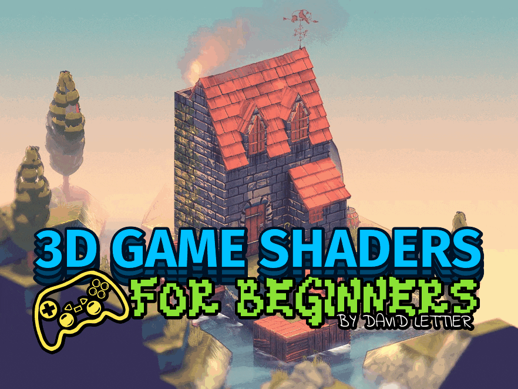

# 3D游戏着色器入门

你是否有兴趣为你的3D游戏添加：
纹理、
光照、
阴影、
法线贴图、
发光物体、
环境光遮蔽、
反射、
折射，
以及更多效果？
太好了！
以下是一些可以将你游戏画面提升到新高度的着色技巧集合。
我对每种技术都进行了详细讲解，确保你能将这些知识应用或移植到你所使用的任意开发栈中——无论是 Godot、Unity、Unreal 还是其他工具。
在连接这些着色器的部分中，我选择了优秀的 Panda3D 游戏引擎和 OpenGL 着色语言（GLSL）。
因此，如果你正好使用这套技术栈，你还可以专门学习如何将这些着色技巧用于 Panda3D 和 OpenGL。

## 目录

- [环境搭建](sections/setup.md)
- [构建演示程序](sections/building-the-demo.md)
- [运行演示程序](sections/running-the-demo.md)
- [参考坐标系](sections/reference-frames.md)
- [GLSL 着色语言](sections/glsl.md)
- [渲染到纹理](sections/render-to-texture.md)
- [纹理贴图](sections/texturing.md)
- [光照](sections/lighting.md)
- [Blinn-Phong 模型](sections/blinn-phong.md)
- [菲涅尔因子](sections/fresnel-factor.md)
- [边缘光照](sections/rim-lighting.md)
- [卡通渲染（Cel Shading）](sections/cel-shading.md)
- [法线贴图](sections/normal-mapping.md)
- [延迟渲染](sections/deferred-rendering.md)
- [雾效](sections/fog.md)
- [模糊](sections/blur.md)
- [泛光（Bloom）](sections/bloom.md)
- [屏幕空间环境光遮蔽（SSAO）](sections/ssao.md)
- [运动模糊](sections/motion-blur.md)
- [色差（Chromatic Aberration）](sections/chromatic-aberration.md)
- [屏幕空间反射](sections/screen-space-reflection.md)
- [屏幕空间折射](sections/screen-space-refraction.md)
- [泡沫效果](sections/foam.md)
- [流动贴图](sections/flow-mapping.md)
- [描边](sections/outlining.md)
- [景深](sections/depth-of-field.md)
- [色彩分层（Posterization）](sections/posterization.md)
- [像素化](sections/pixelization.md)
- [锐化](sections/sharpen.md)
- [膨胀（Dilation）](sections/dilation.md)
- [胶片颗粒（Film Grain）](sections/film-grain.md)
- [查找表（LUT）](sections/lookup-table.md)
- [伽马校正](sections/gamma-correction.md)

## 许可协议

本项目所附的许可证仅适用于《3D游戏着色器入门》中的软件部分——具体是 `.cxx`、`.vert` 和 `.frag` 源代码文件。  
项目的其他部分未被授权使用。

## 致谢

- [Kiwi Soda 字体](https://fontenddev.com/fonts/kiwi-soda/)

## 版权所有

(C) 2019 David Lettier  
   
[lettier.com](https://www.lettier.com)
