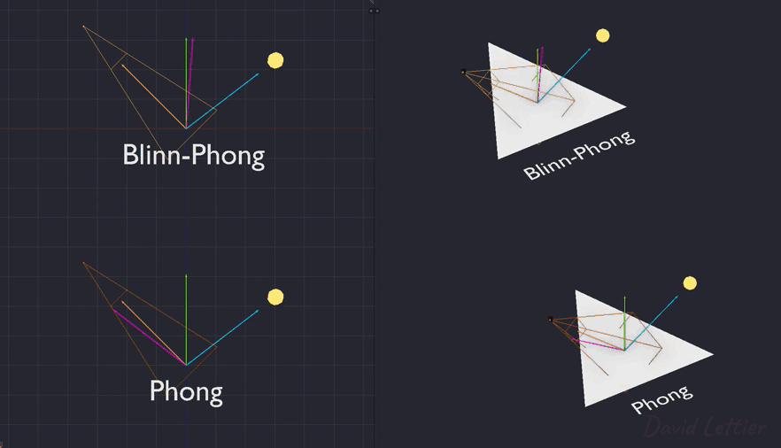
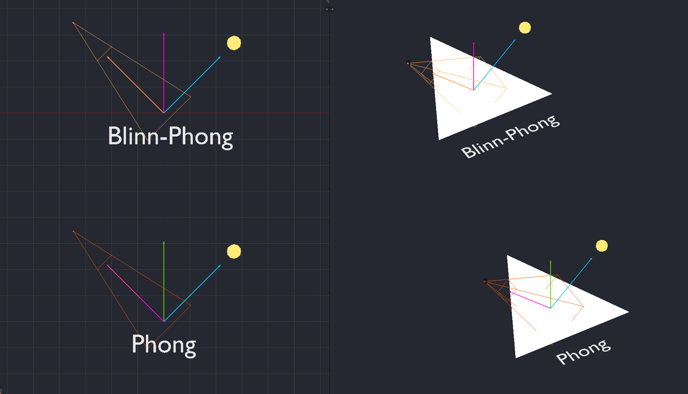
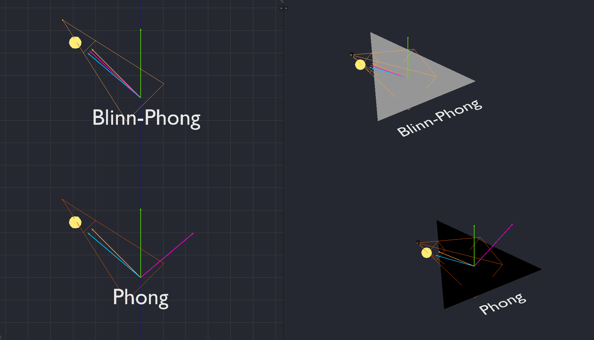

[:arrow_backward:](lighting.md)
[:arrow_double_up:](../README.md)
[:arrow_up_small:](#)
[:arrow_down_small:](#copyright)
[:arrow_forward:](fresnel-factor.md)
# 3D 游戏着色器入门教程教程

## Blinn-Phong 模型

<p align="center">

</p>

Blinn-Phong 模型是你在 [光照](lighting.md) 一节中看到的 Phong 模型的一个小调整。
它提供了更可信或更真实的镜面反射效果。
你会注意到 Blinn-Phong 产生的是椭圆形或拉伸的镜面反射，
而 Phong 模型产生的是球形的镜面反射。
在某些情况下，Blinn-Phong 的计算效率也可能高于 Phong。

```c
  // ...

  vec3 light   = normal(lightPosition.xyz - vertexPosition.xyz);
  vec3 eye     = normalize(-vertexPosition.xyz);
  vec3 halfway = normalize(light + eye);

  // ...
```

与其计算反射向量，
不如计算 halfway（半角）向量。
该向量位于视图/摄像机/观察方向向量和光照方向向量之间。

<p align="center">

</p>

```c
    // ...

    float specularIntensity = dot(normal, halfway);

    // ...
```

镜面强度现在是法线与半角向量的点积。
而在 Phong 模型中，它是反射向量与视图向量的点积。

<p align="center">

</p>

当视图向量（橙色箭头）与反射向量（品红色箭头）方向一致时，
半角向量（品红色箭头）将与法线（绿色箭头）方向一致。
在这种情况下，Blinn-Phong 和 Phong 的镜面强度都会是 1。

<p align="center">

</p>

在其他情况下，Blinn-Phong 的镜面强度会大于零，
而 Phong 的镜面强度则为零。

### 源文件

- [main.cxx](../demonstration/src/main.cxx)
- [base.vert](../demonstration/shaders/vertex/base.vert)
- [base.frag](../demonstration/shaders/fragment/base.frag)

## Copyright

(C) 2020 David Lettier
<br>
[lettier.com](https://www.lettier.com)

[:arrow_backward:](lighting.md)
[:arrow_double_up:](../README.md)
[:arrow_up_small:](#)
[:arrow_down_small:](#copyright)
[:arrow_forward:](fresnel-factor.md)
