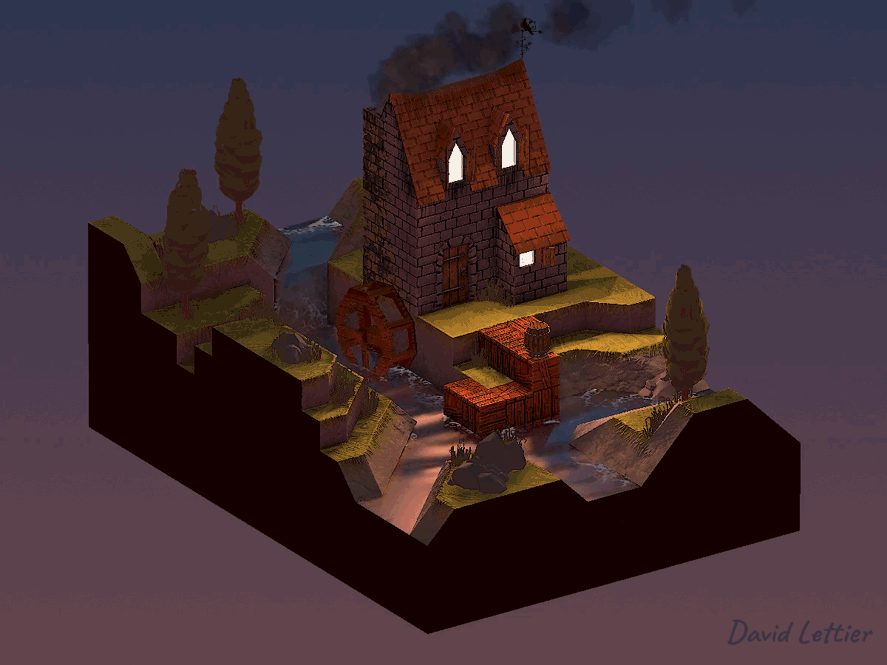
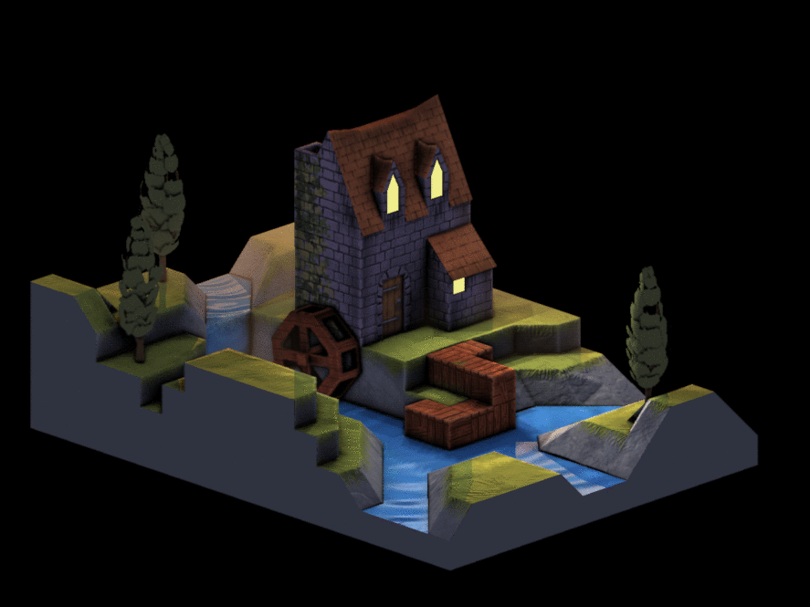

[:arrow_backward:](blur.md)
[:arrow_double_up:](../README.md)
[:arrow_up_small:](#)
[:arrow_down_small:](#copyright)
[:arrow_forward:](ssao.md)

# 3D 游戏着色器入门教程

## Bloom（泛光）

<p align="center">

</p>

给场景添加泛光效果可以很好地增强光照模型的真实感。
发光物体显得更加可信，而高光也更具闪耀感。

```c
  //...

  int   size       = 5;
  float separation = 3;
  float threshold  = 0.4;
  float amount     = 1;

  // ...
```

这些参数控制泛光的外观和感觉。
`size` 决定模糊的程度。
`separation` 控制模糊的扩散范围。
`threshold` 控制哪些片段被认为是发光的。
最后一个参数 `amount` 控制泛光的强度。

```c
  // ...

  vec2 texSize = textureSize(colorTexture, 0).xy;

  float value = 0.0;
  float count = 0.0;

  vec4 result = vec4(0);
  vec4 color  = vec4(0);

  for (int i = -size; i <= size; ++i) {
    for (int j = -size; j <= size; ++j) {
      // ...
    }
  }

  // ...
```

这个技术从循环一个以当前片段为中心的卷积核（窗口）开始。
这类似于 [轮廓描边](outlining.md) 中使用的窗口。
窗口的大小为 `size * 2 + 1` 乘以 `size * 2 + 1`。
例如，`size = 2` 时，窗口使用 `(2 * 2 + 1)^2 = 25` 个采样。

```c
      // ...

      color =
        texture
          ( colorTexture
          ,   ( gl_FragCoord.xy
              + (vec2(i, j) * separation)
              )
            / texSize
          );

      value = max(color.r, max(color.g, color.b));
      if (value < threshold) { color = vec4(0); }

      result += color;
      count  += 1.0;

      // ...
```

每次迭代时，都会从输入纹理中获取颜色，并将其 RGB 值转为灰度值。
如果灰度值小于阈值 `threshold`，就将该颜色置为黑色。
然后将该样本的 RGB 值累加到 `result` 中。

```c
  // ...

  result /= count;

  fragColor = mix(vec4(0), result, amount);

  // ...
```

累加完成后，结果除以采样次数，得到当前片段及其邻域的平均颜色。
对每个片段执行此操作，最终得到模糊图像。
这种模糊形式被称为 [盒式模糊](blur.md#box-blur)。

<p align="center">

</p>

上图展示了泛光算法的渐进过程。

### 源码

- [main.cxx](../demonstration/src/main.cxx)
- [basic.vert](../demonstration/shaders/vertex/basic.vert)
- [bloom.frag](../demonstration/shaders/fragment/outline.frag)


## Copyright

(C) 2019 David Lettier
<br>
[lettier.com](https://www.lettier.com)

[:arrow_backward:](blur.md)
[:arrow_double_up:](../README.md)
[:arrow_up_small:](#)
[:arrow_down_small:](#copyright)
[:arrow_forward:](ssao.md)
