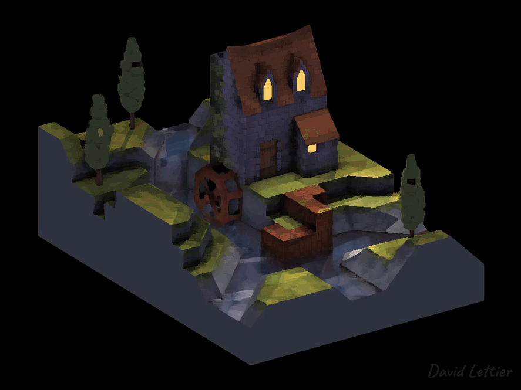
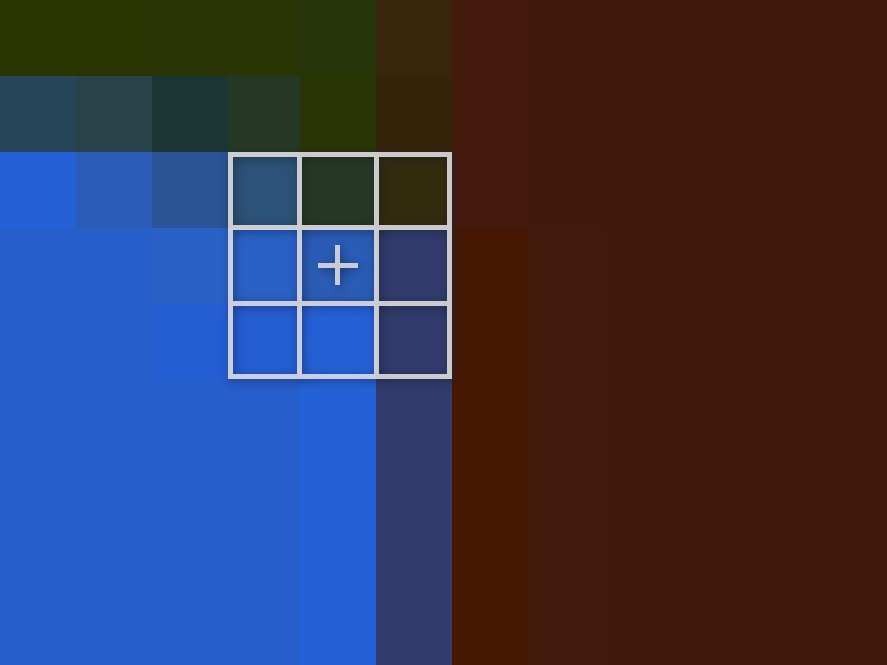
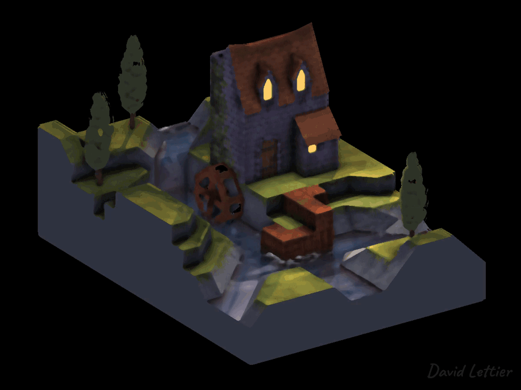
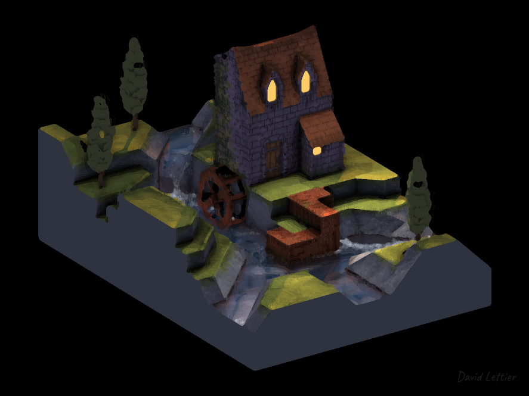
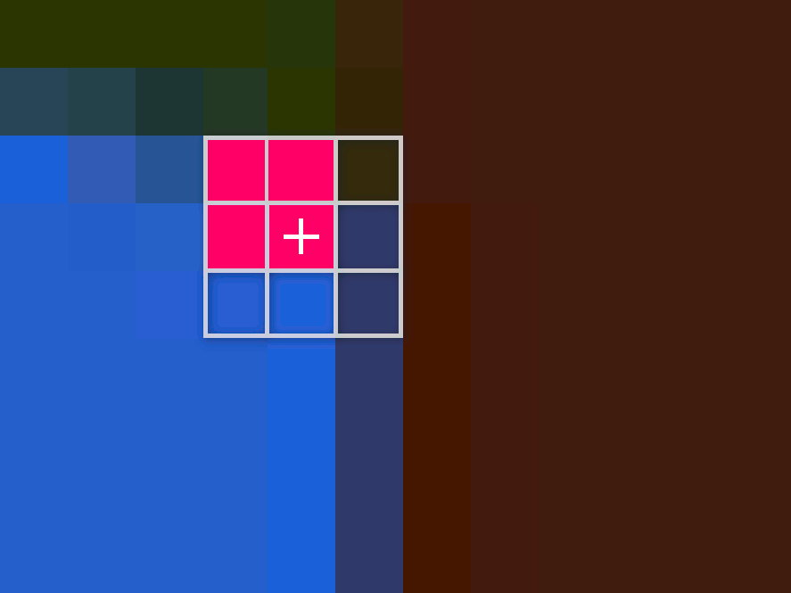

[:arrow_backward:](fog.md)
[:arrow_double_up:](../README.md)
[:arrow_up_small:](#)
[:arrow_down_small:](#copyright)
[:arrow_forward:](bloom.md)

# 3D 游戏着色器入门教程教程

## 模糊（Blur）

<p align="center">  </p>

在实现某种特定视觉风格或执行诸如运动模糊（motion blur）等技术时，经常需要对图像进行模糊处理。
下面是一些可以用于模糊游戏画面的常见方法。

### 均值模糊（Box Blur）
<p align="center">  </p>
均值模糊，也称为盒状模糊（Box Blur）或均值滤波（Mean Filter），是一种易于实现的模糊效果。
它快速且能胜任大多数基本任务。如果你需要更细致的控制，可以升级为高斯模糊（Gaussian Blur）。

```c
  // ...

  vec2 texSize  = textureSize(colorTexture, 0).xy;
  vec2 texCoord = gl_FragCoord.xy / texSize;

  int size  = int(parameters.x);
  if (size <= 0) { fragColor = texture(colorTexture, texCoord); return; }

  // ...
```

`size` 参数控制模糊的强度。
如果 `size` 小于等于 0，直接返回当前像素，不做任何处理。


```c
  // ...

  float separation = parameters.y;
        separation = max(separation, 1);

  // ...
```

`separation` 参数用于在不增加采样数量的情况下扩大模糊半径。
它的范围是 1 到无穷大。

<p align="center">  </p>

```c
  // ...

  for (int i = -size; i <= size; ++i) {
    for (int j = -size; j <= size; ++j) {
      // ...
    }
  }

  // ...
```

和 [描边技术](outlining.md)  类似，均值模糊也使用一个以当前像素为中心的采样窗口（kernel/matrix/window）。
窗口的尺寸为 `size * 2 + 1`，比如 `size = 2` 时，总采样数为 `(2 * 2 + 1)^2 = 25`。


Like the [outlining](outlining.md) technique,
the box blur technique uses a kernel/matrix/window centered around the current fragment.
The size of the window is `size * 2 + 1` by `size * 2 + 1`.
So for example, with a `size` setting of two, the window uses `(2 * 2 + 1)^2 = 25` samples per fragment.

```c
      // ...

      fragColor +=
        texture
          ( colorTexture
          ,   ( gl_FragCoord.xy
              + (vec2(i, j) * separation)
              )
            / texSize
          );

      // ...
```

遍历窗口内的像素，对所有采样颜色进行求和，最终用于计算平均值。


```c
  // ...

  fragColor /= pow(size * 2 + 1, 2);

  // ...
```

最终，将采样颜色总和除以采样数，得到模糊后的最终像素值。


### 中值滤波器（Median Filter）

<p align="center">

</p>

方框模糊使用的是采样颜色的均值。
而中值滤波器使用的是采样颜色的中值。
由于使用中值而不是均值，
图像中的边缘得以保留 —— 换句话说，边缘依然清晰锐利。
例如，比较方框模糊图与中值滤波图中窗户的细节即可见分晓。

不过，计算中值通常比计算均值更慢。
你可以对采样值排序并选取中间值，但这至少需要准线性时间。
虽然存在在线性时间内寻找中值的算法，但在着色器中实现起来相当繁琐。
以下的数值方法在线性时间内近似计算中值。
它的准确程度可以通过参数控制。


<p align="center">

</p>

在较低精度的近似下，
你会得到一种类似于[绘画风格](https://en.wikipedia.org/wiki/Painterliness)的图像效果。

```c
// ...

#define MAX_SIZE        4
#define MAX_KERNEL_SIZE ((MAX_SIZE * 2 + 1) * (MAX_SIZE * 2 + 1))
#define MAX_BINS_SIZE   100

// ...
```

这些是 `size` 参数、窗口尺寸和 `bins` 数组的硬限制。

```c
  // ...

  vec2 texSize  = textureSize(colorTexture, 0).xy;
  vec2 texCoord = gl_FragCoord.xy / texSize;

  int size = int(parameters.x);
  if (size <= 0) { fragColor = texture(colorTexture, texCoord); return; }
  if (size > MAX_SIZE) { size = MAX_SIZE; }
  int kernelSize = int(pow(size * 2 + 1, 2));

  // ...
```

`size` 参数控制模糊或涂抹的程度。
若小于等于零，则直接返回当前片元的颜色。
根据 `size` 参数计算卷积窗口的总尺寸，
也就是每个片元需要采样的像素数量。

```c
  // ...

  int binsSize = int(parameters.y);
      binsSize = clamp(binsSize, 1, MAX_BINS_SIZE);

  // ...
```

设置 `binsSize`，确保它在允许范围（`MAX_BINS_SIZE`）内。
Set up the `binsSize`, making sure to limit it by the `MAX_BINS_SIZE`.

```c
  // ...

  int i        = 0;
  int j        = 0;
  int count    = 0;
  int binIndex = 0;

  // ...
```

`i` 和 `j` 用来围绕当前片元进行采样。
count 用于初始化 colors 数组。
binIndex 用于记录每个采样值所归属的 bin。

`i` and `j` are used to sample the given texture around the current fragment.
`i` is also used as a general for loop count.
`count` is used in the initialization of the `colors` array which you'll see later.
`binIndex` is used to approximate the median color.

```c
  // ...

  vec4  colors[MAX_KERNEL_SIZE];
  float bins[MAX_BINS_SIZE];
  int   binIndexes[colors.length()];

  // ...
```

`i` 和 `j` 用于在当前片段周围对纹理进行采样。  
`i` 同时作为通用循环计数器使用。  
`count` 用于初始化后续将出现的 `colors` 数组。  
`binIndex` 用于近似计算中值颜色。

```c
  // ...

  float total = 0;
  float limit = floor(float(kernelSize) / 2) + 1;

  // ...
```
`total` 用于记录遍历 `bins` 时累计的颜色数量。  
当 `total` 达到 `limit` 时，返回当前所在的 `bins` 索引值。  
该 `limit` 即中位数索引位置。  
例如当窗口大小为81时，`limit` 为41（正中间位置），此时下方有40个样本，上方有40个样本。

```c
  // ...

  float value       = 0;
  vec3  valueRatios = vec3(0.3, 0.59, 0.11);

  // ...
```

这些变量用于转换并存储每个颜色样本的灰度值。  
不同于将红、绿、蓝三通道简单除以3的计算方式，  
该算法采用30%红色、59%绿色加11%蓝色的加权配比（总和100%）。

```c
  // ...

  for (i = -size; i <= size; ++i) {
    for (j = -size; j <= size; ++j) {
      colors[count] =
        texture
          ( colorTexture
          ,   ( gl_FragCoord.xy
              + vec2(i, j)
              )
            / texSize
          );
      count += 1;
    }
  }

  // ...
```

遍历采样窗口，将颜色样本收集到 `colors` 数组中。

```c
  // ...

  for (i = 0; i < binsSize; ++i) {
    bins[i] = 0;
  }

  // ...
```

将 `bins` 数组初始化为零值。

```c
  // ...

  for (i = 0; i < kernelSize; ++i) {
    value           = dot(colors[i].rgb, valueRatios);
    binIndex        = int(floor(value * binsSize));
    binIndex        = clamp(binIndex, 0, binsSize - 1);
    bins[binIndex] += 1;
    binIndexes[i]   = binIndex;
  }

  // ...
```


循环遍历颜色数组，将每个颜色转换为灰度值：  
`dot(colors[i].rgb, valueRatios)` 实现的是基于人眼感知的加权灰度转换，其计算公式为：  
`colors.r * 0.3 + colors.g * 0.59 + colors.b * 0.11`

每个灰度值将被分配到对应的统计区间（bin）中：
每个分箱(bin)对应一个特定的数值区间范围。

例如，当 bin 的数量为 10 时，第一个 bin 所表示的灰度区间是 [0, 0.1)。
将灰度值落入该区间的颜色计数加一，并记录该颜色样本所在的 bin 索引，以便后续查找中值。

```c
  // ...

  binIndex = 0;

  for (i = 0; i < binsSize; ++i) {
    total += bins[i];
    if (total >= limit) {
      binIndex = i;
      break;
    }
  }

  // ...
```
遍历每个 bin，逐步累计颜色样本的数量。
当累计数量达到中值所在的位置时，跳出循环，并记录当前的 `bins` 索引作为近似中值所在的位置。

```c
  // ...

  fragColor = colors[0];

  for (i = 0; i < kernelSize; ++i) {
    if (binIndexes[i] == binIndex) {
      fragColor = colors[i];
      break;
    }
  }

  // ...
```

现在遍历 `binIndexes`，找到第一个对应于刚才所确定的 `bins` 索引的颜色。
它的灰度值就是近似的中值，在很多情况下也会是真正的中值。
将该颜色设置为 fragColor，然后退出循环和着色器程序。

### Kuwahara 滤波器

<p align="center">

</p>

与中值滤波器类似，Kuwahara 滤波器能够保留图像中的主要边缘。
你会注意到，它呈现出一种更具块状或颗粒感的图案。
在实际使用中，Kuwahara 滤波器的运行速度快于中值滤波器，
这使得即便使用较大的 `size` 值，也不会出现明显的性能下降。

```c
// ...

#define MAX_SIZE        5
#define MAX_KERNEL_SIZE ((MAX_SIZE * 2 + 1) * (MAX_SIZE * 2 + 1))

// ...
```

为 `size` 参数和采样数量设置一个硬性上限。

```c
// ...

int i     = 0;
int j     = 0;
int count = 0;

// ...
```

这些变量用于对输入纹理进行采样，并初始化 `values` 数组。

```c
// ...

vec3  valueRatios = vec3(0.3, 0.59, 0.11);

// ...
```

和中值滤波器类似，你需要将采样的颜色转换为灰度值。

```c
// ...

float values[MAX_KERNEL_SIZE];

// ...
```

初始化 `values` 数组。
该数组用于存储颜色采样对应的灰度值。

```c
// ...

vec4  color       = vec4(0);
vec4  meanTemp    = vec4(0);
vec4  mean        = vec4(0);
float valueMean   = 0;
float variance    = 0;
float minVariance = -1;

// ...
```

Kuwahara滤波器的工作原理是计算四个子窗口的方差，然后采用方差最小的子窗口的平均值作为最终结果。

```c
// ...

void findMean(int i0, int i1, int j0, int j1) {

// ...
```

`findMean` 是一个定义在 `main` 函数外的函数。每次调用 `findMean` 都会记录当前子窗口中方差最低的那个子窗口的平均值。

```c
  // ...

  meanTemp = vec4(0);
  count    = 0;

  // ...
```

在计算给定子窗口的均值之前，务必重置 `count` 和 `meanTemp`。

```c
  // ...

  for (i = i0; i <= i1; ++i) {
    for (j = j0; j <= j1; ++j) {
      color  =
        texture
          ( colorTexture
          ,   (gl_FragCoord.xy + vec2(i, j))
            / texSize
          );

      meanTemp += color;

      values[count] = dot(color.rgb, valueRatios);

      count += 1;
    }
  }

  // ...
```

类似于方框模糊，遍历给定的子窗口并累加每个像素的颜色。
同时，确保将该采样点的灰度值存储在 `values` 数组中。

```c
  // ...

  meanTemp.rgb /= count;
  valueMean     = dot(meanTemp.rgb, valueRatios);

  // ...
```

计算均值时，将采样颜色总和除以采样数量。然后计算该均值颜色的灰度值。

```c
  // ...

  for (i = 0; i < count; ++i) {
    variance += pow(values[i] - valueMean, 2);
  }

  variance /= count;

  // ...
```

现在计算该子窗口的方差。
方差是每个样本灰度值与均值灰度值差的平方的平均值。

```c
  // ...

  if (variance < minVariance || minVariance <= -1) {
    mean = meanTemp;
    minVariance = variance;
  }
}

// ...
```

如果当前方差比之前记录的更小，或者这是你第一次计算方差，
就将该子窗口的均值设为最终均值，并更新目前记录的最小方差。

```c
// ...

void main() {
  int size = int(parameters.x);
  if (size <= 0) { fragColor = texture(colorTexture, texCoord); return; }

  // ...
```

回到 `main` 函数，设置 `size` 参数。
如果 `size` 小于或等于零，则直接返回当前片元，不做修改。

<p align="center">

</p>

```c
  // ...

  // Lower Left

  findMean(-size, 0, -size, 0);

  // Upper Right

  findMean(0, size, 0, size);

  // Upper Left

  findMean(-size, 0, 0, size);

  // Lower Right

  findMean(0, size, -size, 0);

  // ...
```

如上所述，
Kuwahara 滤镜通过计算四个子窗口的方差，
然后选取方差最小的子窗口的均值作为最终的片元颜色。
注意，这四个子窗口是相互重叠的。

```c
  // ...

  mean.a    = 1;
  fragColor = mean;

  // ...
```

计算完每个子窗口的方差和均值后，
将片元颜色设置为方差最小的子窗口的均值。

### 源码

- [main.cxx](../demonstration/src/main.cxx)
- [basic.vert](../demonstration/shaders/vertex/basic.vert)
- [position.frag](../demonstration/shaders/fragment/position.frag)
- [box-blur.frag](../demonstration/shaders/fragment/box-blur.frag)
- [median-filter.frag](../demonstration/shaders/fragment/median-filter.frag)
- [kuwahara-filter.frag](../demonstration/shaders/fragment/kuwahara-filter.frag)

## Copyright

(C) 2019 David Lettier
<br>
[lettier.com](https://www.lettier.com)

[:arrow_backward:](fog.md)
[:arrow_double_up:](../README.md)
[:arrow_up_small:](#)
[:arrow_down_small:](#copyright)
[:arrow_forward:](bloom.md)
