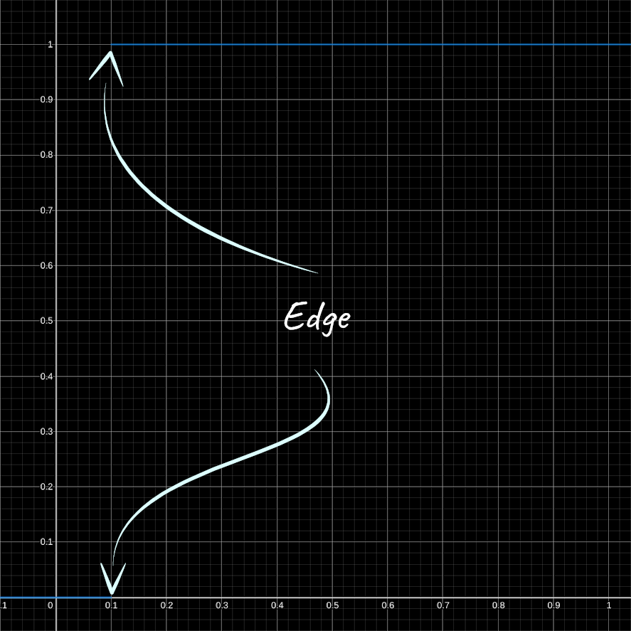
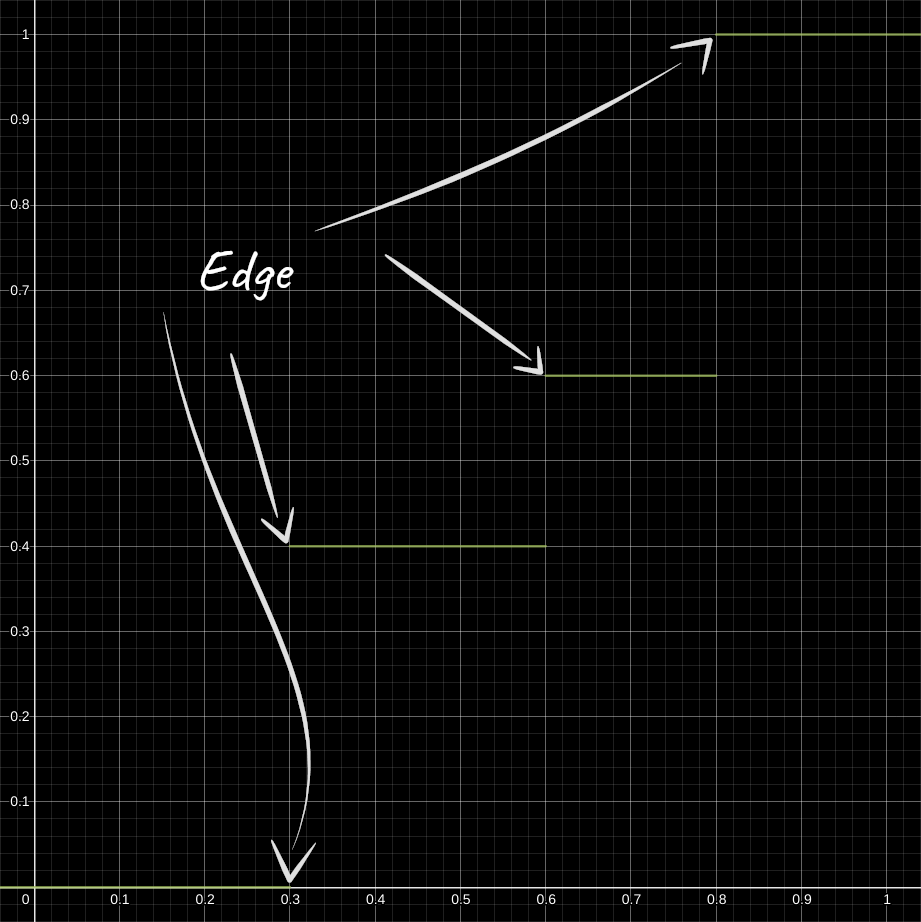

[:arrow_backward:](rim-lighting.md)
[:arrow_double_up:](../README.md)
[:arrow_up_small:](#)
[:arrow_down_small:](#copyright)
[:arrow_forward:](normal-mapping.md)

# 3D 游戏着色器入门教程教程

## 卡通渲染（Cel Shading）

<p align="center">

</p>

卡通渲染是一种让3D物体看起来像2D平面或扁平化的技术。
在2D中，你可以通过应用平滑渐变让物体看起来有立体感。
然而使用卡通渲染时，你会将渐变拆分为明显的跳变。
通常只有一次跳变，即从完全受光部分直接跳转到完全阴影部分。
当结合[描边效果](outlining.md)使用时，卡通渲染能极大地增强二维卡通风格的视觉效果。

## 漫反射（Diffuse）

```c
    // ...

    float diffuseIntensity = max(dot(normal, unitLightDirection), 0.0);
          diffuseIntensity = step(0.1, diffuseIntensity);

    // ...
```

回顾[光照模型](lighting.md#diffuse)，
将 `diffuseIntensity` 修改为只可能是0或1的值。

<p align="center">

</p>

`step` 函数的作用是：当输入小于阈值时返回0，否则返回1。

<p align="center">

</p>

```c
  // ...

  if      (diffuseIntensity >= 0.8) { diffuseIntensity = 1.0; }
  else if (diffuseIntensity >= 0.6) { diffuseIntensity = 0.6; }
  else if (diffuseIntensity >= 0.3) { diffuseIntensity = 0.3; }
  else                              { diffuseIntensity = 0.0; }

  // ...
```

如果你想实现多级跳变效果，可以使用上述代码逻辑。

<p align="center">

</p>

```c
  // ...

  diffuseIntensity = texture(steps, vec2(diffuseIntensity, 0.0)).r;

  // ...
```

另一种做法是将跳变值写入一张纹理，从暗到亮依次排列，
然后用 `diffuseIntensity` 作为纹理的U坐标，这样可以自动完成跳变。

## 高光（Specular）

```c

      // ...

      float specularIntensity = clamp(dot(normal, halfwayDirection), 0.0, 1.0);
            specularIntensity = step(0.98, specularIntensity);

      // ...
```

再次利用 `step` 函数，将 `specularIntensity` 设置为0或1。
你也可以用上面介绍的其他方法来处理高光。
调整完 `specularIntensity` 后，剩下的光照计算保持不变。

### 源码

- [main.cxx](../demonstration/src/main.cxx)
- [base.vert](../demonstration/shaders/vertex/base.vert)
- [base.frag](../demonstration/shaders/fragment/base.frag)

## Copyright

(C) 2020 David Lettier
<br>
[lettier.com](https://www.lettier.com)

[:arrow_backward:](rim-lighting.md)
[:arrow_double_up:](../README.md)
[:arrow_up_small:](#)
[:arrow_down_small:](#copyright)
[:arrow_forward:](normal-mapping.md)
