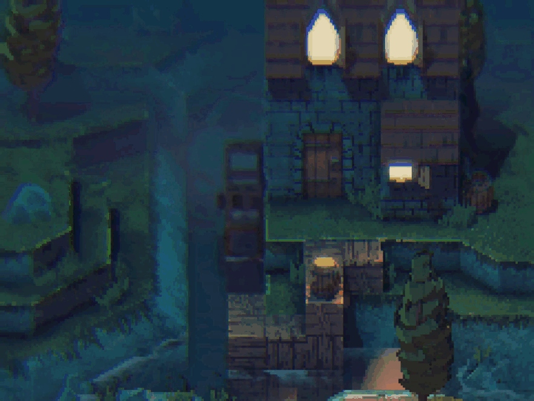

[:arrow_backward:](motion-blur.md)
[:arrow_double_up:](../README.md)
[:arrow_up_small:](#)
[:arrow_down_small:](#copyright)
[:arrow_forward:](screen-space-reflection.md)

# 3D 游戏着色器入门教程

## 色差（Chromatic Aberration）

<p align="center">

</p>

色差是一种屏幕空间技术，模拟镜头失真效果。
你可以用它来为场景营造电影感、低保真模拟效果，或者强调混乱的事件。

### 纹理

```c
uniform sampler2D colorTexture;

// ...
```

此处需要的输入纹理是场景颜色被捕获到帧缓冲纹理中。

### 参数

<p align="center">

</p>

```c
  // ...

  float redOffset   =  0.009;
  float greenOffset =  0.006;
  float blueOffset  = -0.006;

  // ...
```

该技术的可调参数是红色、绿色和蓝色的偏移量。
你可以自由调整它们以获得理想的色彩边缘效果。
这里的偏移量产生了黄色橙色和蓝色的色彩边缘。

### 方向

```c
// ...

uniform vec2 mouseFocusPoint;

  // ...

  vec2 texSize  = textureSize(colorTexture, 0).xy;
  vec2 texCoord = gl_FragCoord.xy / texSize;

  vec2 direction = texCoord - mouseFocusPoint;

  // ...
```

偏移可以沿水平、垂直或径向方向发生。
一种思路是从[景深](depth-of-field.md) 的焦点位置向外辐射。
随着场景越发模糊，色差效果越强。


### 采样

```c
// ...

out vec4 fragColor;

  // ...

  fragColor.r  = texture(colorTexture, texCoord + (direction * vec2(redOffset  ))).r;
  fragColor.g  = texture(colorTexture, texCoord + (direction * vec2(greenOffset))).g;
  fragColor.ba = texture(colorTexture, texCoord + (direction * vec2(blueOffset ))).ba;
}
```

基于方向和偏移，分别对场景颜色进行三次采样，分别取红、绿、蓝通道的颜色值。
这些采样结果组成最终的片元颜色输出。

### 源码

- [main.cxx](../demonstration/src/main.cxx)
- [basic.vert](../demonstration/shaders/vertex/basic.vert)
- [chromatic-aberration.frag](../demonstration/shaders/fragment/chromatic-aberration.frag)

## Copyright

(C) 2021 David Lettier
<br>
[lettier.com](https://www.lettier.com)

[:arrow_backward:](motion-blur.md)
[:arrow_double_up:](../README.md)
[:arrow_up_small:](#)
[:arrow_down_small:](#copyright)
[:arrow_forward:](screen-space-reflection.md)
