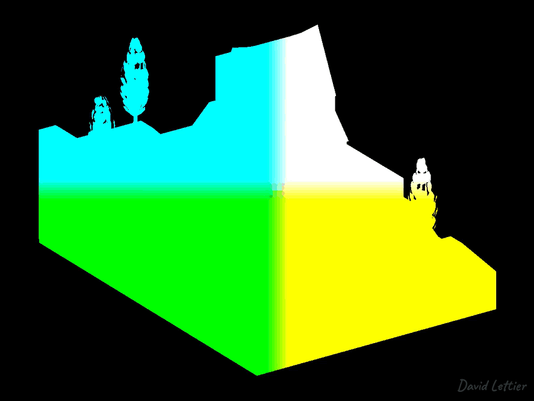

[:arrow_backward:](normal-mapping.md)
[:arrow_double_up:](../README.md)
[:arrow_up_small:](#)
[:arrow_down_small:](#copyright)
[:arrow_forward:](fog.md)

# 3D 游戏着色器入门

## 延迟渲染

延迟渲染（Deferred Rendering，也称延迟着色）是一种基于屏幕空间的光照技术。  
它不是在遍历场景几何体时就计算光照，而是将光照计算延后，等场景几何片元被裁剪或舍弃之后再进行光照计算。  
这根据场景的复杂度可以带来性能提升。

### 阶段

延迟渲染分为两个阶段。  
第一阶段是遍历场景几何体，将其位置或深度、法线以及材质信息渲染到一个叫做几何缓冲区（Geometry Buffer，简称 G-buffer）的帧缓冲中。  
除了少量变换操作，这个阶段大多是只读操作，性能开销较小。  
经过这一阶段后，后续操作只处理屏幕形状的二维纹理。

第二个也是最后一个阶段，使用第一阶段的输出结果进行光照计算。  
此阶段计算环境光、漫反射光和镜面光。  
阴影和法线贴图的处理也在此阶段完成。

### 优点

使用延迟渲染的原因是减少光照计算的次数。  
在前向渲染中，光照计算次数随着片元数和光源数成比例增长。  
而在延迟渲染中，光照计算次数则随着屏幕像素数和光源数增长。  
注意一个像素可以由多个片元产生。  
随着几何体数量增加，前向渲染每像素的光照计算会增加，但延迟渲染不会。

对于简单场景，延迟渲染并不会带来明显性能提升，甚至可能带来性能下降。  
但对于包含大量光源的复杂场景，它则成为更优选择。  
延迟渲染比前向渲染快的原因是，它只需要对每个像素和光源计算一次光照。  
而前向渲染则对每个片元和光源都要计算光照，片元可能是像素的多倍。

### 缺点

延迟渲染允许使用大量光源渲染复杂场景，但也存在一些权衡。  
半透明处理是个难点，因为半透明物体后面的几何数据在第一阶段就被舍弃了，无法被访问。  
其他缺点还包括由于 G-buffer 需要额外内存，以及为处理锯齿等问题所需的额外解决方案。

## Copyright

(C) 2019 David Lettier
 
[lettier.com](https://www.lettier.com)

[:arrow_backward:](normal-mapping.md)
[:arrow_double_up:](../README.md)
[:arrow_up_small:](#)
[:arrow_down_small:](#copyright)
[:arrow_forward:](fog.md)
