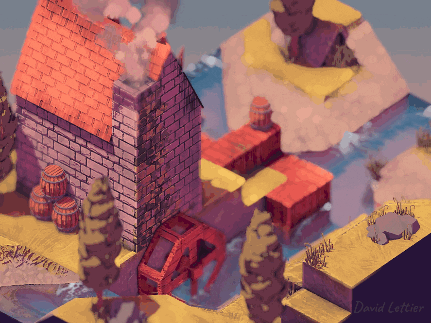
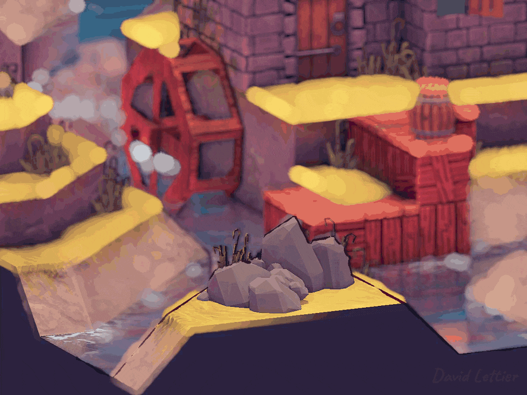
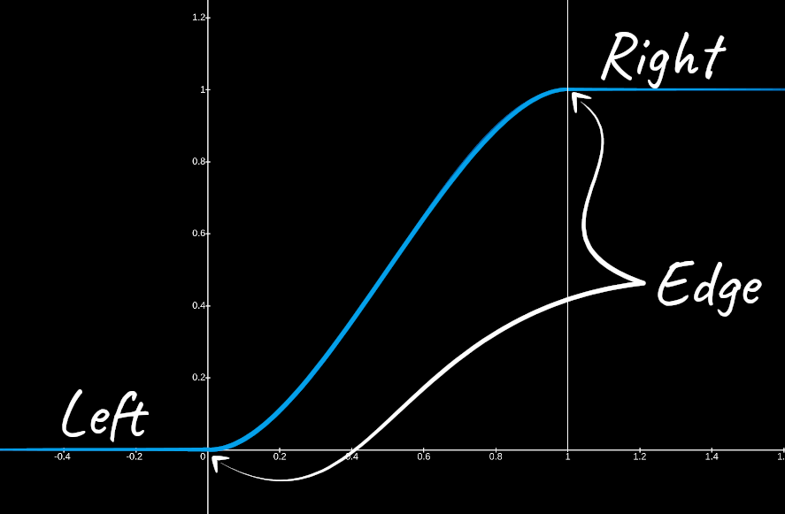

[:arrow_backward:](outlining.md)
[:arrow_double_up:](../README.md)
[:arrow_up_small:](#)
[:arrow_down_small:](#copyright)
[:arrow_forward:](posterization.md)

# 3D 游戏着色器入门教程

## 景深（Depth Of Field）

<p align="center">

</p>

就像 [SSAO](ssao.md) 一样，一旦你使用了景深效果，就再也离不开它了。  
从艺术角度来看，景深可以用来引导观众的视线聚焦在某个主体上。  
而从整体效果而言，景深只需一点代价就能大幅提升画面的真实感。

### 对焦区域

第一步是完整渲染出一个完全对焦的场景。  
请确保将其渲染到一个帧缓冲纹理中。  
这个对焦图像将作为景深着色器的输入之一。

### 模糊区域

第二步是将整个场景模糊处理，模拟完全失焦的效果。  
类似于 Bloom 和 SSAO，你可以使用 [盒式模糊（Box Blur）](blur.md#box-blur)。  
请确保将该模糊后的场景渲染到另一个帧缓冲纹理中。  
这个失焦图像也将作为景深着色器的输入之一。

#### 散景（Bokeh）

<p align="center">

</p>

为了获得更好的散景效果，可以先对失焦纹理进行膨胀处理，然后将其作为失焦输入使用。  
详见 [膨胀操作](dilation.md)。

### 混合处理

```c
  // ...

  float minDistance = 1.0;
  float maxDistance = 3.0;

  // ...
```
你可以自由调整这两个参数。
所有小于等于 `minDistance` 的位置将完全对焦；
所有大于等于 `maxDistance` 的位置将完全失焦。

```c
  // ...

  vec4 focusColor      = texture(focusTexture, texCoord);
  vec4 outOfFocusColor = texture(outOfFocusTexture, texCoord);

  // ...
```

你需要对焦图像和失焦图像中的颜色值。

```c
  // ...

  vec4 position = texture(positionTexture, texCoord);

  // ...
```

你还需要该片元在视图空间中的位置。  
可以复用你在 [SSAO](ssao.md#vertex-positions) 中使用的位置帧缓冲纹理。

```c
  // ...

  vec4 focusPoint = texture(positionTexture, mouseFocusPoint);

  // ...
```

焦点是场景中的某个位置，所有场景中的点都将以此点为参考来计算距离。  
焦点的位置由你自行决定。  
演示中使用的是中键点击时鼠标下方的场景位置。  
当然，你也可以设置一个固定的距离或静态位置。

<p align="center">

</p>

```c
  // ...

  float blur =
    smoothstep
      ( minDistance
      , maxDistance
      , abs(position.y - focusPoint.y)
      );

  // ...
```

`smoothstep` 返回一个介于 0 到 1 之间的值。  
`minDistance` 是左侧边界，表示低于该距离的区域将完全对焦，模糊度为 0；  
`maxDistance` 是右侧边界，表示高于该距离的区域将完全失焦，模糊度为 1；  
在两者之间的距离，将根据 S 形曲线平滑插值，模糊度介于 0 到 1 之间。

```c

  // ...

  fragColor = mix(focusColor, outOfFocusColor, blur);

  // ...
```

最终的 `fragColor` 是对焦色与失焦色之间的混合。  
`blur` 越接近 1，使用的失焦色越多；  
`blur` 为 0 表示完全对焦；  
`blur >= 1` 时表示完全失焦。

### 源码参考

- [main.cxx](../demonstration/src/main.cxx)
- [basic.vert](../demonstration/shaders/vertex/basic.vert)
- [box-blur.frag](../demonstration/shaders/fragment/box-blur.frag)
- [depth-of-field.frag](../demonstration/shaders/fragment/depth-of-field.frag)

## Copyright

(C) 2019 David Lettier
<br>
[lettier.com](https://www.lettier.com)

[:arrow_backward:](outlining.md)
[:arrow_double_up:](../README.md)
[:arrow_up_small:](#)
[:arrow_down_small:](#copyright)
[:arrow_forward:](posterization.md)
