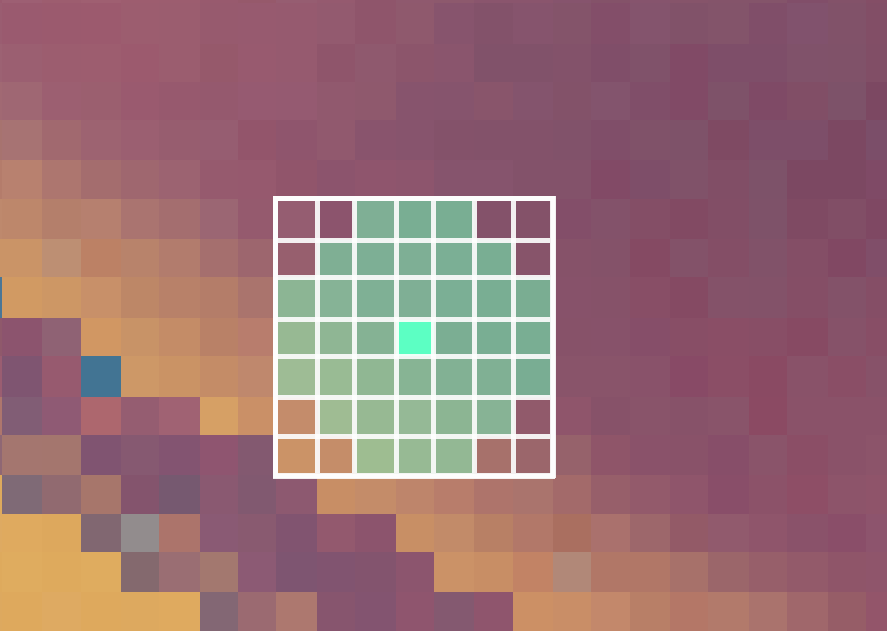

[:arrow_backward:](sharpen.md)
[:arrow_double_up:](../README.md)
[:arrow_up_small:](#)
[:arrow_down_small:](#copyright)
[:arrow_forward:](film-grain.md)

# 3D 游戏着色器入门

## 膨胀（Dilation）

<p align="center">

</p>

膨胀操作会扩大图像中亮度较高的区域，同时收缩图像中较暗的区域，  
从而产生一种“膨胀柔软”的外观。  
你可以使用膨胀来实现光晕 / 泛光效果，或者为你的 [景深效果](depth-of-field.md) 添加散景。

```c
  // ...

  int   size         = int(parameters.x);
  float separation   =     parameters.y;
  float minThreshold = 0.1;
  float maxThreshold = 0.3;

  // ...
```

`size` 和 `separation` 参数控制图像的膨胀程度。  
更大的 `size` 会带来更明显的膨胀效果，但性能开销更大。  
更大的 `separation` 也会扩大膨胀区域，但会降低图像质量。  
`minThreshold` 和 `maxThreshold` 控制图像中哪些部分会被膨胀。


```c
  // ...

  vec2 texSize   = textureSize(colorTexture, 0).xy;
  vec2 fragCoord = gl_FragCoord.xy;

  fragColor = texture(colorTexture, fragCoord / texSize);

  // ...
```

采样当前片元位置的颜色。

```c
  // ...

  float  mx = 0.0;
  vec4  cmx = fragColor;

  for (int i = -size; i <= size; ++i) {
    for (int j = -size; j <= size; ++j) {
      // ...
    }
  }

  // ...
```

在当前片元位置周围建立一个 `size` × `size` 的窗口进行遍历。  
在遍历过程中，找出周围片元中亮度最高的颜色。

<p align="center">

</p>

```c
      // ...

      // For a rectangular shape.
      //if (false);

      // For a diamond shape;
      //if (!(abs(i) <= size - abs(j))) { continue; }

      // For a circular shape.
      if (!(distance(vec2(i, j), vec2(0, 0)) <= size)) { continue; }

      // ...
```

窗口的形状会影响图像膨胀区域的形状。  
如果使用矩形形状，则处理窗口内的所有片元；  
若使用其他形状（如菱形或圆形），则跳过不在该形状内的片元。

```c
      // ...

      vec4 c =
        texture
          ( colorTexture
          ,   ( gl_FragCoord.xy
              + (vec2(i, j) * separation)
              )
            / texSize
          );

      // ...
```

从周围窗口中采样片元颜色。

```c
      // ...

      float mxt = dot(c.rgb, vec3(0.21, 0.72, 0.07));

      // ...
```

将采样颜色转换为灰度值（亮度值）。

```c
      // ...

      if (mxt > mx) {
        mx  = mxt;
        cmx = c;
      }

      // ...
```

如果当前灰度值大于之前记录的最大值，则更新最大灰度值和对应颜色。

```c
  // ...

  fragColor.rgb =
    mix
      ( fragColor.rgb
      , cmx.rgb
      , smoothstep(minThreshold, maxThreshold, mx)
      );

  // ...
```

最终的片元颜色是原始颜色与亮度最高颜色之间的混合结果。  
如果最大灰度值小于 `minThreshold`，颜色保持不变；  
如果大于 `maxThreshold`，颜色被替换为亮度最高的颜色；  
如果介于两者之间，则按 `smoothstep` 插值进行混合。

### 源码参考

- [main.cxx](../demonstration/src/main.cxx)
- [basic.vert](../demonstration/shaders/vertex/basic.vert)
- [dilation.frag](../demonstration/shaders/fragment/dilation.frag)

## Copyright

(C) 2020 David Lettier
<br>
[lettier.com](https://www.lettier.com)

[:arrow_backward:](sharpen.md)
[:arrow_double_up:](../README.md)
[:arrow_up_small:](#)
[:arrow_down_small:](#copyright)
[:arrow_forward:](film-grain.md)
