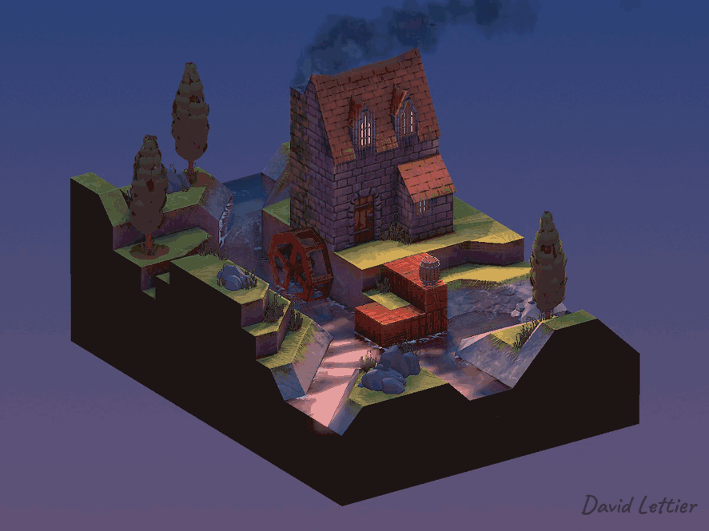
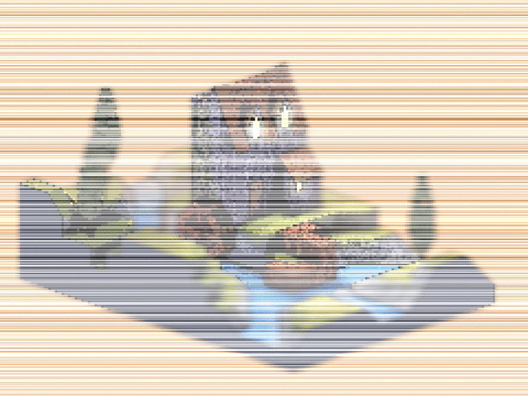
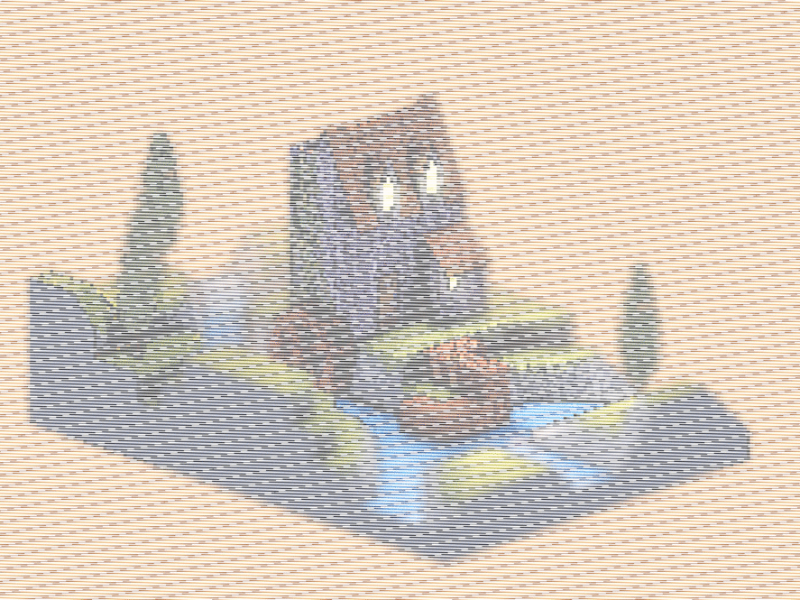

[:arrow_backward:](dilation.md)
[:arrow_double_up:](../README.md)
[:arrow_up_small:](#)
[:arrow_down_small:](#copyright)
[:arrow_forward:](lookup-table.md)

# 3D 游戏着色器入门

## 胶片颗粒（Film Grain）

<p align="center">

</p>

胶片颗粒效果（如果应用得当、不过度），可以悄无声息地增加画面的真实感。  
通常来说，正是这些“瑕疵”让数字图像看起来更可信。  
在着色器流程中，胶片颗粒通常是游戏画面输出前的最后一个后处理效果。

### 强度控制

```c
  // ...

  float amount = 0.1;

  // ...
```

`amount` 控制胶片颗粒的可见程度。  
将其调高可以营造出类似雪花的效果。

### 随机强度

```c
// ...

uniform float osg_FrameTime;

  //...

  float toRadians = 3.14 / 180;

    //...

    float randomIntensity =
      fract
        ( 10000
        * sin
            (
              ( gl_FragCoord.x
              + gl_FragCoord.y
              * osg_FrameTime
              )
            * toRadians
            )
        );

    // ...
```

这段代码用于计算每个片元的随机强度，用于调节噪声。

```text
Time Since F1 = 00 01 02 03 04 05 06 07 08 09 10
Frame Number  = F1    F3    F4       F5 F6
osg_FrameTime = 00    02    04       07 08
```

`osg_FrameTime` 是由 [Panda3D 提供](https://github.com/panda3d/panda3d/blob/daa57733cb9b4ccdb23e28153585e8e20b5ccdb5/panda/src/display/graphicsStateGuardian.cxx#L930) 的帧时间，表示从第一帧开始经过的秒数。  
演示代码利用这个时间戳为胶片颗粒动画提供变化，使每一帧都略有不同。

```c

              // ...

              ( gl_FragCoord.x
              + gl_FragCoord.y
              * 8009 // Large number here.

              // ...
```

如果你想要静态噪点效果，可以将 `osg_FrameTime` 替换成一个较大的常数。  
你可能需要多试几个数值，来避免出现重复图案。

<p align="center">

</p>

```c
        // ...

        * sin
            (
              ( gl_FragCoord.x
              + gl_FragCoord.y
              * someNumber

              // ...
```

将 `x` 和 `y` 坐标同时作为输入，能够产生颗粒状分布。  
如果只使用 `x`，会出现垂直条纹；  
只用 `y`，则会出现水平条纹。  
乘以某个数值是为了打破对角对称性。

<p align="center">

</p>

当然，也可以去掉乘数，获得类似雨滴的效果。  
为了使雨滴动起来，可以把 `sin` 的输出再乘以 `osg_FrameTime`。

```c
              // ...

              ( gl_FragCoord.x
              + gl_FragCoord.y

              // ...
```

调整 `x` 与 `y` 的参与方式可以改变“雨滴”落下的方向。  
只保留 `x` 坐标可模拟垂直下落的雨线。

```text
input = (gl_FragCoord.x + gl_FragCoord.y * osg_FrameTime) * toRadians
  frame(10000 * sin(input)) =
    fract(10000 * sin(6.977777777777778)) =
      fract(10000 * 0.6400723818964882) =
```

`sin` 在这里被用作哈希函数。  
每个片元的坐标经过 `sin` 运算后被压缩到 -1 到 1 的范围，从而产生看似随机的值。

```text
fract(10000 * sin(6.977777777777778)) =
  fract(10000 * 0.6400723818964882) =
    fract(6400.723818964882) =
      0.723818964882
```

结合 `fract` 使用时，`sin` 也可作为伪随机数生成器。

```python
>>> [floor(fract(4     * sin(x * toRadians)) * 10) for x in range(0, 10)]
[0, 0, 1, 2, 2, 3, 4, 4, 5, 6]

>>> [floor(fract(10000 * sin(x * toRadians)) * 10) for x in range(0, 10)]
[0, 4, 8, 0, 2, 1, 7, 0, 0, 5]
```

可以看到第二组数比第一组更“随机”，尽管它们本质上都是确定性输出。  
这说明 `fract(10000 * sin(...))` 虽然是可预测的，但很难察觉出规律。

<p align="center">

</p>

上图展示了 `sin` 乘数从 1、10、100 到 1000 的变化过程。  
乘数越大，图案越混乱。  
这也是为什么示例中使用了 `10000` 作为乘数。

### 设置片元颜色

```c
  // ...

  vec2 texSize  = textureSize(colorTexture, 0).xy;
  vec2 texCoord = gl_FragCoord.xy / texSize;

  vec4 color = texture(colorTexture, texCoord);

  // ...
```

将片元坐标转换为 UV 坐标，并使用该坐标从纹理中采样颜色。

```c
    // ...

    amount *= randomIntensity;

    color.rgb += amount;

    // ...
```

将随机强度乘上总强度，并叠加到颜色上。

```c
  // ...

  fragColor = color;

  // ...
```

设置最终的片元颜色，大功告成。

### 源码参考

- [main.cxx](../demonstration/src/main.cxx)
- [basic.vert](../demonstration/shaders/vertex/basic.vert)
- [film-grain.frag](../demonstration/shaders/fragment/film-grain.frag)


## Copyright

(C) 2019 David Lettier
<br>
[lettier.com](https://www.lettier.com)

[:arrow_backward:](dilation.md)
[:arrow_double_up:](../README.md)
[:arrow_up_small:](#)
[:arrow_down_small:](#copyright)
[:arrow_forward:](lookup-table.md)
