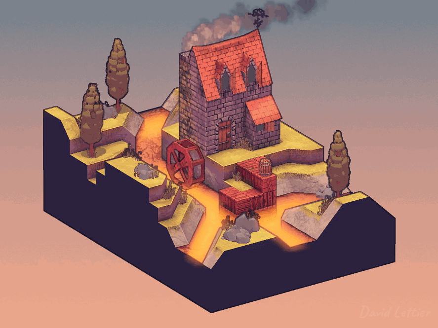
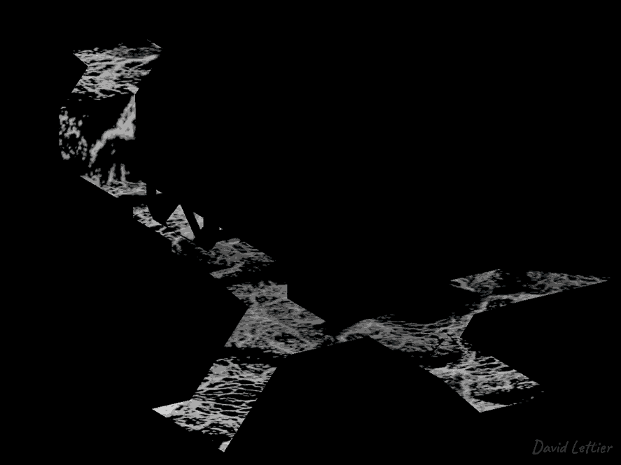
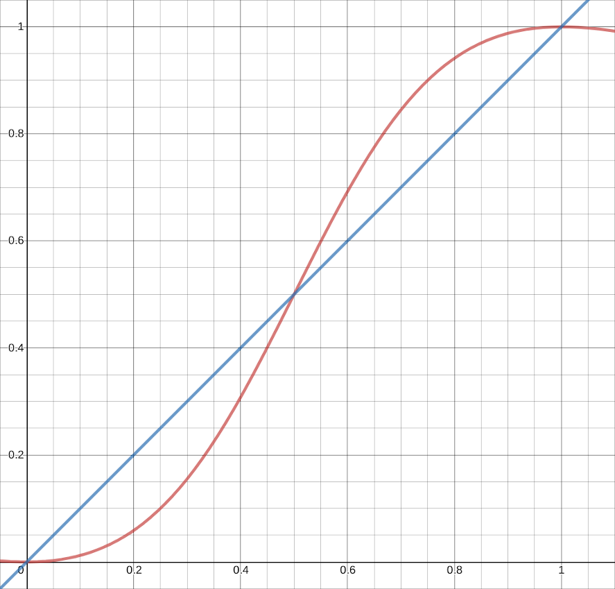

[:arrow_backward:](screen-space-refraction.md)
[:arrow_double_up:](../README.md)
[:arrow_up_small:](#)
[:arrow_down_small:](#copyright)
[:arrow_forward:](flow-mapping.md)

# 3D 游戏着色器入门教程

## 泡沫（Foam）

<p align="center">

</p>

泡沫通常用于模拟水体表面。  
每当水流受到扰动，就可以添加一些泡沫。  
虽然泡沫本身很简单，但它能很好地将水体与周围场景连接起来。

<p align="center">

</p>

当然不必局限于水体。  
例如你可以使用相同的技术来制作熔岩河流。

### 顶点位置

和 [屏幕空间折射](screen-space-refraction.md) 一样，  
你需要获取前景和背景的顶点位置：  
- 前景包含泡沫表面的场景  
- 背景是不含泡沫的原始场景  

关于如何获取视空间中的顶点位置，可以参考 [SSAO](ssao.md#vertex-positions) 章节。

### 蒙版（Mask）

<p align="center">

</p>

你需要使用一张泡沫蒙版纹理来标记泡沫区域。  
示例程序中将除水面以外的部分全部遮罩，  
并在水面上贴图泡沫图案。

```c
// ...

uniform sampler2D foamPatternTexture;

in vec2 diffuseCoord;

out vec4 fragColor;

void main() {
  vec4 foamPattern = texture(foamPatternTexture, diffuseCoord);

  fragColor = vec4(vec3(dot(foamPattern.rgb, vec3(1)) / 3), 1);
}
```

这段片元着色器生成泡沫蒙版。  
它使用漫反射 UV 坐标将泡沫图案贴到几何体表面。  
对除水面外的所有模型，shader 使用纯黑色纹理作为 `foamPatternTexture`。

```c
  // ...

  fragColor = vec4(vec3(dot(foamPattern.rgb, vec3(1)) / 3), 1);

  // ...
```

将泡沫颜色转换为灰度值，这是为了安全起见，  
因为后续泡沫着色器预期泡沫蒙版是灰度图。

### Uniforms

```c
// ...

uniform sampler2D maskTexture;
uniform sampler2D positionFromTexture;
uniform sampler2D positionToTexture;

// ...
```

泡沫着色器接收：
- 泡沫蒙版纹理
- 前景顶点位置（`positionFromTexture`）
- 背景顶点位置（`positionToTexture`）

### 参数设置

```c
  // ...

  float foamDepth = 4;
  vec4  foamColor = vec4(0.8, 0.85, 0.92, 1);

  // ...
```

你可以调整泡沫的“深度”和颜色。  
`foamDepth` 控制泡沫出现的厚度，值越大，泡沫面积越大。

### 距离计算

```c
  // ...

  vec4 positionFrom = texture(positionFromTexture, texCoord);
  vec4 positionTo   = texture(positionToTexture,   texCoord);

  float depth  = (positionTo.xyz - positionFrom.xyz).y;

  // ...
```

计算前景与背景之间的距离。  
由于这些位置是视空间下的坐标，因此只需要 Y 方向的分量。

### 泡沫权重计算

```c
  // ...

  float amount  = clamp(depth / foamDepth.x, 0, 1);
        amount  = 1 - amount;
        amount *= mask.r;
        amount  = amount * amount / (2 * (amount * amount - amount) + 1);

  // ...
```

泡沫量（`amount`）取决于深度、泡沫深度参数和蒙版值。

<p align="center">

</p>

```c
        // ...

        amount  = amount * amount / (2 * (amount * amount - amount) + 1);

        // ...
```

使用缓动函数（easing function）对泡沫量进行重塑，  
可以让深度靠近 0 的区域拥有较多泡沫，接近 `foamDepth` 的区域几乎无泡沫。

### 设置片元颜色

```c
  // ...

  fragColor = mix(vec4(0), foamColor, amount);

  // ...
```

最终的片元颜色是黑色透明与泡沫颜色的混合，按 `amount` 权重插值。

### 源码参考

- [main.cxx](../demonstration/src/main.cxx)
- [base.vert](../demonstration/shaders/vertex/base.vert)
- [basic.vert](../demonstration/shaders/vertex/basic.vert)
- [position.frag](../demonstration/shaders/fragment/position.frag)
- [foam-mask.frag](../demonstration/shaders/fragment/foam-mask.frag)
- [foam.frag](../demonstration/shaders/fragment/foam.frag)
- [base-combine.frag](../demonstration/shaders/fragment/base-combine.frag)


## Copyright

(C) 2019 David Lettier
<br>
[lettier.com](https://www.lettier.com)

[:arrow_backward:](screen-space-refraction.md)
[:arrow_double_up:](../README.md)
[:arrow_up_small:](#)
[:arrow_down_small:](#copyright)
[:arrow_forward:](flow-mapping.md)
