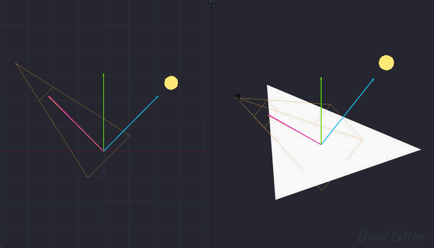

[:arrow_backward:](blinn-phong.md)
[:arrow_double_up:](../README.md)
[:arrow_up_small:](#)
[:arrow_down_small:](#copyright)
[:arrow_forward:](rim-lighting.md)

# 3D 游戏着色器入门教程

## 菲涅尔因子（Fresnel Factor）

<p align="center">

</p>

菲涅尔因子会根据相机或观察角度改变表面的反射性。  
当表面背向相机时，其反射性增强；  
而当表面朝向相机时，其反射性减弱。

<p align="center">

</p>

换句话说，当表面与相机方向垂直时，它会变得更像镜面。  
利用这个特性，你可以动态控制反射的不透明度  
（例如 [镜面反射](lighting.md#specular) 和 [屏幕空间反射](screen-space-reflection.md)），  
或者调整表面的 Alpha 值，让效果更逼真自然。

### 镜面反射

<p align="center">

</p>

```c
  vec4 specular =   materialSpecularColor
                  * lightSpecularColor
                  * pow(max(dot(eye, reflection), 0.0), shininess);
```

在 [光照](lighting.md#specular) 一章中，  
镜面反射部分是由材质的高光颜色、光源的高光颜色、  
以及相机是否朝向光的反射方向这三者组合而成。  
引入菲涅尔因子后，  
我们将根据相机与表面之间的夹角动态调整材质的高光颜色。

```c
  // ...

  vec3 eye = normalize(-vertexPosition.xyz);

  // ...
```

首先你需要观察向量（eye/view/camera vector）。  
它从当前顶点指向相机方向。  
如果顶点坐标是视图空间中的，  
那么观察向量就是该顶点的反方向。

```c
  // ...

  vec3 light   = normal(lightPosition.xyz - vertexPosition.xyz);
  vec3 halfway = normalize(light + eye);

  // ...
```

菲涅尔因子可以用两个向量计算，最简单的是用观察向量和法线向量。  
如果你在使用 [Blinn-Phong 模型](blinn-phong.md)，  
也可以用 halfway 向量与观察向量计算。

```c
  // ...

  float fresnelFactor = dot(halfway, eye); // 或 dot(normal, eye)
        fresnelFactor = max(fresnelFactor, 0.0);
        fresnelFactor = 1.0 - fresnelFactor;
        fresnelFactor = pow(fresnelFactor, fresnelPower);

  // ...
```

有了这些向量之后，就可以计算菲涅尔因子了。  
它的范围是 0 到 1。  
当 dot 值为 1 时，菲涅尔因子为 0；  
当 dot 值为 0 或更小时，菲涅尔因子为 1。  
这个公式来源于 [Schlick 近似](https://en.wikipedia.org/wiki/Schlick%27s_approximation)。

<p align="center">

</p>

在 Schlick 的近似中，`fresnelPower` 默认是 5，  
你可以根据需要修改。  
演示代码中，它通过高光贴图的蓝色通道控制，最大值为 5。

```c
  // ...

  materialSpecularColor.rgb = mix(materialSpecularColor.rgb, vec3(1.0), fresnelFactor);

  // ...
```

当计算出菲涅尔因子之后，  
用它混合材质的镜面反射颜色。  
随着因子接近 1，材质变得越来越像镜子。

```c
  // ...

  vec4 specular      = vec4(vec3(0.0), 1.0);
       specular.rgb  =   materialSpecularColor.rgb
                       * lightSpecularColor.rgb
                       * pow
                          ( max(dot(normal, halfway), 0.0) // 或 max(dot(reflection, eye), 0.0)
                          , shininess
                          );

  // ...
```

最终，镜面反射部分仍然是材质高光、光源高光与视角方向的组合。  
不过通过引入菲涅尔因子，材质的高光颜色会根据视角变化而变化，  
带来更加真实的视觉效果。

### 源码参考

- [main.cxx](../demonstration/src/main.cxx)
- [base.vert](../demonstration/shaders/vertex/base.vert)
- [base.frag](../demonstration/shaders/fragment/base.frag)

## Copyright

(C) 2020 David Lettier
<br>
[lettier.com](https://www.lettier.com)

[:arrow_backward:](blinn-phong.md)
[:arrow_double_up:](../README.md)
[:arrow_up_small:](#)
[:arrow_down_small:](#copyright)
[:arrow_forward:](rim-lighting.md)
