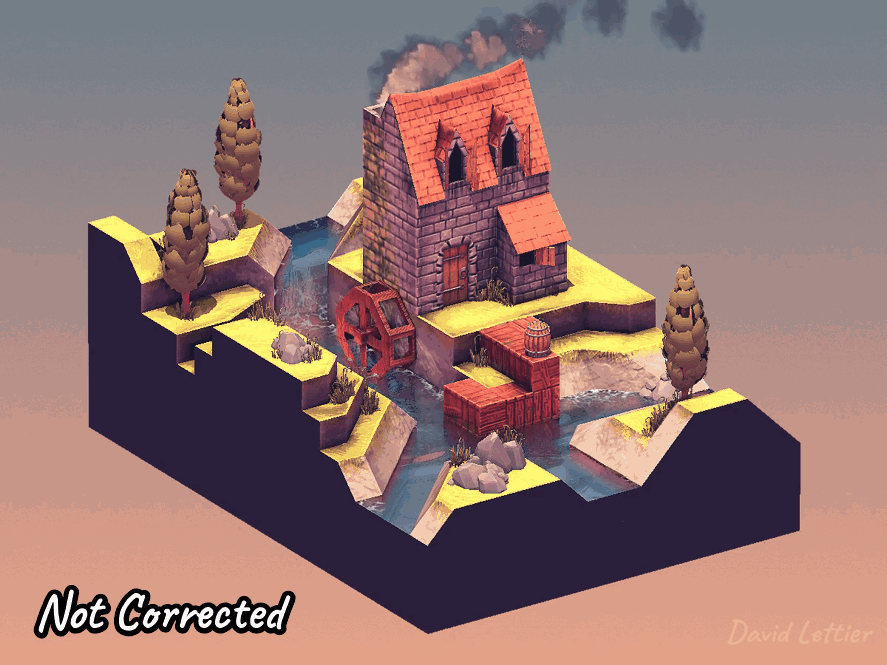
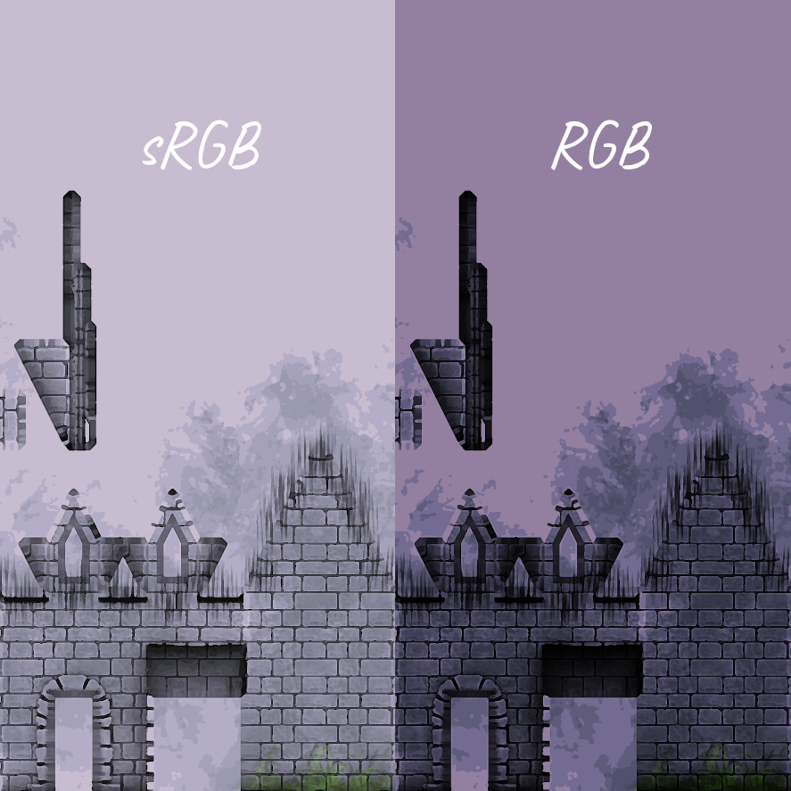
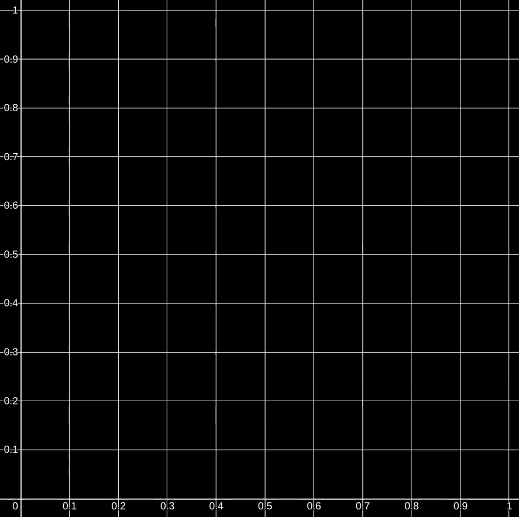
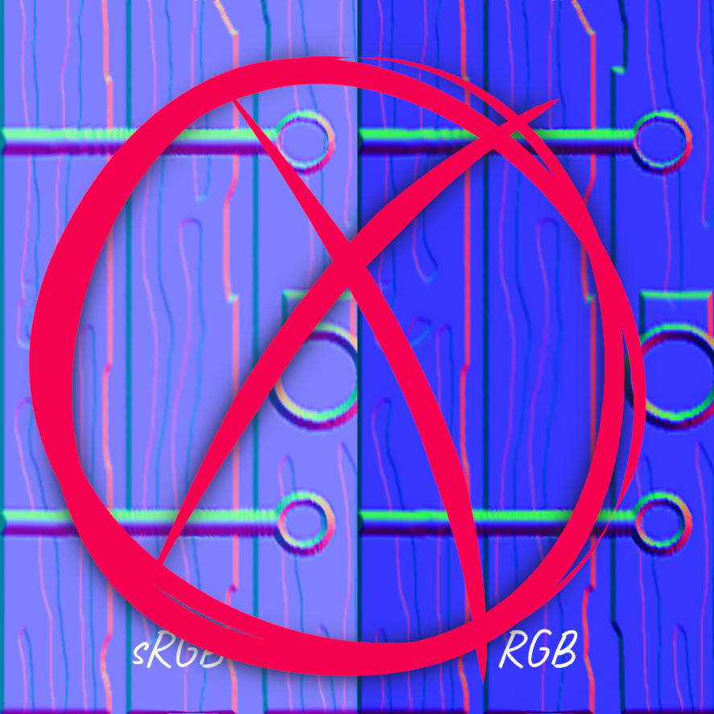
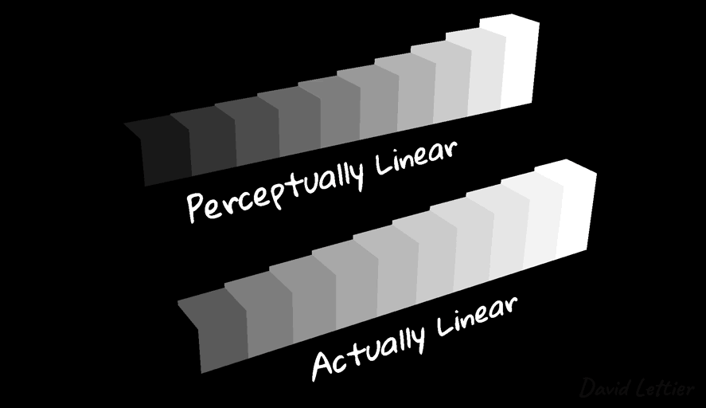
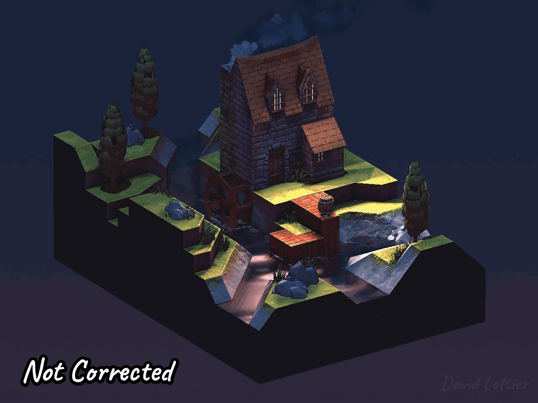

[:arrow_backward:](lookup-table.md)
[:arrow_double_up:](../README.md)
[:arrow_up_small:](#)
[:arrow_down_small:](#copyright)
[:arrow_forward:](setup.md)

# 3D 游戏着色器入门教程

## 伽马校正（Gamma Correction）

<p align="center">

</p>

伽马校正能让你的颜色计算看起来更合理。  
这并不意味着画面一定惊艳，但校正后，颜色融合得更自然，  
阴影更细腻，高光也更柔和。  
如果没有伽马校正，阴影区域常常会被“压死”，  
而高光区域则容易过曝、饱和度过高，导致对比度刺眼。

如果你追求真实感，伽马校正尤为重要。  
因为随着计算步骤的增多，微小的误差会累积，  
让真实感难以实现。即使公式没错，输入输出的偏差也会让你挫败。

伽马校正听起来很绕，但其实归根结底就是：  
**弄清颜色所属的颜色空间，以及如何把它转换到你需要的颜色空间。**  
理解了这两点，伽马校正就变成了一项繁琐但简单的日常工作。

### 颜色空间（Color Spaces）

<p align="center">

</p>

你需要关注的两个颜色空间是：  
**sRGB（标准红绿蓝）** 和 **RGB（线性色彩空间）**。

```bash
identify -format "%[colorspace]\n" house-diffuse-srgb.png
sRGB

identify -format "%[colorspace]\n" house-diffuse-rgb.png
RGB
```

想知道一张贴图属于哪个颜色空间，可以用 ImageMagick 的 `identify` 命令。  
大部分贴图通常都是 sRGB 编码的。

```bash
convert house-diffuse-srgb -colorspace rgb house-diffuse-rgb.png
```

你也可以使用 `convert` 命令把贴图转换到目标颜色空间。  
从 sRGB 转换到 RGB 后，贴图通常会变暗。

### 解码（Decoding）

sRGB 颜色贴图中的红绿蓝值是**经过编码的**，不能直接修改。  
直接操作这些值，就像在加密邮件上运行拼写检查一样。  
你得先“解密”它，才能正确修改。

```c
  // ...

  color     = texture(color_texture, uv);
  color.rgb = pow(color.rgb, 2.2);

  // ...
```

要解码一张 sRGB 颜色，  
只需把其 `rgb` 分量提升到 `2.2` 次方。  
完成解码后，你就可以对它进行加减乘除运算了。

通过这种转换，  
颜色会从 sRGB 空间变换到线性 RGB 空间，  
颜色也会变得更暗一些。

<p align="center">

</p>

例如：  
`vec3(0.9, 0.2, 0.3)` 解码后变成 `vec3(0.793, 0.028, 0.07)`。

<p align="center">

</p>

`2.2` 就是所谓的伽马值（gamma）。  
通俗来讲，gamma 可能取 `1.0 / 2.2`、`2.2` 或 `1.0`。  
其中：

- `2.2` 用于**解码** sRGB。
- `1.0 / 2.2` 用于**编码** RGB。
- `1.0` 表示已经是线性空间，没必要变换。

#### 非颜色数据（Non-color Data）

<p align="center">

</p>

有一种情况你**不应该解码**，  
那就是贴图中的“颜色”其实代表的是非颜色数据，比如：

- 法线贴图（normal map）
- Alpha 通道
- 高度图（height map）
- 流动图（flow map）

这类数据虽然长得像颜色，但实则是向量或数值信息。  
遇到这种情况，直接当作线性空间使用，**跳过解码**。

### 编码（Encoding）

<p align="center">

</p>

之所以需要编码/解码，是因为：

1. **人眼对亮度的感知并不是线性的**；
2. **大多数显示器色深有限，显示能力不够线性**。

由于人类对暗部更敏感，  
所以 sRGB 编码会在暗色区域分配更多比特数，  
让有限的色彩信息更符合视觉感知。

所以，**显示器期望接收到的是 sRGB 编码后的值。**  
你一旦解码使用过，就必须在输出前重新编码。

```c
  // ...

  color     = texture(color_texture, uv);
  color.rgb = pow(color.rgb, 1.0 / 2.2);

  // ...
```

编码方式与解码正好相反。  
把颜色分量提升到 `1.0 / 2.2` 次方即可完成编码。  
`1.0 / 2.2` 就是 `2.2` 的倒数。

<p align="center">

</p>

### 源码参考

- [main.cxx](../demonstration/src/main.cxx)
- [basic.vert](../demonstration/shaders/vertex/basic.vert)
- [gamma-correction.frag](../demonstration/shaders/fragment/gamma-correction.frag)


## Copyright

(C) 2020 David Lettier
<br>
[lettier.com](https://www.lettier.com)

[:arrow_backward:](lookup-table.md)
[:arrow_double_up:](../README.md)
[:arrow_up_small:](#)
[:arrow_down_small:](#copyright)
[:arrow_forward:](setup.md)
