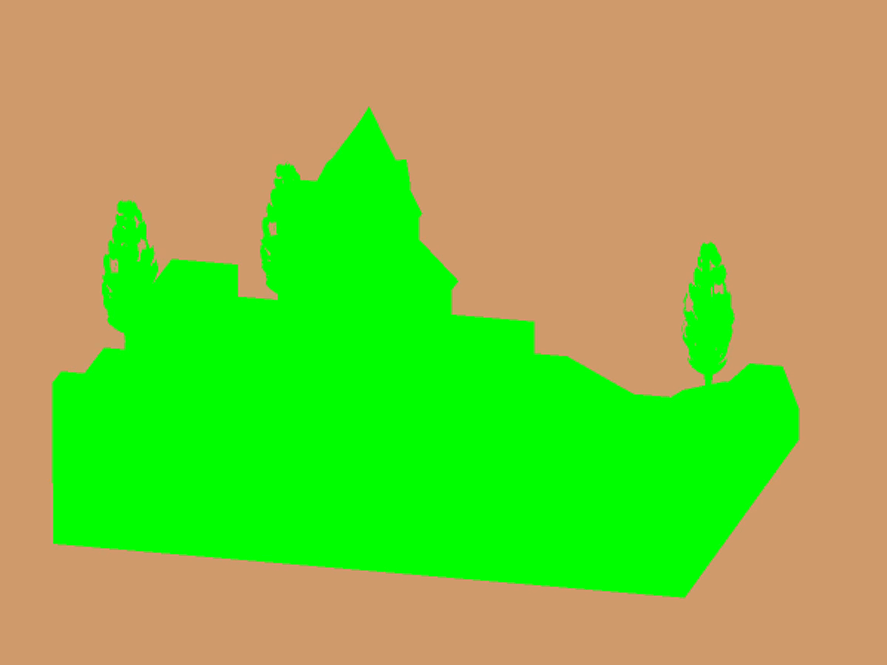

[:arrow_backward:](reference-frames.md)
[:arrow_double_up:](../README.md)
[:arrow_up_small:](#)
[:arrow_down_small:](#copyright)
[:arrow_forward:](render-to-texture.md)

# 3D 游戏着色器入门教程指南

## GLSL

<p align="center">

</p>

与其使用 [固定功能](https://en.wikipedia.org/wiki/Fixed-function) 渲染管线，  
你将使用可编程的 GPU 渲染管线。  
由于它是可编程的，因此你需要以着色器（shader）的形式提供程序逻辑。  
着色器是你用类似 C 语言语法编写的（通常是小型的）程序。  
可编程的 GPU 渲染管线包含多个可由着色器控制的阶段。  
着色器的类型包括：顶点着色器（vertex）、细分着色器（tessellation）、几何着色器（geometry）、片段着色器（fragment）以及计算着色器（compute）。  
在下面的技术中，你只需要关注顶点和片段两个阶段。

```c
#version 150

void main() {}
```

上面是一个极简的 GLSL 着色器，仅包含版本声明和主函数 `main`。

```c
#version 150

uniform mat4 p3d_ModelViewProjectionMatrix;

in vec4 p3d_Vertex;

void main()
{
  gl_Position = p3d_ModelViewProjectionMatrix * p3d_Vertex;
}
```

这是一个简化版的 GLSL 顶点着色器，它将输入顶点转换为裁剪空间（clip space），  
并将新位置作为该顶点的齐次坐标（homogeneous position）输出。  
`main` 函数返回值为 `void`，`gl_Position` 是一个内建的输出变量。

请注意关键字 `uniform` 和 `in`：  
- `uniform` 表示该全局变量对所有顶点是相同的。  
  Panda3D 会为你设置 `p3d_ModelViewProjectionMatrix`，该矩阵对所有顶点一致。  
- `in` 表示该变量是传入给着色器使用的。  
  顶点着色器会依次接收组成模型几何体的每一个顶点。

```c
#version 150

out vec4 fragColor;

void main() {
  fragColor = vec4(0, 1, 0, 1);
}
```

这是一个简化的 GLSL 片段着色器（fragment shader），它将输出颜色设为纯绿色。  
请记住，一个片段（fragment）最多影响一个屏幕像素，但一个像素可能被多个片段影响。

注意关键字 `out`：  
- `out` 表示该全局变量是由着色器设置的。  
- `fragColor` 是一个自定义的变量名，你可以任意命名。

<p align="center">

</p>

这是上述两个着色器的输出效果。

## Copyright

(C) 2019 David Lettier
<br>
[lettier.com](https://www.lettier.com)

[:arrow_backward:](reference-frames.md)
[:arrow_double_up:](../README.md)
[:arrow_up_small:](#)
[:arrow_down_small:](#copyright)
[:arrow_forward:](render-to-texture.md)
