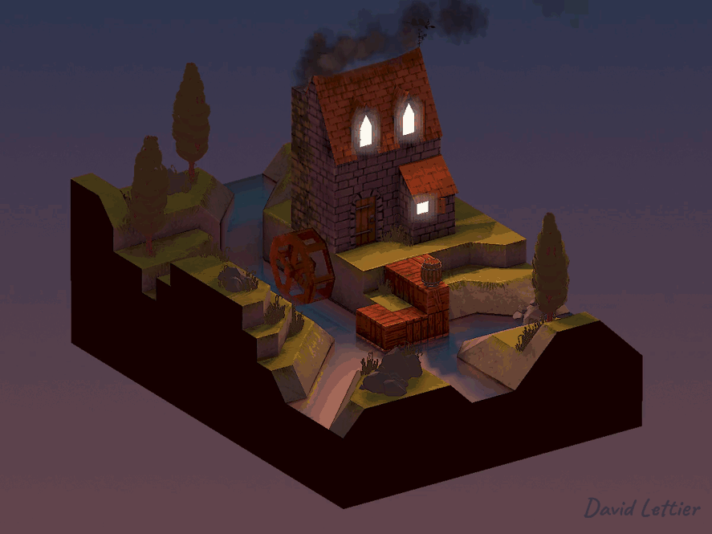
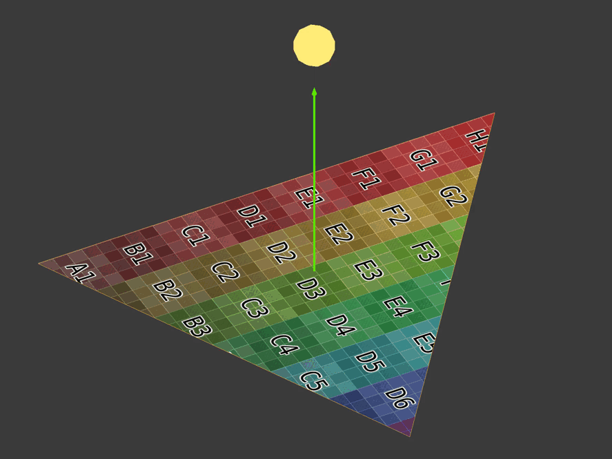
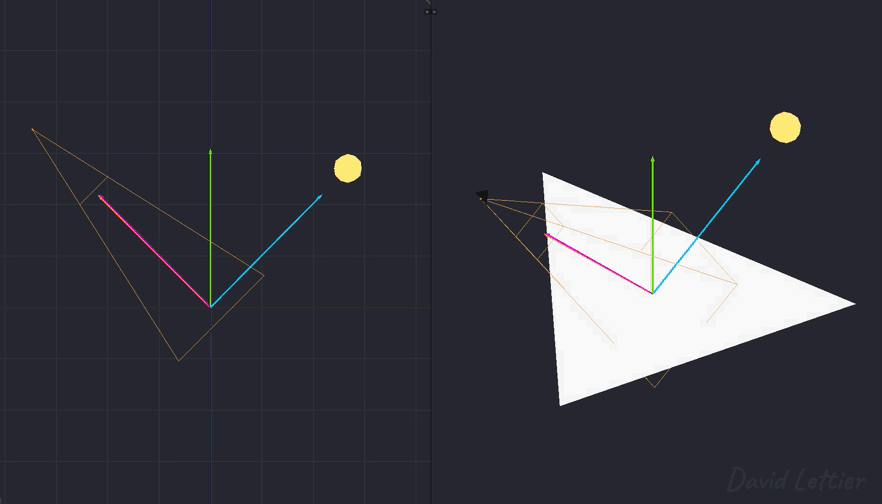
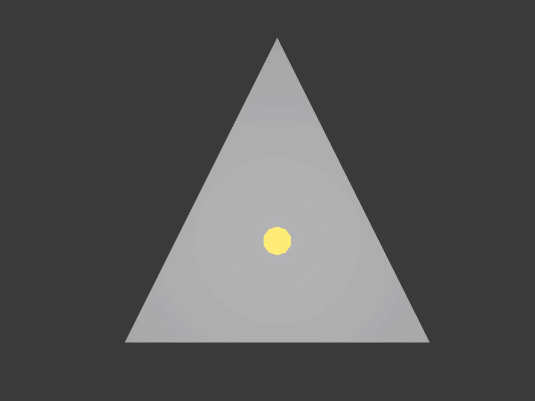
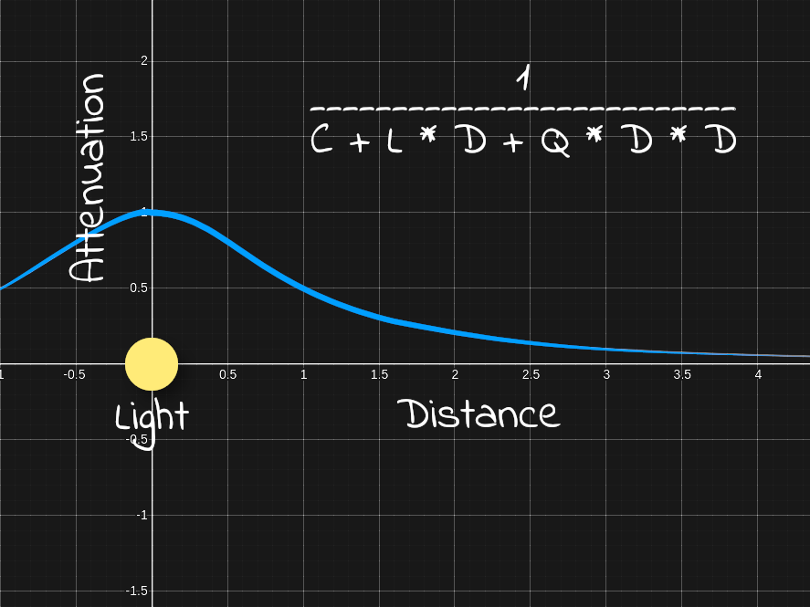

[:arrow_backward:](texturing.md)
[:arrow_double_up:](../README.md)
[:arrow_up_small:](#)
[:arrow_down_small:](#copyright)
[:arrow_forward:](blinn-phong.md)

# 3D 游戏着色器入门教程

## 光照

<p align="center">

</p>

完成光照计算需要计算并组合环境光、漫反射光、高光以及自发光部分。  
示例代码使用的是Phong或Blinn-Phong光照模型。

### 顶点着色器

```c
// ...

uniform struct p3d_LightSourceParameters
  { vec4 color

  ; vec4 ambient
  ; vec4 diffuse
  ; vec4 specular

  ; vec4 position

  ; vec3  spotDirection
  ; float spotExponent
  ; float spotCutoff
  ; float spotCosCutoff

  ; float constantAttenuation
  ; float linearAttenuation
  ; float quadraticAttenuation

  ; vec3 attenuation

  ; sampler2DShadow shadowMap

  ; mat4 shadowViewMatrix
  ;
  } p3d_LightSource[NUMBER_OF_LIGHTS];

// ...
```

对于每个灯光（除环境光外），Panda3D会提供这个方便的结构体，  
该结构体在顶点着色器和片元着色器中均可访问。  
其中最方便的是阴影贴图和阴影视图矩阵，用于将顶点转换到阴影空间或光源空间。

```c
  // ...

  vertexPosition = p3d_ModelViewMatrix * p3d_Vertex;

  // ...

  for (int i = 0; i < p3d_LightSource.length(); ++i) {
    vertexInShadowSpaces[i] = p3d_LightSource[i].shadowViewMatrix * vertexPosition;
  }

  // ...
```

在顶点着色器中，需要把顶点位置从视图空间转换到每个光源的阴影空间或光源空间，  
这一步后续在片元着色器中用于阴影渲染。  
阴影空间或光源空间是以光源位置为原点的坐标系。

### 片元着色器

大部分光照计算都发生在片元着色器中。

#### 材质

```c
// ...

uniform struct
  { vec4 ambient
  ; vec4 diffuse
  ; vec4 emission
  ; vec3 specular
  ; float shininess
  ;
  } p3d_Material;

// ...
```

Panda3D为当前渲染的网格或模型提供材质信息（结构体形式）。

#### 多灯光处理

```c
  // ...

  vec4 diffuse  = vec4(0.0, 0.0, 0.0, diffuseTex.a);
  vec4 specular = vec4(0.0, 0.0, 0.0, diffuseTex.a);

  // ...
```

在遍历场景中的所有灯光前，先创建累加变量用于累计漫反射色和高光色。

```c
  // ...

  for (int i = 0; i < p3d_LightSource.length(); ++i) {
    // ...
  }

  // ...
```

现在可以遍历所有灯光，计算每个灯光贡献的漫反射色和高光色。

#### 相关光照向量

<p align="center">

</p>

下图展示了计算漫反射和高光所需的四个主要向量：  
光线方向向量（浅蓝色箭头，指向光源），  
法线向量（绿色箭头，垂直表面），  
反射向量（深蓝色箭头，光线方向相对于法线的反射），  
视线向量（橙色箭头，指向摄像机）。

```c
    // ...

    vec3 lightDirection =
        p3d_LightSource[i].position.xyz
      - vertexPosition.xyz
      * p3d_LightSource[i].position.w;

    // ...
```

光线方向向量是从顶点位置指向光源位置。

Panda3D中，如果光源是方向光，`p3d_LightSource[i].position.w` 会被设为0。  
方向光没有具体位置，只有方向。  
此时，光线方向是方向光方向的相反方向（Panda3D中`p3d_LightSource[i].position.xyz`存储的是方向光的负方向）。

```c
  // ...

  normal = normalize(vertexNormal);

  // ...
```

需要将顶点法线标准化为单位向量（长度为1）。

```c
    // ...

    vec3 unitLightDirection = normalize(lightDirection);
    vec3 eyeDirection       = normalize(-vertexPosition.xyz);
    vec3 reflectedDirection = normalize(-reflect(unitLightDirection, normal));

    // ...
```

接着需要计算三个单位向量：

- 单位光线方向（标准化光线方向向量，长度为1），  
- 视线方向（从顶点指向摄像机，顶点位置为视图空间坐标，故取负），  
- 反射方向（光线方向相对于法线的反射向量，需取反使其指向视线方向）。

[反射向量详解](http://asawicki.info/news_1301_reflect_and_refract_functions.html)  
光线射向表面时，会按照入射角反射出去，反射角等于入射角。

反射向量需要取反，使其方向和视线向量一致。  
反射向量用于计算高光强度。

#### 漫反射

```c
    // ...

    float diffuseIntensity  = dot(normal, unitLightDirection);

    if (diffuseIntensity < 0.0) { continue; }

    // ...
```

漫反射强度是法线与光线方向单位向量的点积。  
点积范围是-1到1。  
如果两个向量方向相同，点积为1；否则小于1。

<p align="center">

</p>

光线方向越接近法线方向，漫反射强度越接近1。

```c
    // ...

    if (diffuseIntensity < 0.0) { continue; }

    // ...
```

漫反射强度小于等于0时，跳过当前灯光，继续下一灯光。

```c
    // ...

    vec4 diffuseTemp =
      vec4
        ( clamp
            (   diffuseTex.rgb
              * p3d_LightSource[i].diffuse.rgb
              * diffuseIntensity
            , 0
            , 1
            )
        , diffuseTex.a
        );

    diffuseTemp = clamp(diffuseTemp, vec4(0), diffuseTex);

    // ...
```

计算该灯光贡献的漫反射颜色。  
漫反射强度为1时，漫反射颜色是漫反射贴图颜色和灯光颜色的乘积。  
强度较小时，颜色更暗。

注意这里将漫反射颜色限制(clamp)为不超过漫反射贴图颜色，  
避免场景过曝。  
创建漫反射贴图时，假设它们是在完全照明下的颜色。

#### 高光

漫反射之后计算高光。

<p align="center">

</p>

```c
    // ...

    float specularIntensity = max(dot(reflectedDirection, eyeDirection), 0);

    vec4 specularTemp =
      clamp
        (   vec4(p3d_Material.specular, 1)
          * p3d_LightSource[i].specular
          * pow
              ( specularIntensity
              , p3d_Material.shininess
              )
        , 0
        , 1
        );

    // ...
```

高光强度是视线方向与反射方向的点积（最大值不低于0）。  
两个向量方向越一致，高光强度越大。

<p align="center">

</p>

材质的高光强度指数（shininess）决定高光的集中程度，  
数值越大，高光越集中。  
一般在建模软件如Blender中设置，Blender里称为高光硬度。

#### 聚光灯

```c
    // ...

    float unitLightDirectionDelta =
      dot
        ( normalize(p3d_LightSource[i].spotDirection)
        , -unitLightDirection
        );

    if (unitLightDirectionDelta < p3d_LightSource[i].spotCosCutoff) { continue; }

    // ...
}
```

这段代码用于剔除聚光灯光锥外的片元。  
Panda3D同时设置了`spotDirection`和`spotCosCutoff`以支持方向光和点光。  
聚光灯有位置和方向，方向光只有方向，点光只有位置。  
这段代码统一支持三种灯光，避免大量条件判断。

```c
        // ...

        , -unitLightDirection

        // ...
```

这里对`unitLightDirection`取负。  
`unitLightDirection`是从片元指向光源的方向，需要反向变为从光源指向片元，  
因为`spotDirection`是聚光灯中心方向向外的单位向量。


```c
spotCosCutoff = cosine(0.5 * spotlightLensFovAngle);
```

对于聚光灯，如果片元到光源方向向量与聚光灯方向向量的点积小于聚光灯视锥角一半余弦值，着色器将忽略该光源的影响。

对于方向光和点光，Panda3D 会将 `spotCosCutoff` 设置为 -1。  
点积范围是 -1 到 1，  
所以无论 `unitLightDirectionDelta` 是多少，它总是大于或等于 -1。

```c
    // ...

    diffuseTemp *= pow(unitLightDirectionDelta, p3d_LightSource[i].spotExponent);

    // ...
```

和 `unitLightDirectionDelta` 判断类似，这段代码对所有三种光源都适用。  
对于聚光灯，这会让靠近聚光灯中心的片元更亮。  
对于方向光和点光，`spotExponent` 为 0，  
任何数的 0 次方都为 1，漫反射颜色不变。

#### 阴影

```c
    // ...

    float shadow =
      textureProj
        ( p3d_LightSource[i].shadowMap
        , vertexInShadowSpaces[i]
        );

    diffuseTemp.rgb  *= shadow;
    specularTemp.rgb *= shadow;

    // ...
```

Panda3D 为每个场景光源提供阴影贴图和阴影变换矩阵，使得应用阴影相对简单。  
如果你想自己实现阴影变换矩阵，  
需要构建一个矩阵，将视图空间坐标转换到光源空间（坐标以光源为原点）。  
若要自己制作阴影贴图，需要从光源视角渲染场景到帧缓冲纹理，  
该纹理存储从光源到片元的距离，称为“深度图”。  
最后你需将自制的深度图作为 `uniform sampler2DShadow`，阴影变换矩阵作为 `uniform mat4` 传入着色器。  
到这一步，你就重现了 Panda3D 自动帮你完成的功能。

此处用到的 `textureProj` 与之前的 `texture` 函数不同，  
`textureProj` 会先将 `vertexInShadowSpaces[i].xyz` 除以 `vertexInShadowSpaces[i].w`，  
然后用 xy 坐标定位深度图中的深度值，  
接着用 z 坐标将该片元的深度与深度图深度比较。  
比较通过则返回 1，表示该片元未被阴影遮挡；否则返回 0，表示片元处于阴影中。

`textureProj` 也可能返回 0 到 1 之间的值，取决于阴影贴图的设置。  
这种情况下，`textureProj` 会对邻近深度值进行多重深度测试，返回加权平均值，  
从而获得更柔和的阴影效果。

#### 衰减

<p align="center">

</p>

```c
    // ...

    float lightDistance = length(lightDirection);

    float attenuation =
        1
      / ( p3d_LightSource[i].constantAttenuation
        + p3d_LightSource[i].linearAttenuation
        * lightDistance
        + p3d_LightSource[i].quadraticAttenuation
        * (lightDistance * lightDistance)
        );

    diffuseTemp.rgb  *= attenuation;
    specularTemp.rgb *= attenuation;

    // ...
```

光源距离即光线方向向量的长度（不是归一化后的方向，否则长度恒为1）。

计算衰减时需要距离值，  
衰减表示光照影响会随着距离增加而减弱。

你可以任意设置 `constantAttenuation`、`linearAttenuation` 和 `quadraticAttenuation`。  
一个合理的起点是：`constantAttenuation = 1`，`linearAttenuation = 0`，`quadraticAttenuation = 1`。  
这样设置时，光源位置处衰减为 1，远离光源时趋近于 0。

#### 最终光照颜色

```c
    // ...

    diffuse  += diffuseTemp;
    specular += specularTemp;

    // ...
```

最终光照颜色是漫反射色和高光色的叠加。  
遍历场景光源时，需将每个光源的贡献累加。

#### 环境光

```c
// ...

uniform sampler2D p3d_Texture1;

// ...

uniform struct
  { vec4 ambient
  ;
  } p3d_LightModel;

// ...

in vec2 diffuseCoord;

  // ...

  vec4 diffuseTex  = texture(p3d_Texture1, diffuseCoord);

  // ...

  vec4 ambient = p3d_Material.ambient * p3d_LightModel.ambient * diffuseTex;

// ...
```

环境光部分基于材质的环境光颜色、环境光源颜色以及漫反射贴图颜色计算。

环境光在场景中通常只有一个，  
因此环境光颜色计算只需进行一次，  
与此不同的是漫反射和高光颜色需为每个点光、方向光和聚光灯累积。  
当你学习[屏幕空间环境光遮蔽（SSAO）](ssao.md)时，会再次调整环境光计算。

#### 综合计算

```c
  // ...

  vec4 outputColor = ambient + diffuse + specular + p3d_Material.emission;

  // ...
```

最终输出颜色是环境光、漫反射、高光和自发光的颜色叠加。

### 资源链接

- [main.cxx](../demonstration/src/main.cxx)  
- [base.vert](../demonstration/shaders/vertex/base.vert)  
- [base.frag](../demonstration/shaders/fragment/base.frag)


## Copyright

(C) 2019 David Lettier
<br>
[lettier.com](https://www.lettier.com)

[:arrow_backward:](texturing.md)
[:arrow_double_up:](../README.md)
[:arrow_up_small:](#)
[:arrow_down_small:](#copyright)
[:arrow_forward:](blinn-phong.md)
