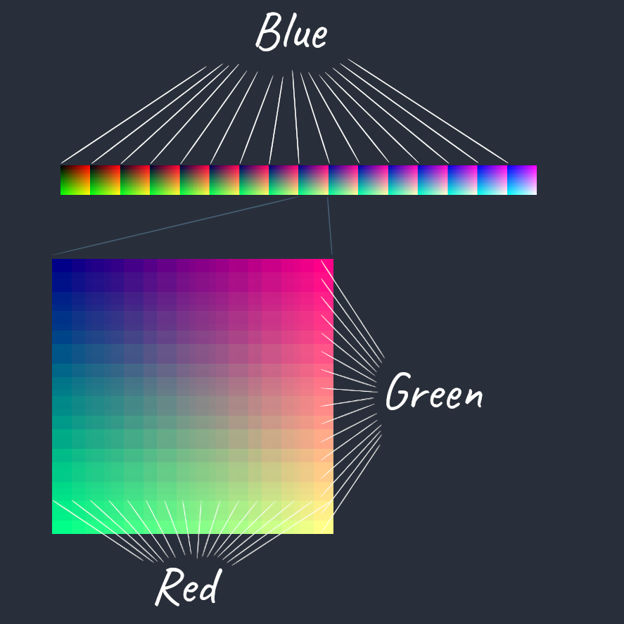

[:arrow_backward:](film-grain.md)
[:arrow_double_up:](../README.md)
[:arrow_up_small:](#)
[:arrow_down_small:](#copyright)
[:arrow_forward:](gamma-correction.md)

# 3D 游戏着色器入门教程

## 查找表（LUT）

<p align="center">

</p>

查找表（LUT）着色器允许你使用图像编辑器（例如 [GIMP](https://www.gimp.org/)）来转换游戏中的颜色。  
无论是进行色彩分级，还是将白天变成夜晚，LUT 着色器都是调整游戏视觉效果的方便工具。

<p align="center">

</p>

开始之前，你需要找到一张“中性”LUT图片。  
“中性”意味着它不会改变片元颜色。  
LUT 图片尺寸需要是宽256像素，高16像素，且包含16个区块，  
每个区块大小为16×16像素。

LUT 被划分成16个区块，  
每个区块的蓝色通道不同。  
从左到右，蓝色通道的强度逐渐增加，  
你可以在每个区块左上角看到对应的蓝色值。  
在每个区块内，  
从左到右红色通道递增，  
从上到下绿色通道递增。  
第一个区块左上角是黑色，因为所有RGB通道都为0。  
最后一个区块右下角是白色，因为所有RGB通道都为1。

<p align="center">

</p>

拿到中性LUT后，截取一张游戏截图并用图像编辑器打开。  
将中性LUT作为新图层叠加到截图上并合并图层。  
你对截图颜色的任何调整都会同步改变LUT。  
编辑完成后，仅选择LUT图层并保存为新图片。  
这样你就获得了新的查找表，可以开始编写着色器了。

```c
  // ...

  vec2 texSize = textureSize(colorTexture, 0).xy;

  vec4 color = texture(colorTexture, gl_FragCoord.xy / texSize);

  // ...
```

LUT 着色器是一种屏幕空间技术，  
因此需要在当前片元或屏幕位置采样场景颜色。

```c
  // ...

  float u  =  floor(color.b * 15.0) / 15.0 * 240.0;
        u  = (floor(color.r * 15.0) / 15.0 *  15.0) + u;
        u /= 255.0;

  float v  = ceil(color.g * 15.0);
        v /= 15.0;
        v  = 1.0 - v;

  // ...
```

为了使用LUT转换当前片元颜色，  
你需要将颜色映射到查找表纹理上的两个UV坐标。  
第一个映射（如上所示）是到最近的左边或下边界区块位置，  
第二个映射（如下所示）是到最近的右边或上边界区块位置。  
最终将结合这两个映射来生成最终颜色变换。

<p align="center">

</p>

红绿蓝三个通道各自映射到 LUT 中的16个可能值。  
蓝色通道映射到16个区块左上角之一。  
确定区块后，红色通道映射区块内的16个水平像素位置之一，  
绿色通道映射区块内的16个垂直像素位置之一。  
这三者决定了你需要从 LUT 采样的 UV 坐标。

```c
  // ...

        u /= 255.0;

        v /= 15.0;
        v  = 1.0 - v;

  // ...
```

计算最终U坐标时，除以255，因为LUT宽度为256像素，U坐标范围0到1。  
计算最终V坐标时，除以15，因为LUT高度为16像素，V坐标范围0到1。  
V坐标还需要用1减去它，  
因为V在纹理中从底部0到顶部1，而绿色通道从顶部0到底部15。

```c
  // ...

  vec3 left = texture(lookupTableTexture, vec2(u, v)).rgb;

  // ...
```

用UV坐标从查找表采样颜色，  
这是最近左边区块的颜色。

```c
  // ...

  u  =  ceil(color.b * 15.0) / 15.0 * 240.0;
  u  = (ceil(color.r * 15.0) / 15.0 *  15.0) + u;
  u /= 255.0;

  v  = 1.0 - (ceil(color.g * 15.0) / 15.0);

  vec3 right = texture(lookupTableTexture, vec2(u, v)).rgb;

  // ...
```

接下来计算最近右边区块的UV坐标。  
注意这里用到了 `ceil`（向上取整），而不是之前的 `floor`（向下取整）。

<p align="center">

</p>

```c
  // ...

  color.r = mix(left.r, right.r, fract(color.r * 15.0));
  color.g = mix(left.g, right.g, fract(color.g * 15.0));
  color.b = mix(left.b, right.b, fract(color.b * 15.0));

  // ...
```

不是每个通道的值都恰好映射到16个位置中的一个。  
例如，0.5的映射：  
- 向下取整映射到0.4666666666666667，  
- 向上取整映射到0.5333333333333333。  
而0.4的映射是向下和向上取整均为0.4。  
对于不能精确映射的通道值，  
你需要根据该值在上下界之间的位置对左右两个颜色进行混合。  
以0.5为例，刚好在中间，因此结果是左右颜色各占一半。  
而0.132则混合比例大约是右边98%，左边2%，  
因为 `fract(0.123 * 15.0)` 等于0.98。

```c
  // ...

  fragColor = color;

  // ...
```

将片元颜色设置为混合后的最终颜色，完成颜色转换。

### 资源链接

- [main.cxx](../demonstration/src/main.cxx)  
- [basic.vert](../demonstration/shaders/vertex/basic.vert)  
- [lookup-table.frag](../demonstration/shaders/fragment/lookup-table.frag)  


## Copyright

(C) 2020 David Lettier
<br>
[lettier.com](https://www.lettier.com)

[:arrow_backward:](film-grain.md)
[:arrow_double_up:](../README.md)
[:arrow_up_small:](#)
[:arrow_down_small:](#copyright)
[:arrow_forward:](gamma-correction.md)
