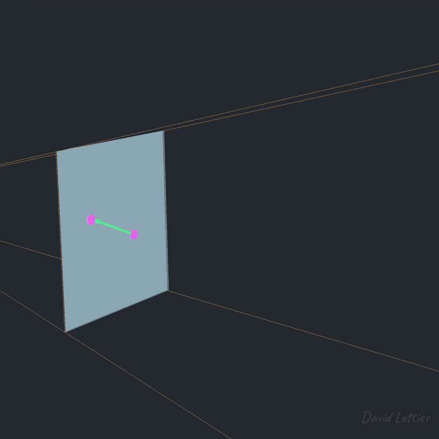

[:arrow_backward:](ssao.md)
[:arrow_double_up:](../README.md)
[:arrow_up_small:](#)
[:arrow_down_small:](#copyright)
[:arrow_forward:](chromatic-aberration.md)

# 3D 游戏着色器入门教程

## 运动模糊（Motion Blur）

<p align="center">

</p>

为了更好地营造速度感，运动模糊是极佳的选择。  
无论是高速追车，还是以光速穿梭，  
运动模糊都能极大提升快速移动物体的观感与真实感。

作为屏幕空间技术，有几种实现运动模糊的方法。  
一种较简单的方法是仅根据相机的移动模糊整个场景；  
更复杂的方法是，即使相机保持不动，也能模糊场景中移动的物体。  
下面介绍的是较简单的方法，但其原理是通用的。

### 纹理输入

```c
uniform sampler2D positionTexture;
uniform sampler2D colorTexture;

// ...
```

所需输入的纹理包括：  
- 顶点在视图空间中的位置（positionTexture）  
- 场景颜色（colorTexture）  
关于如何获取视图空间的顶点位置，可参考 [SSAO](ssao.md#vertex-positions)。

### 矩阵输入

```c
// ...

uniform mat4 previousViewWorldMat;
uniform mat4 worldViewMat;
uniform mat4 lensProjection;

// ...
```

运动模糊通过比较当前帧与上一帧的顶点位置来确定模糊方向。  
你需要以下矩阵：  
- 上一帧的视图转世界矩阵（previousViewWorldMat）  
- 当前帧的世界转视图矩阵（worldViewMat）  
- 摄像机透视投影矩阵（lensProjection）

### 参数设置

```c
// ...

uniform vec2 parameters;

// ...

void main() {
  int   size       = int(parameters.x);
  float separation =     parameters.y;

// ...
```

可调参数包括 `size` 和 `separation`：  
- `size` 控制在模糊方向上采样的次数，数值越大模糊越强，但性能开销越高  
- `separation` 控制每次采样之间的间距，越大模糊越重，但准确度可能下降

### 模糊方向计算

```c
  // ...

  vec2 texSize  = textureSize(colorTexture, 0).xy;
  vec2 texCoord = gl_FragCoord.xy / texSize;

  vec4 position1 = texture(positionTexture, texCoord);
  vec4 position0 = worldViewMat * previousViewWorldMat * position1;

  // ...
```

要确定该片元的模糊方向，  
需知道它在上一帧的位置以及当前帧的位置。  
- 当前帧的位置通过采样 `positionTexture` 获取  
- 上一帧的位置通过变换 `position1`：  
  - 首先用上一帧的 view-to-world 矩阵将其变换为世界空间  
  - 然后用当前帧的 world-to-view 矩阵将其变换回视图空间

<p align="center">

</p>

```c
  // ...

  position0      = lensProjection * position0;
  position0.xyz /= position0.w;
  position0.xy   = position0.xy * 0.5 + 0.5;

  position1      = lensProjection * position1;
  position1.xyz /= position1.w;
  position1.xy   = position1.xy * 0.5 + 0.5;

  // ...
```

获得当前与上一帧的位置后，将它们变换到屏幕空间。  
在屏幕空间中，便可以计算出需要沿哪个 2D 方向模糊图像。

```c
  // ...

  //   position1.xy = position0.xy + direction;
  vec2 direction    = position1.xy - position0.xy;

  if (length(direction) <= 0.0) { return; }

  // ...
```

模糊方向是从上一帧的位置指向当前帧的位置的向量。  
若方向为零（没有移动），就无需模糊。

### 执行模糊

```c
  // ...

  fragColor = texture(colorTexture, texCoord);

  // ...
```

首先采样当前片元颜色，  
这是第一个参与混合的颜色。

```c
  // ...

  direction.xy *= separation;

  // ...
```

将模糊方向乘以 separation 参数，控制采样间隔。

```c
  // ...

  vec2  forward  = texCoord;
  vec2  backward = texCoord;

  // ...
```

为了更平滑的模糊效果，  
在模糊方向和其反方向上同时采样。  
初始时，两者都设置为当前片元的纹理坐标。

```c
  // ...

  float count = 1.0;

  // ...
```

`count` 用于计算平均值，  
初始值为1，因为已经采样了当前片元的颜色。

```c
  // ...

  for (int i = 0; i < size; ++i) {
    forward  += direction;
    backward -= direction;

    fragColor +=
      texture
        ( colorTexture
        , forward
        );
    fragColor +=
      texture
        ( colorTexture
        , backward
        );

    count += 2.0;
  }

  // ...
```

沿模糊方向和反方向逐步采样屏幕颜色，  
并将它们加和。

```c
  // ...

  fragColor /= count;
}
```

最终将采样结果平均，作为输出的颜色。

### 源码文件

- [main.cxx](../demonstration/src/main.cxx)  
- [basic.vert](../demonstration/shaders/vertex/basic.vert)  
- [position.frag](../demonstration/shaders/fragment/position.frag)  
- [motion-blur.frag](../demonstration/shaders/fragment/motion-blur.frag)  

## Copyright

(C) 2020 David Lettier
<br>
[lettier.com](https://www.lettier.com)

[:arrow_backward:](ssao.md)
[:arrow_double_up:](../README.md)
[:arrow_up_small:](#)
[:arrow_down_small:](#copyright)
[:arrow_forward:](chromatic-aberration.md)
