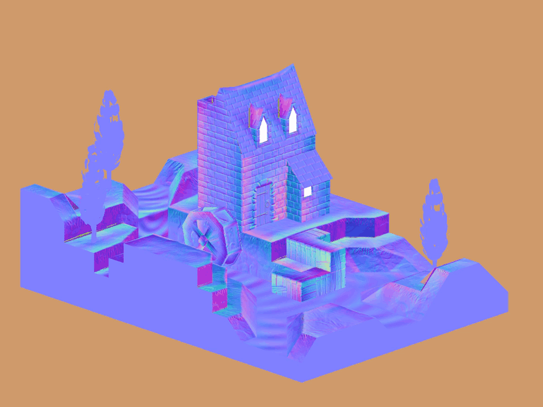
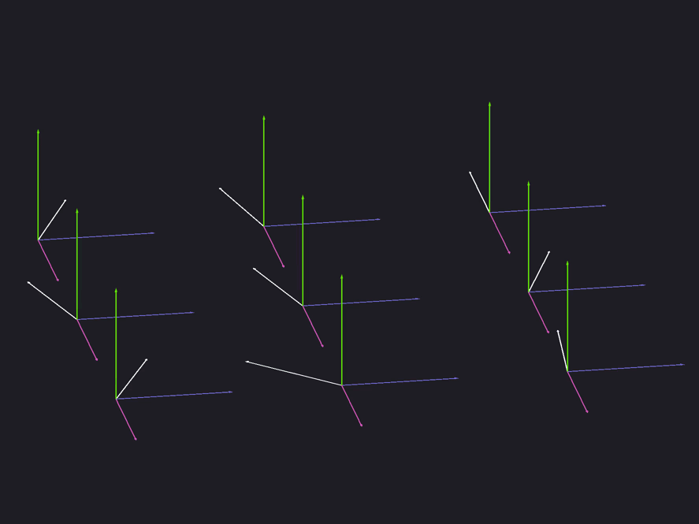

[:arrow_backward:](cel-shading.md)
[:arrow_double_up:](../README.md)
[:arrow_up_small:](#)
[:arrow_down_small:](#copyright)
[:arrow_forward:](deferred-rendering.md)

# 3D 游戏着色器入门教程

## 法线贴图（Normal Mapping）

<p align="center">

</p>

法线贴图允许你在不增加几何体的情况下添加表面细节。  
通常，你会在建模软件（如 Blender）中创建一个高模和一个低模版本的网格，  
然后将高模的顶点法线烘焙到一张纹理中，这张纹理就是法线贴图。  
在片元着色器中，你用这张法线贴图中的法线替代低模顶点的原始法线。  
这样，当你对网格进行光照计算时，低模看起来就像是高模一样细致，  
从而在保持高帧率的同时，呈现出高模的细节。

<p align="center">

</p>

如图所示，这是从高模到低模，再到使用法线贴图的低模的渐进演示。

<p align="center">

</p>

需要注意的是，法线贴图只是视觉上的假象。  
从某些角度观察时，表面仍然会显得平坦。

### 顶点着色器

```c
// ...

uniform mat3 p3d_NormalMatrix;

// ...

in vec3 p3d_Normal;

// ...

in vec3 p3d_Binormal;
in vec3 p3d_Tangent;

  // ...

  vertexNormal = normalize(p3d_NormalMatrix * p3d_Normal);
  binormal     = normalize(p3d_NormalMatrix * p3d_Binormal);
  tangent      = normalize(p3d_NormalMatrix * p3d_Tangent);

  // ...
```

从顶点着色器开始，  
你需要将法线向量、切线向量（tangent）和副切线向量（binormal）传递到片元着色器。  
这些向量用于将法线贴图中的法线从切线空间（tangent space）变换到视图空间。

`p3d_NormalMatrix` 是用于将法线相关向量变换到视图空间的矩阵。  
视图空间下的坐标都是相对于摄像机的位置。

> `p3d_NormalMatrix` 是 `ModelViewMatrix` 的逆转置矩阵的前 3×3 部分，  
> 用于将法线向量变换到视图空间。  
>  
> — [来源](http://www.panda3d.org/manual/?title=List_of_GLSL_Shader_Inputs)

```c
// ...

in vec2 p3d_MultiTexCoord0;

// ...

out vec2 normalCoord;

  // ...

  normalCoord   = p3d_MultiTexCoord0;

  // ...
```

<p align="center">

</p>

你还需要将用于采样法线贴图的 UV 坐标传给片元着色器。

### 片元着色器

记住，我们之前是使用顶点法线来进行光照计算的。  
但现在有了法线贴图，我们将使用它提供的法线来替代原始的顶点法线。

```c
// ...

uniform sampler2D p3d_Texture1;

// ...

in vec2 normalCoord;

  // ...

  /* Find */
  vec4 normalTex   = texture(p3d_Texture1, normalCoord);

  // ...
```

使用从顶点着色器传来的 UV 坐标，从法线贴图中采样法线。

```c
  // ...

  vec3 normal;

    // ...

    /* Unpack */
    normal =
      normalize
        ( normalTex.rgb
        * 2.0
        - 1.0
        );

    // ...
```

正如我们之前介绍的，法线贴图中将 `(x, y, z)` 映射为颜色 `(r, g, b)`，  
这里要做的就是反过来，将颜色值还原为原始法线向量。

公式如下：

```c
(r, g, b) =
  ( r * 2 - 1
  , g * 2 - 1
  , b * 2 - 1
  ) =
    (x, y, z)
```

这是从颜色空间解包回法线向量的过程。

```c
    // ...

    /* Transform */
    normal =
      normalize
        ( mat3
            ( tangent
            , binormal
            , vertexNormal
            )
        * normal
        );

    // ...
```

通常，法线贴图中存储的法线是切线空间的法线。  
当然，也有例外，比如 Blender 支持烘焙为切线空间、物体空间、世界空间或摄像机空间。

<p align="center">

</p>

要将切线空间的法线变换到视图空间，  
你需要用切线、binormal 和顶点法线构建一个 3×3 的变换矩阵。  
将法线向量乘以这个矩阵并归一化即可。

至此替代法线就完成了，  
后续的光照计算保持不变即可。

### 源码文件

- [main.cxx](../demonstration/src/main.cxx)  
- [base.vert](../demonstration/shaders/vertex/base.vert)  
- [base.frag](../demonstration/shaders/fragment/base.frag)  

## Copyright

(C) 2019 David Lettier
<br>
[lettier.com](https://www.lettier.com)

[:arrow_backward:](cel-shading.md)
[:arrow_double_up:](../README.md)
[:arrow_up_small:](#)
[:arrow_down_small:](#copyright)
[:arrow_forward:](deferred-rendering.md)
