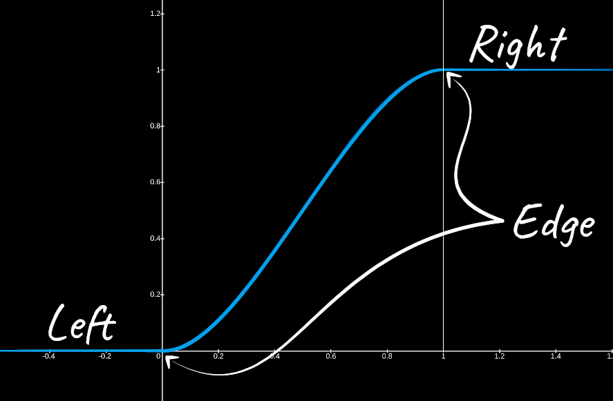

[:arrow_backward:](flow-mapping.md)
[:arrow_double_up:](../README.md)
[:arrow_up_small:](#)
[:arrow_down_small:](#copyright)
[:arrow_forward:](depth-of-field.md)

# 3D游戏着色器入门

## 描边（Outlining）

<p align="center">

</p>

为场景几何体添加描边可以赋予游戏一种独特的外观，让人联想到漫画和卡通。

### 不连续性

描边的过程是寻找并标记不连续性或差异的过程。
每当你发现一个显著的差异，就用线条颜色标记出来。
随着你逐步标记这些差异，描边轮廓就会形成。

你可以选择在哪些地方查找不连续性。
可能是场景中的漫反射颜色、模型的法线、深度缓冲，或其他与场景相关的数据。

这个示例使用插值后的顶点位置来绘制描边。
但更常见的一种方式是结合使用场景的法线和深度缓冲值来生成描边效果。

### 顶点位置

```c
// ...

uniform sampler2D positionTexture;

// ...
```

就像 SSAO 一样，你需要视图空间中的顶点位置。
具体细节可参考 [SSAO](ssao.md#vertex-positions)。

### 场景颜色

```c
// ...

uniform sampler2D colorTexture;

// ...
```

这个示例在有描边的区域会加深颜色。
这种方式比使用纯色看起来更自然，因为边缘有一些颜色变化。

### 参数

```c
// ...

float minSeparation = 1.0;
float maxSeparation = 3.0;
float minDistance   = 0.5;
float maxDistance   = 2.0;
int   size          = 1;
vec3 colorModifier  = vec3(0.324, 0.063, 0.099);

// ...
```

min/max 分离参数根据片元距相机的深度控制描边粗细。
min/max 距离参数控制被视为显著变化的阈值。
`size` 控制线条固定的粗细。
描边颜色由 `colorModifier` 和片元原有颜色共同决定。

### 片元位置

```c
// ...

vec2 texSize   = textureSize(colorTexture, 0).xy;
vec2 fragCoord = gl_FragCoord.xy;
vec2 texCoord  = fragCoord / texSize;

vec4 position = texture(positionTexture, texCoord);

// ...
```

从 positionTexture 中采样当前片元在场景中的位置。
这个纹理是屏幕形状的四边形，因此 UV 坐标就是屏幕坐标除以屏幕尺寸。

### 片元深度

```c
// ...

float depth =
  clamp(
    1.0 - ((far - position.y) / (far - near)),
    0.0,
    1.0
  );

float separation = mix(maxSeparation, minSeparation, depth);

// ...
```

深度值范围从 0 到 1。
片元的视图空间 y 坐标等于 far 平面时，深度为 1；
等于 near 平面时为 0。

```c
// ...

float separation = mix(maxSeparation, minSeparation, depth);

// ...
```

转换为深度值不是必须的，
但这样你可以让距离更远的片元使用更细的线条，近处使用更粗的。
这种方式看起来更具空间感。

### 寻找不连续性

<p align="center">

</p>

```c
// ...

float mx = 0.0;

for (int i = -size; i <= size; ++i) {
  for (int j = -size; j <= size; ++j) {
    // ...
  }
}

// ...
```

现在你有了当前片元的位置，可以遍历一个 i x j 的窗口区域。

```c
// ...

texCoord = (fragCoord + (vec2(i, j) * separation)) / texSize;

vec4 positionTemp = texture(positionTexture, texCoord);

mx = max(mx, abs(position.y - positionTemp.y));

// ...
```

每次迭代中，比较当前片元和邻近片元之间 y 坐标的最大差异。

<p align="center">

</p>

```c
// ...

float diff = smoothstep(minDistance, maxDistance, mx);

// ...
```

使用 `smoothstep` 判断差异是否足够显著。
小于 `minDistance` 为 0，大于 `maxDistance` 为 1，之间为插值结果。

### 线条颜色

```c
// ...

vec3 lineColor = texture(colorTexture, texCoord).rgb * colorModifier;

// ...
```

线条颜色是当前片元颜色的加深或变亮版本。

### 片元颜色输出

<p align="center">

</p>

```c
// ...

fragColor.rgb = vec4(lineColor, diff);

// ...
```

片元的 RGB 为描边颜色，Alpha 为差异值。

### 草图风格（Sketchy）

<p align="center">

</p>

要实现涂鸦风格的描边，可以扭曲采样位置的 UV 坐标。

<p align="center">

</p>

```c
// ...

uniform sampler2D noiseTexture;

// ...
```

准备一张 RGB 噪声纹理，尺寸如 128x128 或 512x512，
要模糊并可重复平铺，这样可以产生波浪状墨迹描边效果。

```c
// ...

float noiseScale = 10.0;

// ...
```

`noiseScale` 控制扰动强度，数值越大越草图化。

```c
// ...

vec2 fragCoord = gl_FragCoord.xy;

vec2 noise = texture(noiseTexture, fragCoord / textureSize(noiseTexture, 0).xy).rb;
noise = noise * 2.0 - 1.0;
noise *= noiseScale;

// ...
```

使用屏幕坐标采样噪声纹理，两个颜色通道足矣。
将其值从 `[0, 1]` 映射为 `[-1, 1]`，再乘以 `noiseScale`。

```c
// ...

vec2 texSize  = textureSize(colorTexture, 0).xy;
vec2 texCoord = (fragCoord - noise) / texSize;

vec4 position = texture(positionTexture, texCoord);

// ...
```

采样时从当前坐标中减去扰动值。

<p align="center">

</p>

你也可以将噪声加到当前坐标，
这样会产生一种更加扭曲的线条，贴近几何边缘但略有变化。

```c
// ...

texCoord = (vec2(i, j) * separation + fragCoord + noise) / texSize;

vec4 positionTemp = texture(positionTexture, texCoord);

// ...
```

在循环中采样周围片元时，将噪声添加到坐标中，其余逻辑不变。

### 源码文件

- [main.cxx](../demonstration/src/main.cxx)
- [base.vert](../demonstration/shaders/vertex/base.vert)
- [basic.vert](../demonstration/shaders/vertex/basic.vert)
- [position.frag](../demonstration/shaders/fragment/position.frag)
- [outline.frag](../demonstration/shaders/fragment/outline.frag)

## Copyright

(C) 2019 David Lettier
<br>
[lettier.com](https://www.lettier.com)

[:arrow_backward:](flow-mapping.md)
[:arrow_double_up:](../README.md)
[:arrow_up_small:](#)
[:arrow_down_small:](#copyright)
[:arrow_forward:](depth-of-field.md)
