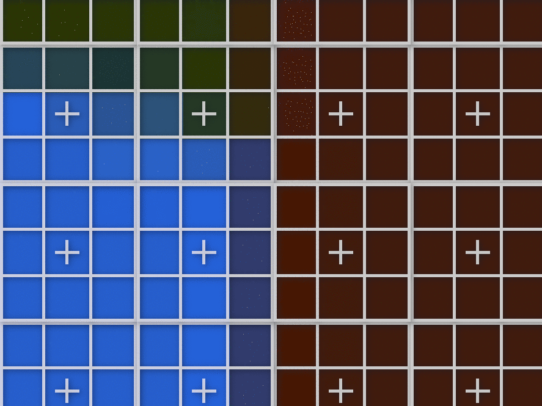

[:arrow_backward:](posterization.md)
[:arrow_double_up:](../README.md)
[:arrow_up_small:](#)
[:arrow_down_small:](#copyright)
[:arrow_forward:](sharpen.md)

# 3D 游戏着色器入门教程

## 像素化（Pixelization）

<p align="center">

</p>

对你的3D游戏进行像素化处理，可以赋予其有趣的视觉效果，
并且可能节省你手工制作所有像素艺术的时间。
结合色调分离（posterization）可以获得真正复古的效果。

```c
  // ...

  int pixelSize = 5;

  // ...
```

你可以随意调整像素大小。
像素越大，图像看起来越方块化。

<p align="center">

</p>

```c
  // ...

  float x = int(gl_FragCoord.x) % pixelSize;
  float y = int(gl_FragCoord.y) % pixelSize;

  x = floor(pixelSize / 2.0) - x;
  y = floor(pixelSize / 2.0) - y;

  x = gl_FragCoord.x + x;
  y = gl_FragCoord.y + y;

  // ...
```

该技术的原理是将每个片元映射到其最近且不重叠的像素大小窗口的中心。
这些窗口以网格形式覆盖输入纹理。
窗口中心的片元颜色决定该窗口内其他片元的颜色。

```c
    // ...

    fragColor = texture(colorTexture, vec2(x, y) / texSize);

    // ...
```

确定正确的片元坐标后，
从输入纹理中采样该坐标的颜色，并赋值给当前片元颜色。

### 源代码

- [main.cxx](../demonstration/src/main.cxx)
- [basic.vert](../demonstration/shaders/vertex/basic.vert)
- [pixelize.frag](../demonstration/shaders/fragment/pixelize.frag)

## Copyright

(C) 2019 David Lettier
<br>
[lettier.com](https://www.lettier.com)

[:arrow_backward:](posterization.md)
[:arrow_double_up:](../README.md)
[:arrow_up_small:](#)
[:arrow_down_small:](#copyright)
[:arrow_forward:](sharpen.md)
