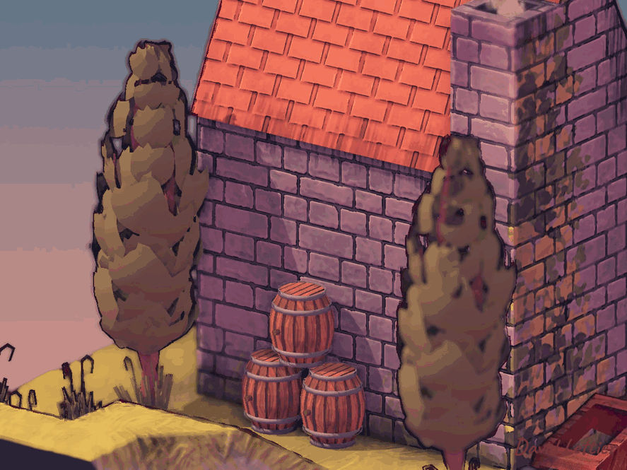

[:arrow_backward:](depth-of-field.md)
[:arrow_double_up:](../README.md)
[:arrow_up_small:](#)
[:arrow_down_small:](#copyright)
[:arrow_forward:](pixelization.md)

# 3D 游戏着色器入门教程

## 色调分离（Posterization）

<p align="center">

</p>

色调分离或颜色量化是减少图像中唯一颜色数量的过程。
你可以使用此着色器为你的游戏赋予漫画书或复古风格。
结合[outlining](outlining.md)使用，可以实现完整的卡通艺术风格。

实现色调分离的方法有多种。
此方法直接处理灰度值，间接作用于图像的RGB值。
对于每个片元，它将RGB颜色映射为灰度值。
然后将灰度值映射到它的下一级和上一级色阶。
最后选择最接近原始灰度值的色阶，再映射回RGB值。
这个新的RGB值成为片元颜色。
我觉得这种方法比一般常见的方法效果更好。

```c
  // ...

  float levels = 10;

  // ...
```

`levels`参数控制离散色阶的数量。
它会将连续的0到1的值分割成多个区间。
例如4个色阶时，0.0到1.0会被分割成0.0、0.25、0.5、0.75和1.0。

```c
  // ...

  fragColor = texture(posterizeTexture, texCoord);

  // ...
```

采样当前片元的颜色。

```c
  // ...

  float greyscale = max(fragColor.r, max(fragColor.g, fragColor.b));

  // ...
```

将RGB值映射为灰度值。
这里用的是R、G、B中的最大值作为灰度。

```c
  // ...

  float lower     = floor(greyscale * levels) / levels;
  float lowerDiff = abs(greyscale - lower);

  // ...
```

将灰度映射到下一级色阶，并计算它与灰度本身的差值。
例如灰度为0.87，色阶为4时，下一级色阶是0.75，差值是0.12。

```c
  // ...

  float upper     = ceil(greyscale * levels) / levels;
  float upperDiff = abs(upper - greyscale);

  // ...
```

计算上一级色阶及差值。
以上例为例，上一级色阶是1.0，差值是0.13。

```c
  // ...

  float level      = lowerDiff <= upperDiff ? lower : upper;
  float adjustment = level / greyscale;

  // ...
```

选择距离灰度最近的色阶计算调整比例。
调整比例为量化灰度值与未量化灰度值的比值。
该比例用于将量化的灰度映射回RGB值。

```c
  // ...

  fragColor.rgb * adjustment;

  // ...
```

将RGB乘以调整比例后，max(r, g, b)即为量化后的灰度值，
实现了灰度向RGB的映射。

### 源代码

- [main.cxx](../demonstration/src/main.cxx)
- [basic.vert](../demonstration/shaders/vertex/basic.vert)
- [posterize.frag](../demonstration/shaders/fragment/posterize.frag)


## Copyright

(C) 2019 David Lettier
<br>
[lettier.com](https://www.lettier.com)

[:arrow_backward:](depth-of-field.md)
[:arrow_double_up:](../README.md)
[:arrow_up_small:](#)
[:arrow_down_small:](#copyright)
[:arrow_forward:](pixelization.md)
