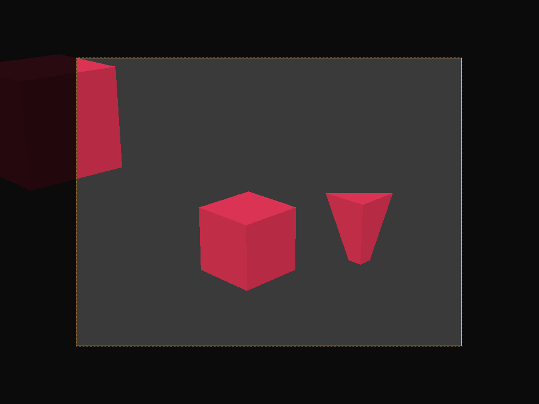
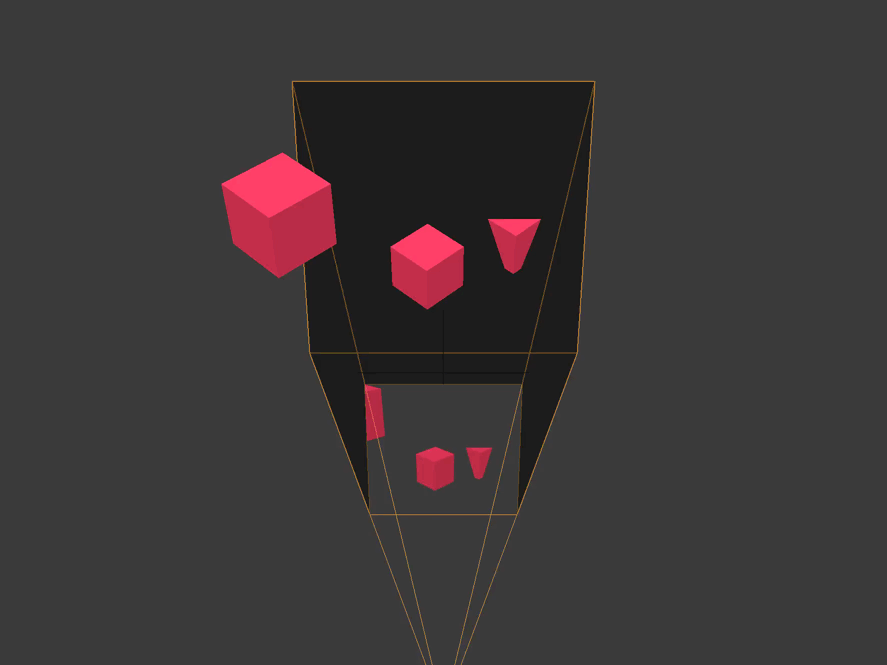

[:arrow_backward:](running-the-demo.md)
[:arrow_double_up:](../README.md)
[:arrow_up_small:](#)
[:arrow_down_small:](#copyright)
[:arrow_forward:](glsl.md)
# 3D 游戏着色器入门教程

## 参考坐标系

在编写任何着色器之前，你应该先了解以下几种参考坐标系或坐标系统。  
这些坐标系的本质问题是：当前这些坐标是相对于哪个原点 `(0, 0, 0)` 来定义的？  
一旦你了解了当前的坐标空间，就可以通过某个矩阵将其转换为其他向量空间。  
通常，当一个着色器的输出看起来不对时，问题往往出在坐标系统混乱上。

### 模型空间（Model Space）

模型空间，也称为对象坐标系，是相对于模型自身原点的坐标系。  
这个原点通常在建模软件（如 Blender）中设置为模型几何中心。

### 世界空间（World Space）

世界空间是相对于整个场景/关卡/世界的原点而言的。

### 视图空间（View Space）

视图空间，也称为眼睛坐标系，是相对于当前活动摄像机的位置而言的。

### 裁剪空间（Clip Space）

裁剪空间是相对于摄像机底片中心的坐标系。  
此时所有坐标都是齐次坐标，范围在 `(-1, 1)` 之间。  
X 和 Y 与摄像机底片平行，Z 表示深度。

任何顶点如果超出摄像机视锥体或视野范围（View Volume）都会被裁剪掉。  
如图中后方的立方体被远裁剪面切掉，旁边的立方体也被部分裁剪。

### 屏幕空间（Screen Space）

屏幕空间（通常）是相对于屏幕左下角而言的。  
X 从 0 到屏幕宽度，Y 从 0 到屏幕高度。

## Copyright

(C) 2019 David Lettier
 
[lettier.com](https://www.lettier.com)

[:arrow_backward:](running-the-demo.md)
[:arrow_double_up:](../README.md)
[:arrow_up_small:](#)
[:arrow_down_small:](#copyright)
[:arrow_forward:](glsl.md)
