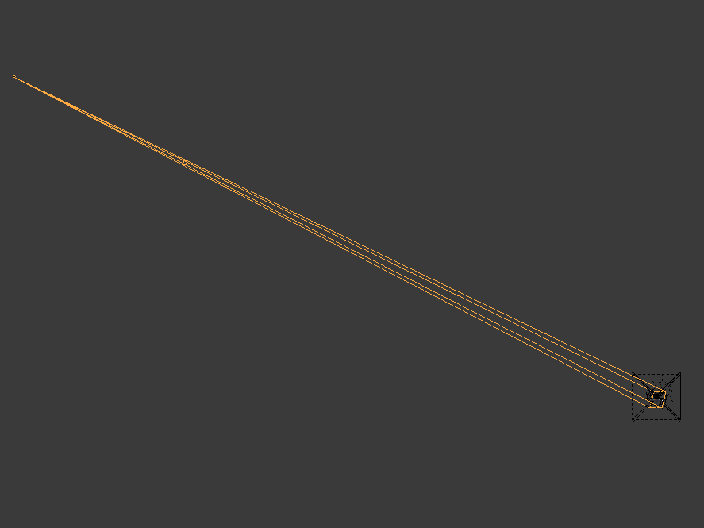
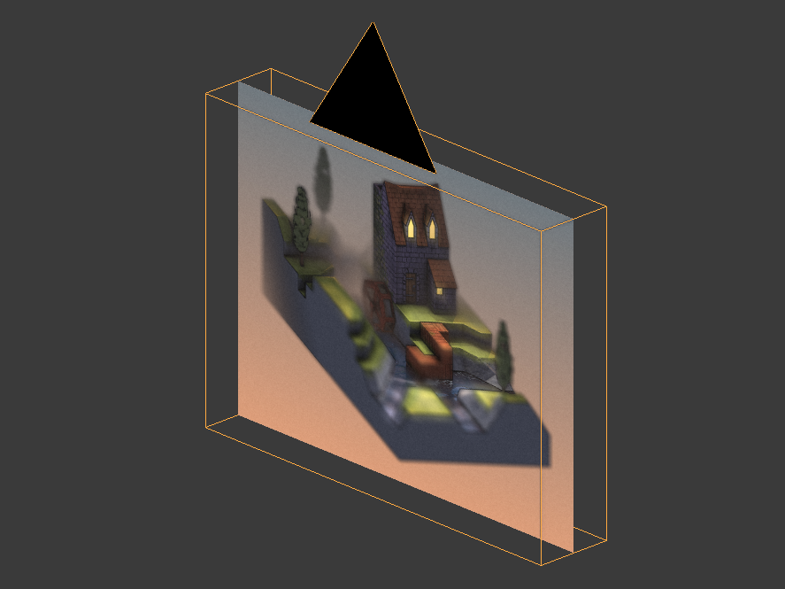
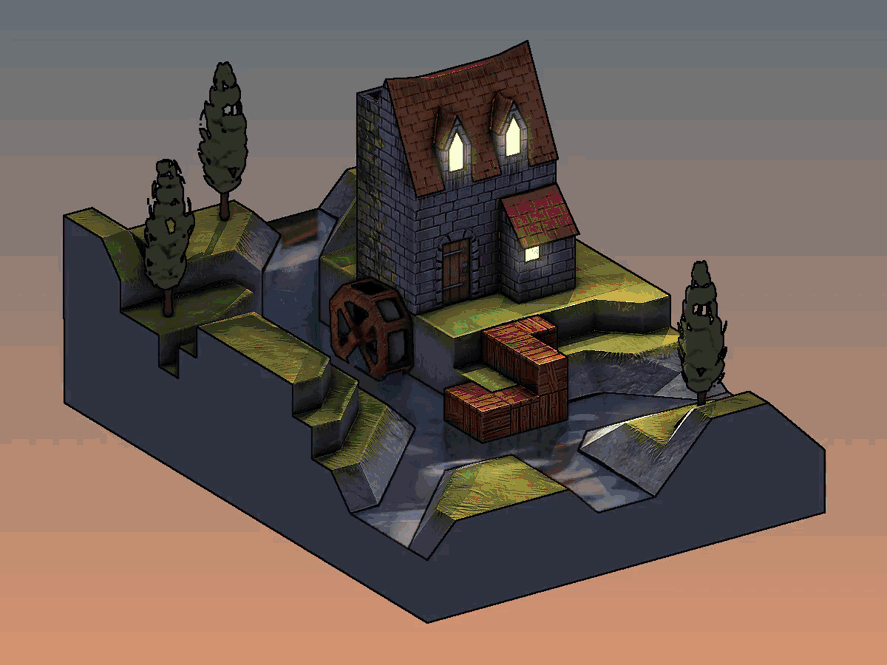

[:arrow_backward:](glsl.md)
[:arrow_double_up:](../README.md)
[:arrow_up_small:](#)
[:arrow_down_small:](#copyright)
[:arrow_forward:](texturing.md)

# 3D游戏着色器入门

## 渲染到纹理（Render To Texture）

示例代码并不是直接渲染/绘制/绘画到屏幕上，而是使用一种称为“渲染到纹理”的技术。
为了实现渲染到纹理，你需要设置一个帧缓冲（framebuffer）并将纹理绑定到它。
一个帧缓冲可以绑定多个纹理。

绑定到帧缓冲的纹理保存了片元着色器返回的向量。
通常这些向量是颜色向量 `(r, g, b, a)`，但也可能是位置或法线向量 `(x, y, z, w)`。
对于每个绑定的纹理，片元着色器可以输出不同的向量。
例如，你可以在一次渲染中同时输出顶点的位置和法线。

大部分涉及 Panda3D 的示例代码都涉及设置
[帧缓冲纹理](https://www.panda3d.org/manual/?title=Render-to-Texture_and_Image_Postprocessing)。
为了简化，示例代码中的几乎所有片元着色器都只有一个输出。
但为了保持较高的帧率（FPS），你希望每次渲染尽可能输出更多内容。

示例代码中有两种帧缓冲纹理的设置。

第一个设置将水车场景渲染到帧缓冲纹理中，使用了多种顶点和片元着色器。
这个设置会处理水车场景中的每个顶点和对应的片元。

在此设置中，示例代码执行了以下操作：

- 存储几何数据（如顶点位置或法线）以备后用。
- 存储材质数据（如漫反射颜色）以备后用。
- 对各种纹理（漫反射、法线、阴影等）进行UV映射。
- 计算环境光、漫反射、高光和自发光照明。

第二个设置是一个正交相机，面向一个屏幕形状的矩形。
这个设置只处理四个顶点及其对应的片元。

在第二个设置中，示例代码执行了以下操作：

- 操作另一个帧缓冲纹理的输出。
- 将多个帧缓冲纹理合成为一个。

我喜欢把第二个设置想象成使用 GIMP、Krita 或 Inkscape 的图层功能。

在示例代码中，你可以通过按 <kbd>Tab</kbd> 键或 <kbd>Shift</kbd>+<kbd>Tab</kbd> 键查看特定帧缓冲纹理的输出。

## Copyright

(C) 2019 David Lettier
 
[lettier.com](https://www.lettier.com)

[:arrow_backward:](glsl.md)
[:arrow_double_up:](../README.md)
[:arrow_up_small:](#)
[:arrow_down_small:](#copyright)
[:arrow_forward:](texturing.md)
