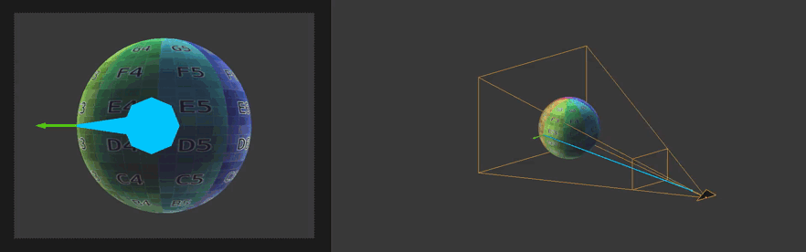
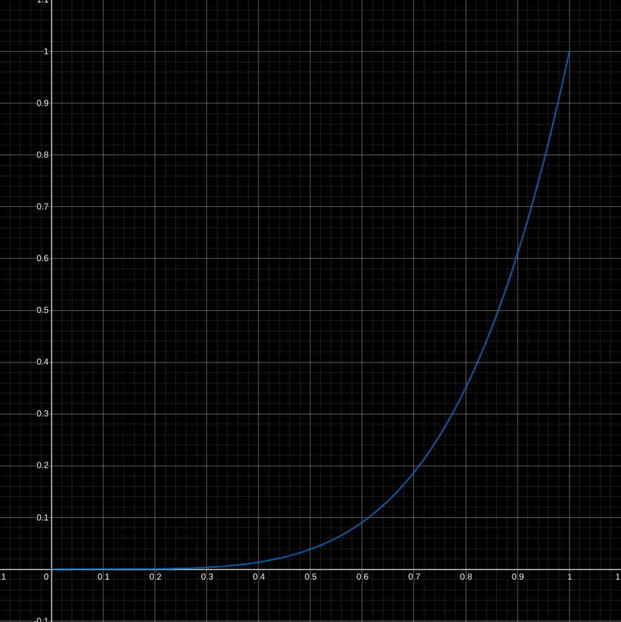

[:arrow_backward:](fresnel-factor.md)
[:arrow_double_up:](../README.md)
[:arrow_up_small:](#)
[:arrow_down_small:](#copyright)
[:arrow_forward:](cel-shading.md)

# 3D 游戏着色器入门教程

## 边缘光（Rim Lighting）

<p align="center">

</p>

灵感来源于[fresnel因子](fresnel-factor.md)，
边缘光着重突出物体的边缘或轮廓。
结合[卡通渲染](cel-shading.md)和[描边](outlining.md)，
它能完美强化卡通效果。
你也可以用它来高亮游戏中的物体，
帮助玩家更容易导航和完成任务。

```c
  // ...

  vec3 eye = normalize(-vertexPosition.xyz);

  // ...
```

与fresnel因子一样，
你需要计算视线向量（eye vector）。
如果顶点位置是视图空间的，那么视线向量就是顶点位置的反向。

<p align="center">

</p>

```c
  // ...

  float rimLightIntensity = dot(eye, normal);
        rimLightIntensity = 1.0 - rimLightIntensity;
        rimLightIntensity = max(0.0, rimLightIntensity);

  // ...
```

边缘光强度范围是0到1。
当视线向量和法线方向相同时，边缘光强度为0。
两者方向逐渐不同，边缘光强度增加，
当视线与法线正交时，强度达到1。

<p align="center">

</p>

```c
  // ...

  rimLightIntensity = pow(rimLightIntensity, rimLightPower);

  // ...
```

你可以用幂函数控制边缘光的衰减曲线。

```c
  // ...

  rimLightIntensity = smoothstep(0.3, 0.4, rimLightIntensity)

  // ...
```

也可以用`step`或`smoothstep`控制衰减，
搭配[卡通渲染](cel-shading.md)时效果更佳。
你将在后续章节学习更多相关函数。

```c
  // ...

  vec4 rimLight   = rimLightIntensity * diffuse;
       rimLight.a = diffuse.a;

  // ...
```

边缘光的颜色由你决定。
示例代码将漫反射颜色乘以边缘光强度，
这样既突出轮廓，又不会过曝或照亮阴影区域。

```c
  // ...

  vec4 outputColor     = vec4(0.0);
       outputColor.a   = diffuseColor.a;
       outputColor.rgb =
           ambient.rgb
        +  diffuse.rgb
        + specular.rgb
        + rimLight.rgb
        + emission.rgb;

  // ...
```

计算完边缘光后，将其与环境光、漫反射、高光和自发光叠加。

### 源码

- [main.cxx](../demonstration/src/main.cxx)
- [basic.vert](../demonstration/shaders/vertex/basic.vert)
- [base.frag](../demonstration/shaders/fragment/base.frag)

## Copyright

(C) 2020 David Lettier
<br>
[lettier.com](https://www.lettier.com)

[:arrow_backward:](fresnel-factor.md)
[:arrow_double_up:](../README.md)
[:arrow_up_small:](#)
[:arrow_down_small:](#copyright)
[:arrow_forward:](cel-shading.md)
