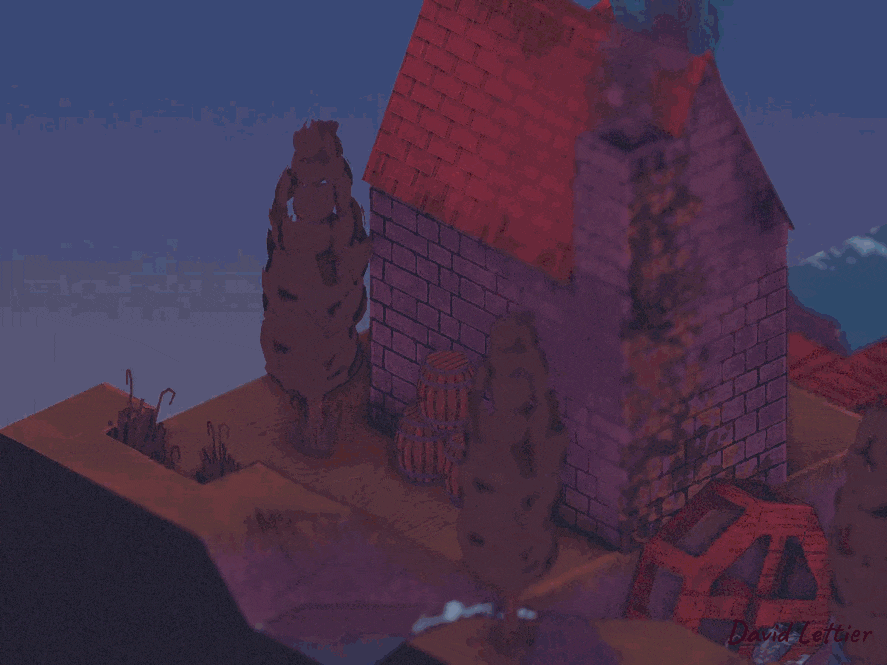

[:arrow_backward:](building-the-demo.md)
[:arrow_double_up:](../README.md)
[:arrow_up_small:](#)
[:arrow_down_small:](#copyright)
[:arrow_forward:](reference-frames.md)

# 3D 游戏着色器入门教程教程

## 运行演示程序

<p align="center">

</p>

在你编译完示例代码之后，就可以运行可执行文件或演示程序了。

```bash
./3d-game-shaders-for-beginners
```

这是在 Linux 或 Mac 上运行的方法。

```bash
3d-game-shaders-for-beginners.exe
```

这是在 Windows 上运行的方法。


### 演示控制方式

该演示程序支持键盘和鼠标控制来移动摄像机、切换不同的特效、调节雾效以及查看各种帧缓冲贴图。

#### 鼠标控制

你可以按住 <kbd>鼠标左键</kbd> 拖动来旋转场景。
按住 <kbd>鼠标右键</kbd> 拖动可以向上、下、左、右平移视角。
向前滚动 <kbd>鼠标滚轮</kbd> 可以放大场景，向后滚动可缩小场景。

你还可以使用鼠标改变焦点。
点击场景任意位置并使用 <kbd>鼠标中键</kbd> 即可更换焦点。


#### 键盘控制

- <kbd>w</kbd> 向下旋转视角
- <kbd>a</kbd> 顺时针旋转视角
- <kbd>s</kbd> 向上旋转视角
- <kbd>d</kbd> 逆时针旋转视角
- <kbd>z</kbd> 放大视角
- <kbd>x</kbd> 缩小视角
- <kbd>⬅</kbd> 向左移动
- <kbd>➡</kbd> 向右移动
- <kbd>⬆</kbd> 向上移动
- <kbd>⬇</kbd> 向下移动

<p></p>

- <kbd>1</kbd> 显示正午
- <kbd>2</kbd> 显示午夜

<p></p>


- <kbd>Delete</kbd> 切换声音开关
- <kbd>3</kbd> 切换菲涅尔效果
- <kbd>4</kbd> 切换边缘光
- <kbd>5</kbd> 切换粒子
- <kbd>6</kbd> 切换运动模糊
- <kbd>7</kbd> 切换 Kuwahara 滤镜
- <kbd>8</kbd> 切换卡通渲染
- <kbd>9</kbd> 切换查找表（LUT）处理
- <kbd>0</kbd> 在 Phong 与 Blinn-Phong 模型之间切换
- <kbd>y</kbd> 切换屏幕空间环境光遮蔽（SSAO）
- <kbd>u</kbd> 切换描边效果
- <kbd>i</kbd> 切换泛光（Bloom）
- <kbd>o</kbd> 切换法线贴图
- <kbd>p</kbd> 切换雾效
- <kbd>h</kbd> 切换景深效果
- <kbd>j</kbd> 切换色调分离（Posterization）
- <kbd>k</kbd> 切换像素化（Pixelization）
- <kbd>l</kbd> 切换锐化滤镜
- <kbd>n</kbd> 切换胶片颗粒（Film Grain）
- <kbd>m</kbd> 切换屏幕空间反射
- <kbd>,</kbd> 切换屏幕空间折射
- <kbd>.</kbd> 切换流动贴图（Flow Mapping）
- <kbd>/</kbd> 切换太阳动画
- <kbd>\</kbd> 切换色差（Chromatic Aberration）

<p></p>

- <kbd>r</kbd> 重置场景

<p></p>

- <kbd>[</kbd> 减少雾的最近距离
- <kbd>Shift</kbd>+<kbd>[</kbd> 增加雾的最近距离
- <kbd>]</kbd> 增加雾的最远距离
- <kbd>Shift</kbd>+<kbd>]</kbd> 减少雾的最远距离

<p></p>

- <kbd>Shift</kbd>+<kbd>-</kbd> 减少泡沫量
- <kbd>-</kbd> 增加泡沫量

<p></p>

- <kbd>Shift</kbd>+<kbd>=</kbd> 减少相对折射率
- <kbd>=</kbd> 增加相对折射率

<p></p>

- <kbd>Tab</kbd> 向前切换帧缓冲贴图
- <kbd>Shift</kbd>+<kbd>Tab</kbd> 向后切换帧缓冲贴图

## Copyright

(C) 2019 David Lettier
<br>
[lettier.com](https://www.lettier.com)

[:arrow_backward:](building-the-demo.md)
[:arrow_double_up:](../README.md)
[:arrow_up_small:](#)
[:arrow_down_small:](#copyright)
[:arrow_forward:](reference-frames.md)
