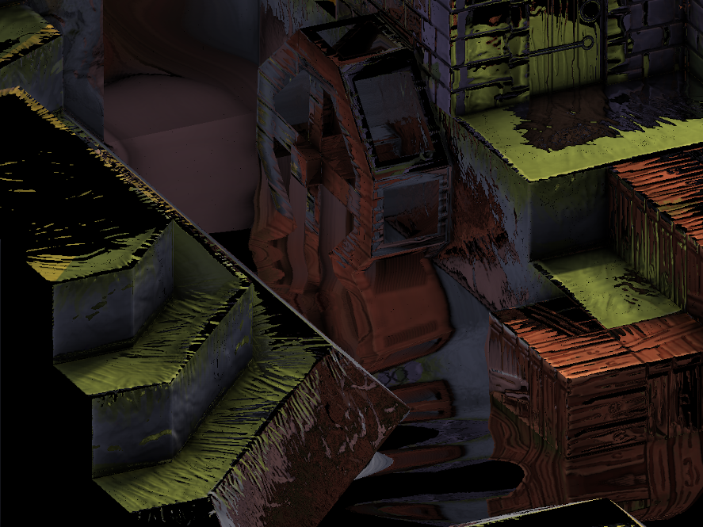

[:arrow_backward:](chromatic-aberration.md)
[:arrow_double_up:](../README.md)
[:arrow_up_small:](#)
[:arrow_down_small:](#copyright)
[:arrow_forward:](screen-space-refraction.md)

# 3D 游戏着色器入门

## 屏幕空间反射（SSR）

<p align="center">

</p>

添加反射可以让你的场景更具真实感。  
湿润和有光泽的物体会变得生动起来，没有什么比反射更能让物体看起来湿润或闪亮了。  
借助反射，你可以更好地营造出水面和金属物体的幻觉。

在[光照](lighting.md)部分，你模拟了光源的镜面反射图像。  
这是渲染镜面反射的过程。  
还记得我们是用反射光方向来计算镜面光的。  
类似地，使用屏幕空间反射（SSR）你可以模拟场景中其他物体的反射，而不仅仅是光源。  
这不再是从光源发出的光线反射进入摄像机，而是场景中某个物体发出的光线反射进入摄像机。

SSR 的工作原理是使用屏幕图像自身来对自身进行反射。  
这与使用六面贴图（立方体贴图）不同，后者使用六个视角的纹理。  
在立方体贴图中，你从场景中某点发出一条射线，并反射到包围整个场景的立方体内部的某一点。  
而在 SSR 中，你从屏幕上的一个点发出射线，并反射到屏幕上的另一个点。  
通过将屏幕反射到自己上面，你可以制造出反射的幻觉。  
这种幻觉在大多数情况下是有效的，但如你将看到的，它也有失效的时候。

### 光线步进（Ray Marching）

屏幕空间反射使用一种称为“光线步进”的技术来为每个片元确定反射。  
光线步进是一种迭代延展或缩短某个向量的长度（或大小）来在空间中探测或采样信息的方法。  
在屏幕空间反射中，反射光线是相对于法线方向反射后的位置向量。

直观上讲，一条光线打到场景中的某个点，  
发生反射，  
然后沿反射向量的相反方向传播，  
打到当前片元，  
再沿位置向量的相反方向传播，  
最终击中摄像机镜头，从而让你在当前片元中看到场景中某点的反射颜色。  
SSR 就是在反向追踪这条光线路径。  
它试图找出光线反射并击中当前片元的那个反射点。  
每次迭代时，  
算法会沿着反射光线采样场景的位置或深度，  
每次判断光线是否与场景几何体相交。  
如果有相交，  
那么这个位置就是当前片元可能反射的候选点。

理想情况下，应该有某种解析方法可以精确求出第一次相交的点。  
因为这个第一次相交点才是当前片元应该反射的唯一有效点。  
但实际上，这个方法更像是一场“战舰游戏”。  
你看不到是否有相交点，因此只能从反射光线的起点开始，沿着方向一个一个坐标“喊出来”。  
每喊一个，就看看是否“击中”。  
如果击中，  
你就围绕那个区域再尝试，希望找出准确的相交点。

<p align="center">

</p>

这里展示了如何使用光线步进来计算每个片元的反射点。  
绿色亮箭头表示顶点法线，  
蓝色亮箭头是位置向量，  
红色亮箭头是通过视空间进行步进的反射射线。

### 顶点位置

与 SSAO 一样，你需要将顶点位置转换到视空间中。  
参见 [SSAO](ssao.md#vertex-positions) 章节获取更多细节。

### 顶点法线

为了计算反射，你也需要将顶点法线转换到视空间中。  
参见 [SSAO](ssao.md#vertex-normals) 章节获取更多细节。

<p align="center">

</p>

这里展示的是使用法线贴图中的法线进行 SSR，  
而不是使用顶点法线。  
注意反射如何随着水面波纹而变化，  
而不是之前所展示的那种镜面反射效果。

要使用法线贴图，  
你需要像在光照计算中那样将法线从切线空间变换到视空间。  
可以在 [normal.frag](../demonstration/shaders/fragment/normal.frag) 中看到这个过程。

### 位置变换

<p align="center">

</p>

与 [SSAO](ssao.md) 一样，SSR 也需要在屏幕空间和视空间之间来回转换。  
你需要相机镜头的投影矩阵来将视空间中的点变换到裁剪空间（clip space）。  
再从裁剪空间转换到 UV 空间。  
在 UV 空间中，  
你可以从场景中采样顶点或片元位置，  
这些位置就是你采样点在场景中最接近的位置。  
这就是“屏幕空间反射”中的“屏幕空间”部分，  
因为“屏幕”本质上是一张映射到屏幕大小矩形上的 UV 纹理。

### 反射的 UV 坐标

你可以用几种不同的方式来实现 SSR。  
示例代码是从计算每个屏幕片元的反射 UV 坐标开始反射过程的。  
你也可以跳过这一步，直接计算反射颜色，使用的是场景最终渲染的结果。

回忆一下，UV 坐标的 U 和 V 值范围都是从 0 到 1。  
屏幕本质上是一张映射到屏幕大小矩形上的 2D 纹理。  
知道这一点后，示例代码实际上不需要场景的最终渲染图像来计算反射。  
它可以直接计算每个屏幕像素最终要使用的 UV 坐标。  
这些计算出的 UV 坐标可以保存到帧缓冲纹理中，  
在渲染完成后再使用。

<p align="center">

</p>

上图显示的是反射后的 UV 坐标。  
即使场景还没渲染出来，  
你也可以预先感受到反射大致会是什么样子。

```c
//...

uniform mat4 lensProjection;

uniform sampler2D positionTexture;
uniform sampler2D normalTexture;

//...
```

你需要相机镜头的投影矩阵，以及视空间中插值得到的顶点位置和法线。

```c
// ...

float maxDistance = 15;
float resolution  = 0.3;
int   steps       = 10;
float thickness   = 0.5;

// ...
```

与其他特效一样，SSR 有一些可以调节的参数。  
根据场景的复杂度，找到合适设置可能需要一些时间。  
当你要反射复杂几何体时，让 SSR 看起来“正确”会特别困难。

- `maxDistance` 控制片元最多可以反射多远，  
  换句话说，它决定了反射射线的最大长度或大小。

- `resolution` 控制反射射线第一次遍历时跳过多少片元。  
  这第一次遍历用于找到射线进入或穿过某个几何体的粗略位置。  
  可以认为它是“粗步”。  
  注意，`resolution` 的范围是 0 到 1。  
  值为 0 会导致没有反射，而值为 1 会逐片元检查沿射线方向的所有点。  
  在大 `maxDistance` 值下，使用 1 的 `resolution` 会显著降低帧率。

- `steps` 控制第二次遍历中进行的迭代次数。  
  这一次是为了找到射线与几何体精确相交的位置。  
  可认为它是“精步”。

- `thickness` 决定哪些相交点算作命中，哪些不算。  
  理想情况下，射线应该精确停在某个场景中的片元或深度位置上。  
  那将是光线发生反射、打到当前片元、再进入相机的那个点。  
  可惜计算不是总能精确命中，所以 `thickness` 给了我们一定的容差。  
  你希望这个值尽可能小，只比采样位置或深度稍微大一点。

<p align="center">

</p>

你会发现 `thickness` 越大，反射越模糊、越容易“糊掉”。

<p align="center">

</p>

相反地，如果 `thickness` 越小，  
反射会变得充满噪点，出现许多小洞和细缝。

```c
// ...

vec2 texSize  = textureSize(positionTexture, 0).xy;
vec2 texCoord = gl_FragCoord.xy / texSize;

vec4 positionFrom     = texture(positionTexture, texCoord);
vec3 unitPositionFrom = normalize(positionFrom.xyz);
vec3 normal           = normalize(texture(normalTexture, texCoord).xyz);
vec3 pivot            = normalize(reflect(unitPositionFrom, normal));

// ...
```

获取当前片元的位置、法线以及关于法线的反射向量。  
`positionFrom` 是从摄像机到当前片元的向量。  
`normal` 是当前片元插值得到的法线方向。  
`pivot` 是将 `positionFrom` 相对于法线反射后得到的反射向量，  
其长度为 1。

```c
// ...

vec4 startView = vec4(positionFrom.xyz + (pivot *           0), 1);
vec4 endView   = vec4(positionFrom.xyz + (pivot * maxDistance), 1);

// ...
```

计算视空间中反射射线的起点和终点。

```c
// ...

vec4 startFrag      = startView;
     // 投影到屏幕空间
     startFrag      = lensProjection * startFrag;
     // 透视除法
     startFrag.xyz /= startFrag.w;
     // 屏幕空间 XY 转换为 UV 坐标
     startFrag.xy   = startFrag.xy * 0.5 + 0.5;
     // UV 转换为片元坐标
     startFrag.xy  *= texSize;

vec4 endFrag      = endView;
     endFrag      = lensProjection * endFrag;
     endFrag.xyz /= endFrag.w;
     endFrag.xy   = endFrag.xy * 0.5 + 0.5;
     endFrag.xy  *= texSize;

// ...
```

将起点和终点从视空间投影到屏幕空间。  
这两个点现在对应于屏幕上的片元像素位置。  
你可以在屏幕空间中沿着这条射线方向遍历。  
可以将这条射线想象成屏幕上的一条线，  
你将在这条线上进行步进，并在位置帧缓冲纹理中采样对应的片元位置。

<p align="center">

</p>

注意你可以在视空间中进行步进，  
但这样可能会对位置纹理进行欠采样或过采样。  
要记住位置帧缓冲纹理的尺寸和形状就是屏幕本身。  
每个屏幕像素对应摄像机拍摄到的某个位置。  
反射射线在视空间中可能走得很远，  
但在屏幕空间中可能只覆盖少量像素。  
你只能对屏幕像素进行采样，  
因此在视空间中步进可能会多次采样同一个像素，效率很低。  
而在屏幕空间中步进会更高效地采样真正覆盖到的像素。

```c
// ...

vec2 frag  = startFrag.xy;
     uv.xy = frag / texSize;

// ...
```

第一步从反射射线的起点片元位置开始。  
将片元坐标除以位置纹理的尺寸，转换为 UV 坐标。

```c
// ...

float deltaX    = endFrag.x - startFrag.x;
float deltaY    = endFrag.y - startFrag.y;

// ...
```

计算终点和起点之间的 X、Y 坐标差值（delta）。  
这代表射线在屏幕空间中 X 和 Y 方向上占了多少像素。

<p align="center">

</p>

```c
// ...

float useX      = abs(deltaX) >= abs(deltaY) ? 1 : 0;
float delta     = mix(abs(deltaY), abs(deltaX), useX) * clamp(resolution, 0, 1);

// ...
```

为了适配各种方向（垂直、水平、斜线等），  
你需要判断哪个方向的差值更大。  
较大的那个差值决定：

- 每次迭代在 X 和 Y 上移动的量；
- 需要迭代多少次才能走完整条射线；
- 当前点在线上的相对位置百分比。

`useX` 是 0 或 1，  
用来选择 X 轴还是 Y 轴。  
`delta` 是两个差值中较大的一个，  
用于控制每次步进时的增量和总步数。

```c
// ...

vec2  increment = vec2(deltaX, deltaY) / max(delta, 0.001);

// ...
```

根据较大的 delta 值计算每次 X 和 Y 上的增量。  
如果两个 delta 一样大，则每次都加 1。  
否则，大的那一维加 1，小的那一维加 <1。  
假设 `resolution = 1`，  
当 `resolution < 1` 时，算法就会跳过某些像素。

```c
startFrag  = ( 1,  4)
endFrag    = (10, 14)

deltaX     = (10 - 1) = 9
deltaY     = (14 - 4) = 10

resolution = 0.5

delta      = 10 * 0.5 = 5

increment  = (deltaX, deltaY) / delta
           = (     9,     10) / 5
           = ( 9 / 5,      2)
```

例如，`resolution` 为 0.5 时，  
较大的维度每步进 2 像素而不是 1。

```c
  // ...

  float search0 = 0;
  float search1 = 0;

  // ...
```

为了从起始片元移动到结束片元，算法使用线性插值：

```c
current position x = (start x) * (1 - search1) + (end x) * search1;
current position y = (start y) * (1 - search1) + (end y) * search1;
```

`search1` 的取值范围是 0 到 1。  
- 当 `search1` 为 0 时，当前坐标等于起始片元；  
- 当 `search1` 为 1 时，当前坐标等于结束片元；  
- 当 `search1` 为其他值时，当前坐标在起始和结束片元之间。

`search0` 用来记录上一次光线没有命中场景几何体的位置。  
第二遍遍历时，算法会使用 `search0` 来帮助细化射线首次接触场景的位置。

```c
  // ...

  int hit0 = 0;
  int hit1 = 0;

  // ...
```

- `hit0` 表示第一次遍历期间发生了碰撞；
- `hit1` 表示第二次遍历期间发生了碰撞。

```c
  // ...

  float viewDistance = startView.y;
  float depth        = thickness;

  // ...
```

`viewDistance` 是当前光线点离摄像机的距离。  
在 Panda3D 中，视空间的 Y 轴表示从屏幕外向内；  
在其他系统中，通常是 Z 轴。  
不管哪种方式，`viewDistance` 表示光线在当前点离摄像机的远近程度。

注意不要将 `viewDistance` 与屏幕上的 Y 轴混淆。  
`viewDistance` 表示的是视空间中的深度；  
而 Y 轴是在屏幕平面上上下移动。

`depth` 是当前光线点的视距离与场景采样位置视距离之间的差值，  
用于判断该点是位于场景前方还是后方。

```c
  // ...

  for (i = 0; i < int(delta); ++i) {

  // ...
```

现在可以开始第一次遍历了。  
第一次遍历在 `i < delta` 时持续。  
当 `i == delta` 时，算法已经走完了整条反射线。

<p align="center">

</p>

```c
    // ...

    frag      += increment;
    uv.xy      = frag / texSize;
    positionTo = texture(positionTexture, uv.xy);

    // ...
```

将当前片元位置推进，靠近终点片元。  
使用这个新位置在位置贴图中采样场景的位置。

```c
    // ...

    search1 =
      mix
        ( (frag.y - startFrag.y) / deltaY
        , (frag.x - startFrag.x) / deltaX
        , useX
        );

    // ...
```

计算当前片元所占的线段百分比。  
如果 `useX == 0`，使用 Y 方向；否则使用 X 方向。

- 当 `frag == startFrag`，`search1 == 0`；
- 当 `frag == endFrag`，`search1 == 1`；
- 中间值表示当前在射线线段上的相对位置。

```c
    // ...

    viewDistance = (startView.y * endView.y) / mix(endView.y, startView.y, search1);

    // ...
```

使用 `search1` 来插值当前点在视空间中的距离。

```c
// 错误方式
viewDistance = mix(startView.y, endView.y, search1);

// 正确方式
viewDistance = (startView.y * endView.y) / mix(endView.y, startView.y, search1);
```

尽管你可能会尝试直接用 `mix` 插值视距离，但这会导致误差。  
应使用透视修正插值（perspective-correct interpolation）。

参考：[Perspective-Correct Interpolation](https://www.comp.nus.edu.sg/~lowkl/publications/lowk_persp_interp_techrep.pdf)

```c
    // ...

    depth        = viewDistance - positionTo.y;

    // ...
```

计算光线当前点的视距与场景采样位置的视距之间的差值。

```c
    // ...

    if (depth > 0 && depth < thickness) {
      hit0 = 1;
      break;
    } else {
      search0 = search1;
    }

    // ...
```

如果差值在 0 和 `thickness` 之间，说明碰撞发生了。  
设置 `hit0 = 1`，并跳出第一次遍历。  
否则记录当前 `search1` 为 `search0`，继续步进。

```c
  // ...

  search1 = search0 + ((search1 - search0) / 2);

  // ...
```

第一次遍历结束后，将 `search1` 设为最后一次 miss 与 hit 之间的中点。

```c
  // ...

  steps *= hit0;

  for (i = 0; i < steps; ++i) {

  // ...
```

开始第二次遍历。如果第一次遍历没有碰撞（`hit0 == 0`），跳过这一步。

```c
    // ...

    frag       = mix(startFrag.xy, endFrag.xy, search1);
    uv.xy      = frag / texSize;
    positionTo = texture(positionTexture, uv.xy);

    // ...
```

像第一次遍历那样，采样当前射线位置对应的场景坐标。

```c
    // ...

    viewDistance = (startView.y * endView.y) / mix(endView.y, startView.y, search1);
    depth        = viewDistance - positionTo.y;

    // ...
```

计算当前点的视距，并与场景视距做差。

```c
    // ...

    if (depth > 0 && depth < thickness) {
      hit1 = 1;
      search1 = search0 + ((search1 - search0) / 2);
    } else {
      float temp = search1;
      search1 = search1 + ((search1 - search0) / 2);
      search0 = temp;
    }

    // ...
```

若深度差值在合法范围内，说明命中；设置 `hit1 = 1`，  
更新 `search1` 为 miss 和当前 hit 的中点。  
如果没有命中，更新 `search0` 和 `search1`，继续二分。

```c
  // ...

  float visibility =
      hit1

  // ...
```

第二次遍历结束，准备计算最终反射的可见性（visibility）。  
`visibility` 的取值范围是 0 到 1；  
若未命中，值为 0。

```c
  // ...

    * positionTo.w

  // ...
```

如果采样点的 alpha 分量为 0（即 `w == 0`），则说明没有场景信息。  
此时 `visibility == 0`。

<p align="center">

</p>

```c
  // ...

    * ( 1
      - max
         ( dot(-unitPositionFrom, pivot)
         , 0
         )
      )

  // ...
```

当反射向量朝向摄像机时，可能会出现 SSR 错误。  
为了解决这一问题，使用 dot 值对反射做渐变衰减。

- dot 为 -1（完全相反）时，`visibility = 1`  
- dot 为 1（完全相同方向）时，`visibility = 0`

```c
  // ...

    * ( 1
      - clamp
          ( depth / thickness
          , 0
          , 1
          )
      )

  // ...
```

如果你没能准确找到交点，可以根据差值与 `thickness` 的比值进行模糊衰减。

```c
  // ...

    * ( 1
      - clamp
          (   length(positionTo - positionFrom)
            / maxDistance
          , 0
          , 1
          )
      )

  // ...
```

根据反射点与起点之间的距离进行进一步衰减，  
避免反射突然中断。

<p align="center">

</p>

```c
  // ...

    * (uv.x < 0 || uv.x > 1 ? 0 : 1)
    * (uv.y < 0 || uv.y > 1 ? 0 : 1);

  // ...
```

如果 UV 坐标超出了 [0, 1] 范围，表示光线跑出视锥体，`visibility = 0`。

```c
  visibility = clamp(visibility, 0, 1);

  uv.ba = vec2(visibility);
```

将 visibility 存储在 uv 向量的蓝色和 alpha 分量中；红绿分量是 UV 坐标。

```c
  // ...

  fragColor = uv;

  // ...
```

最终片元颜色即为反射 UV 坐标（uv.rg）以及其可见性（uv.ba）。


### 高光贴图（Specular Map）

<p align="center">

</p>

除了反射 UV 坐标之外，你还需要一个高光贴图。  
示例代码使用片元材质的高光属性来创建它：

```c
// ...

#define MAX_SHININESS 127.75

uniform struct
  { vec3 specular
  ; float shininess
  ;
  } p3d_Material;

out vec4 fragColor;

void main() {
  fragColor =
    vec4
      ( p3d_Material.specular
      , clamp(p3d_Material.shininess / MAX_SHININESS, 0, 1)
      );
}
```

这个高光片元着色器非常简单。  
它使用片元的材质信息输出高光颜色，并将 alpha 通道用于光泽度（shininess）。  
光泽度被映射到 0 到 1 的范围内。  
在 Blender 中，最高的高光硬度（shininess）是 511，  
从 Blender 导出到 Panda3D 时，511 被转换为 127.75。  
你可以根据自己的需求调整这个值，使它落在 0 到 1 的范围内。

示例代码根据材质高光属性生成高光贴图，  
但你也可以在 GIMP 等软件中手动绘制，并作为纹理附加到你的 3D 模型上。

比如：  
假设你的 3D 宝箱上有一些闪亮的金属扣件，但其它部分不需要反射环境。  
你可以将扣件绘制为灰色，而将其它区域涂成黑色。  
这样，shader 就会只在扣件区域渲染反射，而忽略其它部分。

---

### 场景颜色（Scene Colors）

<p align="center">

</p>

你需要渲染场景中希望被反射的部分，并将其存储到一个 framebuffer 纹理中。  
这通常是未加反射效果的场景。

---

### 被反射的场景颜色（Reflected Scene Colors）

<p align="center">

</p>

上图展示了保存到 framebuffer 纹理中的反射颜色。

```c
// ...

uniform sampler2D uvTexture;
uniform sampler2D colorTexture;

// ...
```

一旦你得到了反射的 UV 坐标，查找反射颜色就很简单了。  
你需要：
- 一个反射 UV 坐标纹理（`uvTexture`）；
- 一个包含待反射颜色的颜色纹理（`colorTexture`）。

```c
  // ...

  vec2 texSize  = textureSize(uvTexture, 0).xy;
  vec2 texCoord = gl_FragCoord.xy / texSize;

  vec4 uv    = texture(uvTexture,    texCoord);
  vec4 color = texture(colorTexture, uv.xy);

  // ...
```

使用当前片元的 UV 坐标，在颜色纹理中查找反射颜色。

```c
  // ...

  float alpha = clamp(uv.b, 0, 1);

  // ...
```

回忆一下：反射 UV 纹理将可见性（visibility）存储在蓝色（B）通道中。  
这将作为反射颜色 framebuffer 的 alpha 通道。

```c
  // ...

  fragColor = vec4(mix(vec3(0), color.rgb, alpha), alpha);

  // ...
```

最终的片元颜色是根据可见性 `alpha` 在黑色与反射颜色之间进行插值的结果。  
可见性值是在反射 UV 坐标计算步骤中求出的。

### 高光贴图（Specular Map）

<p align="center">

</p>

除了反射 UV 坐标之外，你还需要一个高光贴图。示例代码使用片元的材质高光属性创建该贴图：

```c
\#define MAX\_SHININESS 127.75

uniform struct
{ vec3 specular
; float shininess
;
} p3d\_Material;

out vec4 fragColor;

void main() {
fragColor =
vec4
( p3d\_Material.specular
, clamp(p3d\_Material.shininess / MAX\_SHININESS, 0, 1)
);
}
```

该高光着色器非常简单。使用材质的高光颜色作为输出的 RGB 值，
并将光泽度（shininess）通过映射后的 alpha 值输出。
光泽度被映射到 0 到 1 范围内。Blender 中最大 shininess 是 511，
但导出到 Panda3D 时会转换为 127.75。你可以根据具体需求调整这个范围。

上述代码是通过材质的高光属性动态生成高光贴图，
但你也可以使用 GIMP 等工具手动绘制灰度图作为贴图。

例如：
你的 3D 宝箱模型中只有金属扣件需要反射，其它部分不需要。
你可以将金属扣件区域涂成灰色，其它区域涂成黑色。
Shader 将根据这个贴图，仅在灰色区域渲染反射效果。

---

### 场景颜色（Scene Colors）

<p align="center">

</p>

你需要渲染希望被反射的场景部分，并将其存入 framebuffer 纹理中。
通常该场景不包含反射，仅是基本渲染结果。

---

### 被反射的场景颜色（Reflected Scene Colors）

<p align="center">

</p>

下图展示了保存反射颜色的 framebuffer 纹理：

```c
uniform sampler2D uvTexture;
uniform sampler2D colorTexture;
```

获取反射颜色的方式是：

* 读取反射 UV 坐标纹理 `uvTexture`；
* 用该坐标在颜色纹理 `colorTexture` 中查找颜色。

```c
vec2 texSize  = textureSize(uvTexture, 0).xy;
vec2 texCoord = gl\_FragCoord.xy / texSize;

vec4 uv    = texture(uvTexture,    texCoord);
vec4 color = texture(colorTexture, uv.xy);
```

当前片元坐标用作查找反射 UV 的索引，再利用反射 UV 查找反射颜色。

```c
float alpha = clamp(uv.b, 0, 1);
```

反射 UV 纹理的 B（蓝色）通道存储的是 visibility 值，
该值在反射颜色纹理中作为 alpha 通道使用。

```c
fragColor = vec4(mix(vec3(0), color.rgb, alpha), alpha);
```

最终颜色是在黑色和反射颜色之间基于 visibility 的插值。
这个 visibility 是在计算反射 UV 坐标阶段确定的。

---

### 模糊的反射颜色（Blurred Reflected Scene Colors）

<p align="center">

</p>

现在对反射颜色进行模糊处理，并将其写入 framebuffer。模糊使用 box blur 算法，
参考 [SSAO 模糊处理](ssao.md#blurring) 一节。

模糊反射颜色用于非镜面材质表面，例如表面有细微粗糙度时，反射应被模糊处理。
这部分将在 roughness 粗糙度计算时进一步讨论。

---

### 最终反射合成（Reflections）

```c
uniform sampler2D colorTexture;
uniform sampler2D colorBlurTexture;
uniform sampler2D specularTexture;
```

最终合成需要三个纹理：反射颜色、模糊反射颜色和高光贴图。

```c
vec4 specular  = texture(specularTexture,  texCoord);
vec4 color     = texture(colorTexture,     texCoord);
vec4 colorBlur = texture(colorBlurTexture, texCoord);
```

获取当前像素的高光信息、反射颜色和模糊反射颜色。

```c
float specularAmount = dot(specular.rgb, vec3(1)) / 3;

if (specularAmount <= 0) {
fragColor = vec4(0);
return;
}
```

将 RGB 高光颜色转为灰度值作为反射强度。
如果该值为 0，则不显示反射。

```c
dot(specular.rgb, vec3(1)) == (specular.r + specular.g + specular.b);
```

使用点积简写将 RGB 三通道相加转为灰度值。

```c
float roughness = 1 - min(specular.a, 1);
```

利用高光贴图的 alpha 通道（存储的是 shininess）计算粗糙度 roughness。
shininess 越大，反射越锐利，roughness 越小；shininess 越小，反射越模糊。

你也可以通过绘制 roughness 贴图（例如在 GIMP 中），标识哪些区域表面光滑，哪些区域粗糙。
例如一块瓷砖地面有些区域抛光，有些区域刮花。
可将抛光区域设为接近黑色（低 roughness），刮花区域设为接近白色（高 roughness）。
shader 会据此决定使用清晰反射还是模糊反射。

```c
fragColor = mix(color, colorBlur, roughness) \* specularAmount;
```

使用 roughness 在 color（清晰反射）和 colorBlur（模糊反射）之间插值。
再乘以 specularAmount 得到最终颜色。

---

### 源码参考

* [main.cxx](../demonstration/src/main.cxx)
* [base.vert](../demonstration/shaders/vertex/base.vert)
* [basic.vert](../demonstration/shaders/vertex/basic.vert)
* [position.frag](../demonstration/shaders/fragment/position.frag)
* [normal.frag](../demonstration/shaders/fragment/normal.frag)
* [material-specular.frag](../demonstration/shaders/fragment/material-specular.frag)
* [screen-space-reflection.frag](../demonstration/shaders/fragment/screen-space-reflection.frag)
* [reflection-color.frag](../demonstration/shaders/fragment/reflection-color.frag)
* [reflection.frag](../demonstration/shaders/fragment/reflection.frag)
* [box-blur.frag](../demonstration/shaders/fragment/box-blur.frag)
* [base-combine.frag](../demonstration/shaders/fragment/base-combine.frag)

## Copyright

(C) 2019 David Lettier
<br>
[lettier.com](https://www.lettier.com)

[:arrow_backward:](chromatic-aberration.md)
[:arrow_double_up:](../README.md)
[:arrow_up_small:](#)
[:arrow_down_small:](#copyright)
[:arrow_forward:](screen-space-refraction.md)
