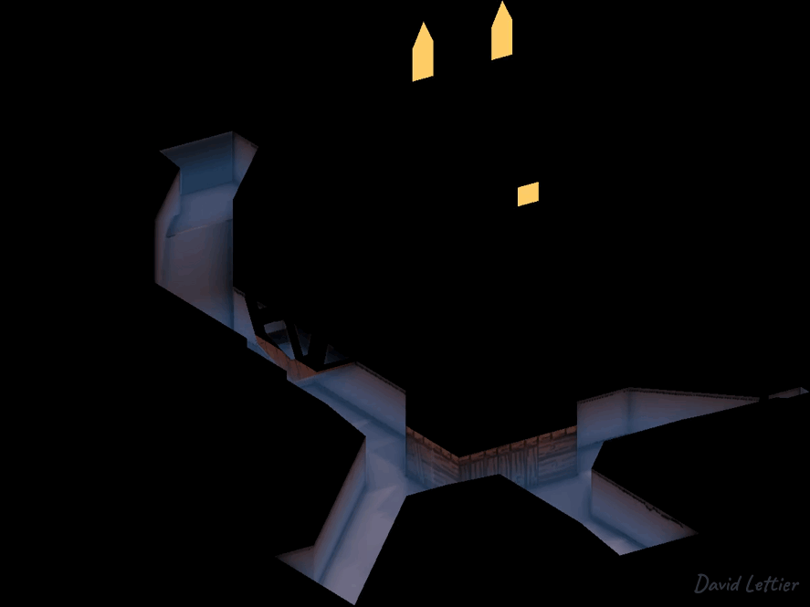
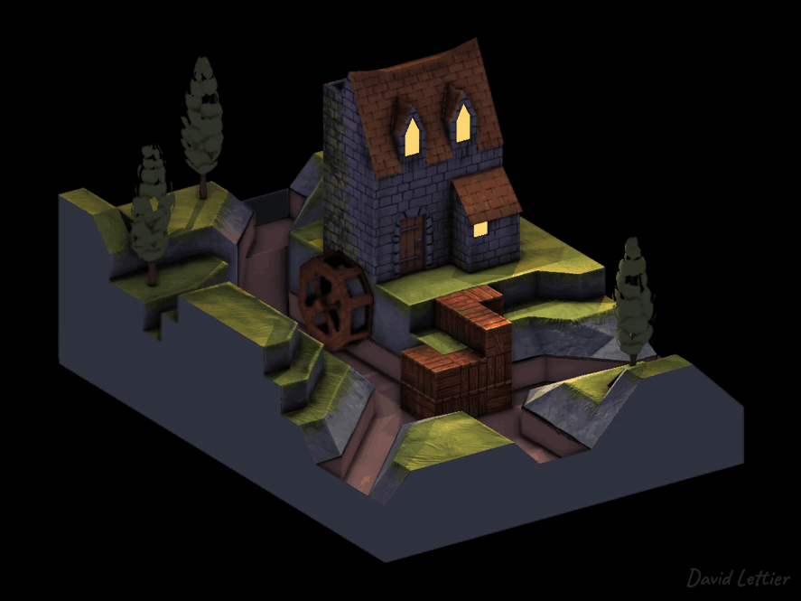
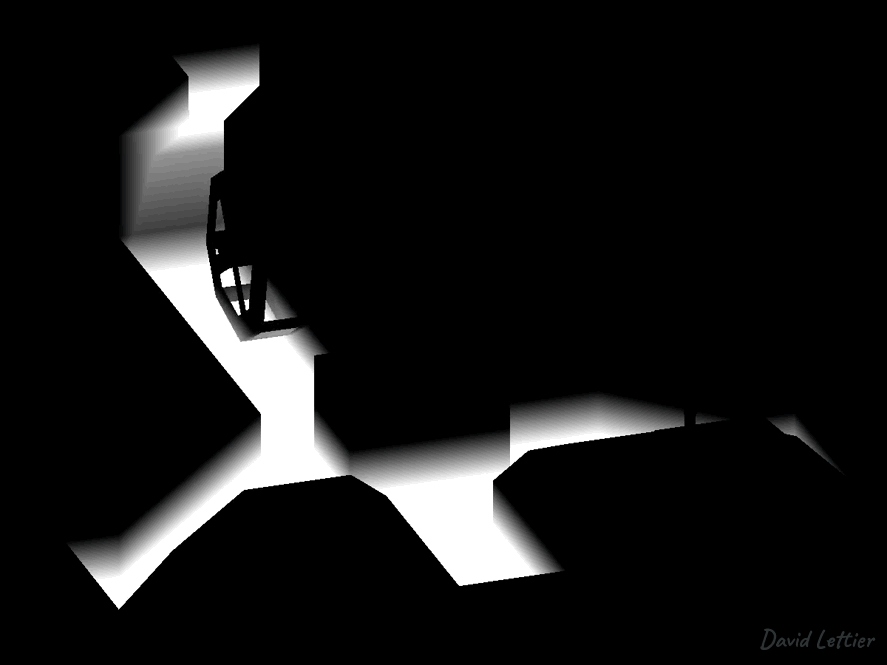

[:arrow_backward:](screen-space-reflection.md)
[:arrow_double_up:](../README.md)
[:arrow_up_small:](#)
[:arrow_down_small:](#copyright)
[:arrow_forward:](foam.md)

# 3D 游戏着色器入门教程

## 屏幕空间折射 (SSR)

<p align="center">

</p>

屏幕空间折射，  
就像  
[屏幕空间反射](screen-space-reflection.md)，  
能为画面增添其他地方难以呈现的真实感。  
玻璃、塑料、水和其他透明/半透明材质会栩栩如生。

[屏幕空间反射](screen-space-reflection.md)  
和屏幕空间折射的实现几乎完全相同，唯一区别在于。  
屏幕空间反射使用反射向量，  
而屏幕空间折射使用  
[折射向量](http://asawicki.info/news_1301_reflect_and_refract_functions.html)。  
代码改动细微，但视觉效果差别明显。

### 顶点位置

和 SSAO 一样，你需要视图空间中的顶点位置。  
详情请参阅 [SSAO](ssao.md#vertex-positions)。

不过，  
不同于 SSAO，  
你需要场景中包含折射物体和去除折射物体两种状态下的顶点位置。  
折射表面是半透明的，意味着你可以透过它看到背后的东西。  
既然能看到背面，就必须获取折射表面背后的顶点位置。  
同时拥有前景和背景顶点位置，才能计算出 UV 坐标和深度。

### 顶点法线

计算折射时，你需要视图空间中场景前景的顶点法线。  
除非你想在计算折射 UV 坐标和距离时加入背景表面细节，  
否则不需要背景顶点法线。  
详情请参阅 [SSAO](ssao.md#vertex-normals)。

<p align="center">

</p>

上图展示了水面折射光线时，有无法线贴图的差别。  
如果有法线贴图，一定要用法线贴图中的法线替代顶点法线。  
表面越平滑越平坦，折射的光线变化越不明显。  
会有一些形变，但不明显时没必要使用。

若使用法线贴图，  
你需要像[光照计算](normal-mapping.md#fragment)中那样，  
将法线贴图中的切线空间法线转换到视图空间。  
可以参见 [normal.frag](../demonstration/shaders/fragment/normal.frag) 的实现。

### 位置变换

<p align="center">

</p>

和  
[SSAO](ssao.md) 以及 [屏幕空间反射](screen-space-reflection.md) 一样，  
屏幕空间折射需要在屏幕空间和视图空间之间来回转换。  
你需要相机镜头的投影矩阵，将视图空间点转换到裁剪空间。  
从裁剪空间再转换到 UV 空间。  
一旦进入 UV 空间，  
你就能采样场景中的顶点或片元位置，  
这表示离当前采样点最近的场景位置。  
这就是“屏幕空间折射”中“屏幕空间”的含义，  
因为“屏幕”就是映射在屏幕矩形上的二维纹理。

### 折射 UV 坐标

记住，UV 坐标的 U 和 V 都是从 0 到 1 之间。  
屏幕就是一个映射在屏幕矩形上的二维纹理。  
基于此，示例代码其实不需要最终渲染的场景就能计算折射。  
它可以直接计算每个屏幕像素最终使用的 UV 坐标。  
计算出的 UV 坐标可以保存到帧缓冲纹理，  
然后在场景渲染完成后使用。

折射 UV 坐标的计算过程和  
[反射 UV 坐标](screen-space-reflection.md#reflected-uv-coordinates)  
非常相似。  
下面是从反射转换到折射需要做的调整。

```c
// ...

uniform sampler2D positionFromTexture;
uniform sampler2D positionToTexture;
uniform sampler2D normalFromTexture;

// ...
```

反射只涉及反射表面前方的物体。  
折射则涉及折射表面背后的物体。  
为此，你需要两个场景的顶点位置：  
包含折射物体的场景和去除折射物体的场景。

<p align="center">

</p>

`positionFromTexture` 是包含折射物体的场景顶点位置。  
`positionToTexture` 是去除折射物体的场景顶点位置。  
`normalFromTexture` 是包含折射表面的场景顶点法线。  
通常不需要折射表面背后的法线，除非你想把背景细节也考虑进折射。

```c
// ...

uniform vec2 rior;

// ...
```

折射比反射多了一个调节参数。  
`rior` 是相对折射率（相对折射指数）。  
它是两个介质折射率的比值。  
例如，从水到空气是 `1 / 1.33 ≈ 0.75`。  
分子是光线离开的介质折射率，  
分母是光线进入的介质折射率。  
`rior` 为 1 表示光线直接穿过，无折射或偏折。  
随着 `rior` 增大，折射效果会趋近于  
[全反射](https://en.wikipedia.org/wiki/Total_internal_reflection)。

`rior` 不必严格遵守现实物理。  
演示中用了 `1.05`。  
这不现实（光不会在水中比空气中快），  
但现实设置会产生过多瑕疵。  
最终，只需效果可信即可，不必完全真实。

<p align="center">

</p>

`rior` 大于 1 时，折射会被拉长；  
小于 1 时，折射会被缩短。

和屏幕空间反射一样，  
屏幕空间没有完整的场景几何信息。  
折射射线可能在屏幕空间内行进，但永远没击中捕获的表面，  
或者击中了摄像机不可见的表面背面。  
反射时，遇到这种情况片元会留空。  
表示无反射或信息不足。  
空白片元对反射来说没问题，因为反射表面会填充空白。

<p align="center">

</p>

但折射必须给片元赋予 UV。  
若留空，折射表面会出现空洞，透出背后的细节。  
这对完全透明的表面没问题，但通常折射表面会带有色彩、反射等。

```c
  // ...

  vec2 texSize  = textureSize(positionFromTexture, 0).xy;
  vec2 texCoord = gl_FragCoord.xy / texSize;

  vec4 uv = vec4(texCoord.xy, 1, 1);

  // ...
```

最佳方案是把 UV 设为 `rior` 为 1 时的值。  
这会保持 UV 坐标不变，  
让背景内容显示，而不会出现折射表面空洞。

<p align="center">

</p>

这是磨坊场景的折射 UV 贴图。  
轮子和水道扰乱了原本平滑的梯度，  
将 UV 坐标从屏幕位置偏移到折射屏幕位置。

```c
  // ...

  vec3 unitPositionFrom = normalize(positionFrom.xyz);
  vec3 normalFrom       = normalize(texture(normalFromTexture, texCoord).xyz);
  vec3 pivot            = normalize(refract(unitPositionFrom, normalFrom, rior.x));

  // ...
```

最关键的区别是折射向量和反射向量的计算。  
两者都用单位位置和法线，但 `refract` 需要额外的相对折射率参数。

```c
    // ...

    frag      += increment;
    uv.xy      = frag / texSize;
    positionTo = texture(positionToTexture, uv.xy);

    // ...
```

用 `uv` 坐标采样 `positionToTexture` 得到 `positionTo`。  
反射时，只需要一个包含视图空间顶点位置的帧缓冲纹理。  
而折射时，`positionToTexture` 是去除折射表面的顶点位置，  
因为折射光线通常穿过折射表面到达背后。  
如果 `positionFromTexture` 和 `positionToTexture` 一样，  
折射射线会撞到折射表面本身，而非背后的物体。

### 折射遮罩

<p align="center">

</p>

你需要一个遮罩来筛选出非折射部分。  
该遮罩决定哪些片元接收折射颜色，哪些不接收。  
你可以在折射 UV 计算阶段使用遮罩，或在实际采样折射颜色时使用。

磨坊场景使用模型的材质高光作为遮罩。  
演示中用高光贴图足够，但你可能想用更专用的贴图。  
详情请参考[屏幕空间反射](screen-space-reflection.md#specular-map)中如何渲染高光贴图。

## 背景颜色

<p align="center">

</p>

你需要渲染折射物体背后的场景部分。  
这可以通过隐藏折射物体，然后将场景渲染到帧缓冲纹理实现。

### 前景颜色

<p align="center">

</p>

```c
// ...

uniform sampler2D uvTexture;
uniform sampler2D refractionMaskTexture;
uniform sampler2D positionFromTexture;
uniform sampler2D positionToTexture;
uniform sampler2D backgroundColorTexture;

// ...
```

渲染实际折射或前景颜色时，  
你需要折射 UV 坐标、折射遮罩、前景和背景顶点位置，  
以及背景颜色。

```c
  // ...

  vec3  tintColor = vec3(0.27, 0.58, 0.92, 0.3);
  float depthMax  = 2;

  // ...
```

`tintColor` 和 `depthMax` 是可调参数。  
`tintColor` 用于给背景颜色着色。  
`depthMax` 范围从 0 到无穷大。  
当前景和背景位置的距离达到 `depthMax`，  
前景颜色为完全着色的背景色。  
距离为 0 时，前景为背景色。

```c
  // ...

  vec2 texSize  = textureSize(backgroundColorTexture, 0).xy;
  vec2 texCoord = gl_FragCoord.xy / texSize;

  vec4 uv              = texture(uvTexture,              texCoord);
  vec4 mask            = texture(maskTexture,            texCoord);
  vec4 positionFrom    = texture(positionFromTexture,    texCoord);
  vec4 positionTo      = texture(positionToTexture,      uv.xy);
  vec4 backgroundColor = texture(backgroundColorTexture, uv.xy);

  if (refractionMask.r <= 0) { fragColor = vec4(0); return; }

  // ...
```

获取 uv 坐标、遮罩、背景位置、前景位置和背景颜色。  
如果折射遮罩关闭，则不渲染该片元。

```c
  // ...

  float depth   = length(positionTo.xyz - positionFrom.xyz);
  float mixture = clamp(depth / depthMax, 0, 1);

  vec3 shallowColor    = backgroundColor.rgb;
  vec3 deepColor       = mix(shallowColor, tintColor.rgb, tintColor.a);
  vec3 foregroundColor = mix(shallowColor, deepColor,     mixture);

  // ...
```

<p align="center">

</p>

计算前景和背景位置间的深度或距离。  
深度为 0 时，前景颜色为浅色（背景色）。  
深度达到 `depthMax` 时，前景颜色为深色（着色后的背景色）。  
深色是将背景色按 `tintColor` 进行着色的结果。

```c
  // ...

  fragColor = mix(vec4(0), vec4(foregroundColor, 1), uv.b);

  // ...
```

回想一下，折射 UV 纹理的蓝色通道存储了可见度。  
当折射射线指向摄像机时，可见度会降低。  
虽然可见度应始终为 1，这里保留是为了完整性。  
可见度降低时，片元颜色接收的前景颜色也会相应减少。

### 来源

- [main.cxx](../demonstration/src/main.cxx)  
- [base.vert](../demonstration/shaders/vertex/base.vert)  
- [basic.vert](../demonstration/shaders/vertex/basic.vert)  
- [position.frag](../demonstration/shaders/fragment/position.frag)  
- [normal.frag](../demonstration/shaders/fragment/normal.frag)  
- [material-specular.frag](../demonstration/shaders/fragment/material-specular.frag)  
- [screen-space-refraction.frag](../demonstration/shaders/fragment/screen-space-refraction.frag)  
- [refraction.frag](../demonstration/shaders/fragment/refraction.frag)  
- [base-combine.frag](../demonstration/shaders/fragment/base-combine.frag)  


## Copyright

(C) 2019 David Lettier
<br>
[lettier.com](https://www.lettier.com)

[:arrow_backward:](screen-space-reflection.md)
[:arrow_double_up:](../README.md)
[:arrow_up_small:](#)
[:arrow_down_small:](#copyright)
[:arrow_forward:](foam.md)
