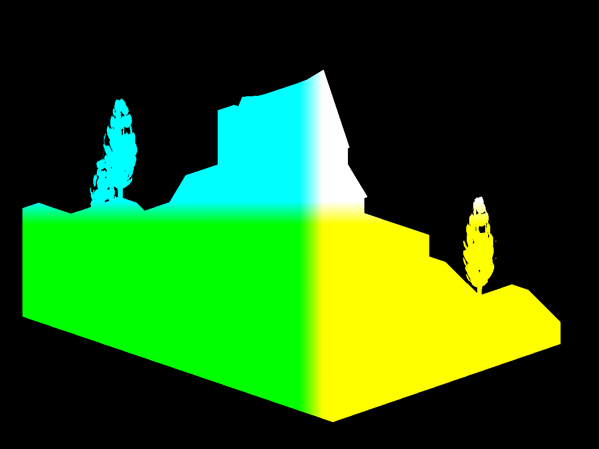
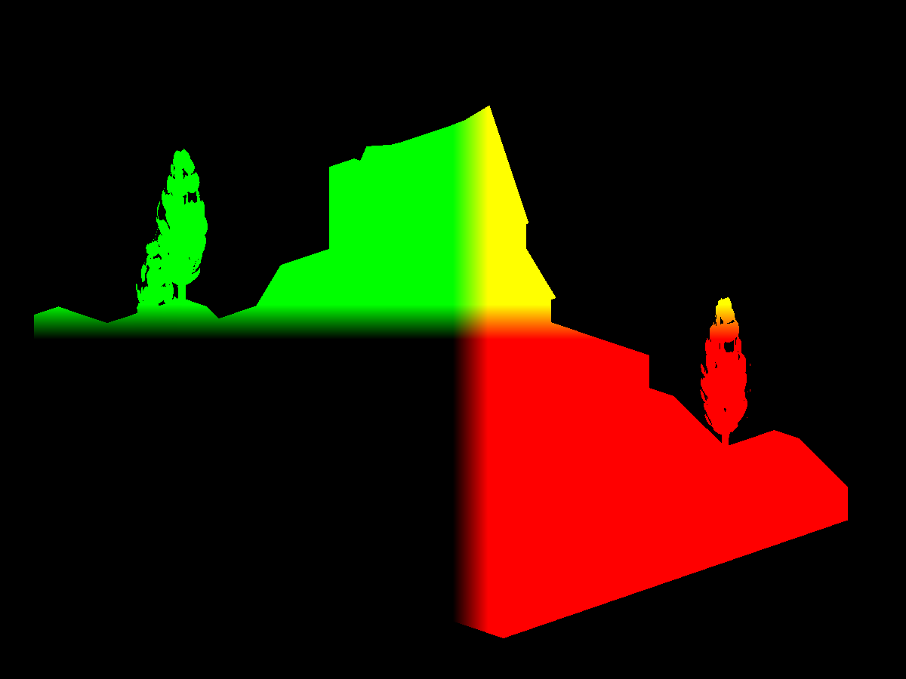
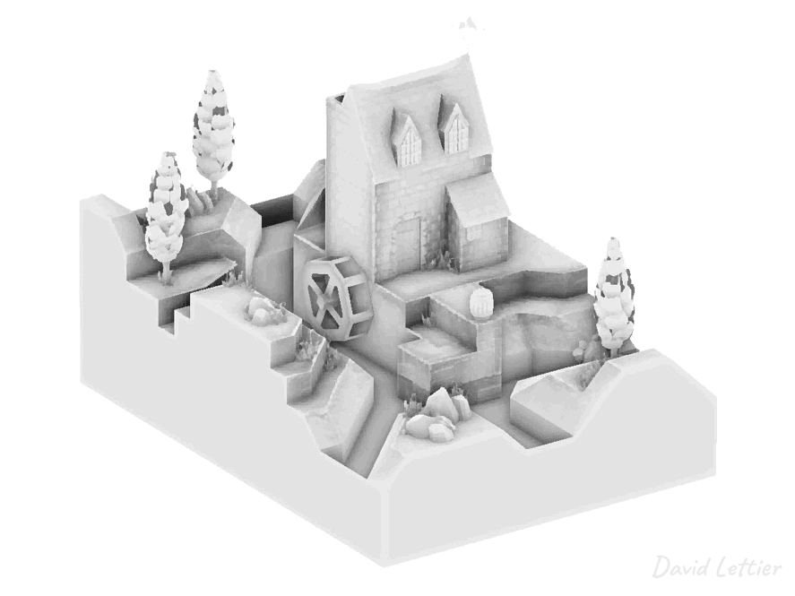

[:arrow_backward:](bloom.md)
[:arrow_double_up:](../README.md)
[:arrow_up_small:](#)
[:arrow_down_small:](#copyright)
[:arrow_forward:](motion-blur.md)

# 3D游戏着色器入门

## 屏幕空间环境光遮蔽（SSAO）

<p align="center">

</p>

SSAO 是一种你之前可能没意识到自己需要，但一旦有了就离不开的效果。
它可以将一个普通场景提升到惊艳的层次！
对于相对静态的场景，你可以将环境光遮蔽烘焙到贴图中，但对于动态场景，则需要使用着色器。
SSAO 是较复杂的着色技术之一，但一旦掌握，你会觉得自己就是着色器大师。

SSAO 通过使用少量纹理，来近似计算场景的
[环境光遮蔽（Ambient Occlusion）](https://en.wikipedia.org/wiki/Ambient_occlusion)，
这种方法比遍历场景所有几何体计算环境光遮蔽要快得多。
这几张纹理都基于屏幕空间（screen space），因此称为“屏幕空间环境光遮蔽”。

### 输入

SSAO 着色器需要以下输入：

* 视图空间中的顶点位置向量。
* 视图空间中的顶点法线向量。
* 切线空间中的采样向量。
* 切线空间中的噪声向量。
* 摄像机的投影矩阵。

### 顶点位置

<p align="center">

</p>

将顶点位置存入帧缓冲纹理并非必须，
你可以从摄像机的深度缓冲区重建它们（详见[教程](http://theorangeduck.com/page/pure-depth-ssao)）。
不过本教程为了简明，避免使用该优化，保持直接。
你也可以根据需求自由选择是否使用深度缓冲。

```cpp
PT(Texture) depthTexture =
  new Texture("depthTexture");
depthTexture->set_format
  ( Texture::Format::F_depth_component32
  );

// 省略部分代码...

depthBuffer->set_clear_color
  ( LVecBase4f(0, 0, 0, 0)
  );

// 省略部分代码...
```

以上是使用 Panda3D 创建深度缓冲的示例代码。

```c
in vec4 vertexPosition;

out vec4 fragColor;

void main() {
  fragColor = vertexPosition;
}
```

这是一个简单的顶点位置输出着色器，将视图空间顶点位置输出到帧缓冲。
关键是确保帧缓冲纹理的精度足够高且不限制值范围（不限制在 \[0,1] 之间）。
例如位置 `<-139.44, 0.00034, 2.5>` 不应被错误存成 `<0.0, 0.0, 1.0>`。

```c
  // ...

  FrameBufferProperties fbp = FrameBufferProperties::get_default();

  // ...

  fbp.set_rgba_bits(32, 32, 32, 32);
  fbp.set_rgb_color(true);
  fbp.set_float_color(true);

  // ...
```

示例中设置了每个颜色通道32位浮点，且禁用了数值范围限制。

```c
  glTexImage2D
    ( GL_TEXTURE_2D
    , 0
    , GL_RGB32F
    , 1200
    , 900
    , 0
    , GL_RGB
    , GL_FLOAT
    , nullptr
    );
```

等效的 OpenGL 调用，`GL_RGB32F` 表示32位浮点颜色格式且不限制范围。

<blockquote>
如果颜色缓冲是固定点格式，源和目标的值及混合因子会被限制在 [0,1] 或 [-1,1] 区间；  
而浮点格式的颜色缓冲则不会被限制。  
<br>
<br>
<footer>
<a href="https://www.khronos.org/registry/OpenGL/specs/gl/glspec44.core.pdf">来源</a>
</footer>
</blockquote>

<p align="center">

</p>

图中展示了视图空间中，Y轴为上方向的顶点位置。
请注意，Panda3D 默认Z轴为上，但OpenGL习惯用Y轴为上。

### 顶点法线

<p align="center">

</p>

法线用于确定采样方向。示例代码在半球内分布多个采样向量，也可以在球体内分布而不用法线。

```c
in vec3 vertexNormal;

out vec4 fragColor;

void main() {
  vec3 normal = normalize(vertexNormal);

  fragColor = vec4(normal, 1);
}
```

这是输出视图空间法线的简单着色器。别忘了归一化法线。

<p align="center">

</p>

法线图同样是Y轴向上。

<p align="center">

</p>

也可以用法线贴图替代顶点法线以获得更精细的细节，
这需要将法线贴图从切线空间转换到视图空间，方法类似于光照计算时的处理。

```c
    // ...

    normal =
      normalize
        ( normalTex.rgb
        * 2.0
        - 1.0
        );
    normal =
      normalize
        ( mat3
            ( tangent
            , binormal
            , vertexNormal
            )
        * normal
        );

    // ...
```

### 采样点

计算某个片元的环境光遮蔽程度，需要采样它周围区域。
采样点越多，结果越准确，但性能开销越大。

```cpp
  // ...

  for (int i = 0; i < numberOfSamples; ++i) {
    LVecBase3f sample =
      LVecBase3f
        ( randomFloats(generator) * 2.0 - 1.0
        , randomFloats(generator) * 2.0 - 1.0
        , randomFloats(generator)
        ).normalized();

    float rand = randomFloats(generator);
    sample[0] *= rand;
    sample[1] *= rand;
    sample[2] *= rand;

    float scale = (float) i / (float) numberOfSamples;
    scale = lerp(0.1, 1.0, scale * scale);
    sample[0] *= scale;
    sample[1] *= scale;
    sample[2] *= scale;

    ssaoSamples.push_back(sample);
  }

  // ...
```

示例代码生成随机分布于半球内的采样向量，将其传入着色器。

```cpp
    LVecBase3f sample =
      LVecBase3f
        ( randomFloats(generator) * 2.0 - 1.0
        , randomFloats(generator) * 2.0 - 1.0
        , randomFloats(generator) * 2.0 - 1.0
        ).normalized();
```

如果想改成球形分布，只需将Z分量的随机值范围改成 `[-1, 1]`。

### 噪声

```c
  // ...

  for (int i = 0; i < numberOfNoise; ++i) {
    LVecBase3f noise =
      LVecBase3f
        ( randomFloats(generator) * 2.0 - 1.0
        , randomFloats(generator) * 2.0 - 1.0
        , 0.0
        );

    ssaoNoise.push_back(noise);
  }

  // ...
```

为了更好地随机旋转采样半球，生成一组二维噪声向量。

### 环境光遮蔽计算

<p align="center">

</p>

SSAO 通过采样片元视图空间周围，
采样点越多被遮挡，片元颜色越暗。
采样向量沿法线方向分布，采样点对应的位置与场景深度比较，判断是否被遮挡。

<p align="center">

</p>

采样示意图。

```c
  // ...

  float radius    = 1;
  float bias      = 0.01;
  float magnitude = 1.5;
  float contrast  = 1.5;

  // ...
```

控制参数：

* `bias`：偏移量，防止自遮挡（“痘痘”效应）
* `radius`：采样半径大小
* `magnitude`：遮蔽强度
* `contrast`：遮蔽对比度

```c
  // ...

  vec4 position =           texture(positionTexture, texCoord);
  vec3 normal   = normalize(texture(normalTexture,   texCoord).xyz);

  int  noiseX = int(gl_FragCoord.x - 0.5) % 4;
  int  noiseY = int(gl_FragCoord.y - 0.5) % 4;
  vec3 random = noise[noiseX + (noiseY * 4)];

  // ...
```

读取采样点位置、法线和随机噪声。

```c
  // ...

  vec3 tangent  = normalize(random - normal * dot(random, normal));
  vec3 binormal = cross(normal, tangent);
  mat3 tbn      = mat3(tangent, binormal, normal);

  // ...
```

构造TBN矩阵，将采样向量从切线空间变换到视图空间。

```c
  // ...

  float occlusion = NUM_SAMPLES;

  for (int i = 0; i < NUM_SAMPLES; ++i) {
    // ...
  }

  // ...
```

循环遍历采样点，计算遮蔽数量。

```c
    // ...

    vec3 samplePosition = tbn * samples[i];
         samplePosition = position.xyz + samplePosition * radius;

    // ...
```

计算采样点的视图空间位置。

```c
    // ...

    vec4 offsetUV      = vec4(samplePosition, 1.0);
         offsetUV      = lensProjection * offsetUV;
         offsetUV.xyz /= offsetUV.w;
         offsetUV.xy   = offsetUV.xy * 0.5 + 0.5;

    // ...
```

将采样点从视图空间变换到裁剪空间，再映射到UV坐标。

```c
-1 * 0.5 + 0.5 = 0
 1 * 0.5 + 0.5 = 1
```

裁剪空间范围\[-1,1]映射到UV空间\[0,1]。

```c
    // ...

    vec4 offsetPosition = texture(positionTexture, offsetUV.xy);

    float occluded = 0;
    if (samplePosition.y + bias <= offsetPosition.y) { occluded = 0; } else { occluded = 1; }

    // ...
```

根据采样点深度判断是否被遮挡。

```c
    // ...

    float intensity =
      smoothstep
        ( 0.0
        , 1.0
        ,   radius
          / abs(position.y - offsetPosition.y)
        );
    occluded *= intensity;

    occlusion -= occluded;

    // ...
```

根据距离调节遮蔽强度，累计遮蔽值。

```c
    // ...

    occlusion /= NUM_SAMPLES;

    // ...

    fragColor = vec4(vec3(occlusion), position.a);

    // ...
```

归一化遮蔽值到\[0,1]，赋值为片元颜色。

```c
    // ...

    fragColor = vec4(vec3(occlusion), position.a);

    // ...
```

示例中使用位置纹理的alpha通道，避免遮挡背景。

### 模糊处理

<p align="center">

</p>

SSAO结果噪声较多，通常需要模糊处理降低噪点。
参考[模糊章节](blur.md)，推荐使用中值滤波或桑原滤波保持边缘清晰。

### 环境光颜色叠加

```c
  // ...

  vec2 ssaoBlurTexSize  = textureSize(ssaoBlurTexture, 0).xy;
  vec2 ssaoBlurTexCoord = gl_FragCoord.xy / ssaoBlurTexSize;
  float ssao            = texture(ssaoBlurTexture, ssaoBlurTexCoord).r;

  vec4 ambient = p3d_Material.ambient * p3d_LightModel.ambient * diffuseTex * ssao;

  // ...
```

最终在光照计算中使用SSAO遮蔽因子调节环境光，提升视觉效果。

---

### 参考源码

* [main.cxx](../demonstration/src/main.cxx)
* [basic.vert](../demonstration/shaders/vertex/basic.vert)
* [base.vert](../demonstration/shaders/vertex/base.vert)
* [base.frag](../demonstration/shaders/fragment/base.frag)
* [position.frag](../demonstration/shaders/fragment/position.frag)
* [normal.frag](../demonstration/shaders/fragment/normal.frag)
* [ssao.frag](../demonstration/shaders/fragment/ssao.frag)
* [median-filter.frag](../demonstration/shaders/fragment/median-filter.frag)
* [kuwahara-filter.frag](../demonstration/shaders/fragment/kuwahara-filter.frag)

## Copyright

(C) 2019 David Lettier
<br>
[lettier.com](https://www.lettier.com)

[:arrow_backward:](bloom.md)
[:arrow_double_up:](../README.md)
[:arrow_up_small:](#)
[:arrow_down_small:](#copyright)
[:arrow_forward:](motion-blur.md)
