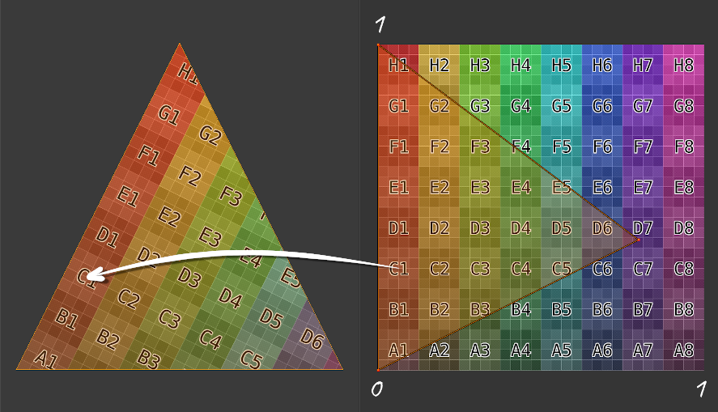

[:arrow_backward:](render-to-texture.md)
[:arrow_double_up:](../README.md)
[:arrow_up_small:](#)
[:arrow_down_small:](#copyright)
[:arrow_forward:](lighting.md)

# 3D游戏着色器入门

## 贴图（Texturing）

<p align="center">

</p>

贴图就是使用 UV 坐标将某种颜色或其他向量映射到片元上。  
U 和 V 都是在 0 到 1 之间的值。  
每个顶点会有对应的 UV 坐标，这个坐标会在顶点着色器中输出。

<p align="center">

</p>

片元着色器接收插值后的 UV 坐标。  
插值的意思是，片元的 UV 坐标是在组成该片元的三角形顶点 UV 坐标之间进行线性插值计算得到的。

### 顶点着色器

```c
#version 150

uniform mat4 p3d_ModelViewProjectionMatrix;

in vec2 p3d_MultiTexCoord0;

in vec4 p3d_Vertex;

out vec2 texCoord;

void main()
{
  texCoord = p3d_MultiTexCoord0;

  gl_Position = p3d_ModelViewProjectionMatrix * p3d_Vertex;
}
```

这里顶点着色器将纹理坐标输出到片元着色器。  
注意这是二维向量，一维是 U，另一维是 V。

### 片元着色器

```c
#version 150

uniform sampler2D p3d_Texture0;

in vec2 texCoord;

out vec2 fragColor;

void main()
{
  texColor = texture(p3d_Texture0, texCoord);

  fragColor = texColor;
}
```

片元着色器根据 UV 坐标查找纹理颜色，并输出为片元颜色。

#### 全屏贴图纹理

```c
#version 150

uniform sampler2D screenSizedTexture;

out vec2 fragColor;

void main()
{
  vec2 texSize  = textureSize(texture, 0).xy;
  vec2 texCoord = gl_FragCoord.xy / texSize;

  texColor = texture(screenSizedTexture, texCoord);

  fragColor = texColor;
}
```

在渲染到纹理时，网格是一个与屏幕宽高比相同的平面矩形。  
因此，计算 UV 坐标只需要知道：  
A) 这个屏幕大小的纹理的宽高，  
B) 当前片元的屏幕坐标 x 和 y。  

将 x 除以纹理宽度即可得到 U，  
将 y 除以纹理高度即可得到 V。  

你会在示例代码中见到这种用法。


## Copyright

(C) 2019 David Lettier
<br>
[lettier.com](https://www.lettier.com)

[:arrow_backward:](render-to-texture.md)
[:arrow_double_up:](../README.md)
[:arrow_up_small:](#)
[:arrow_down_small:](#copyright)
[:arrow_forward:](lighting.md)
